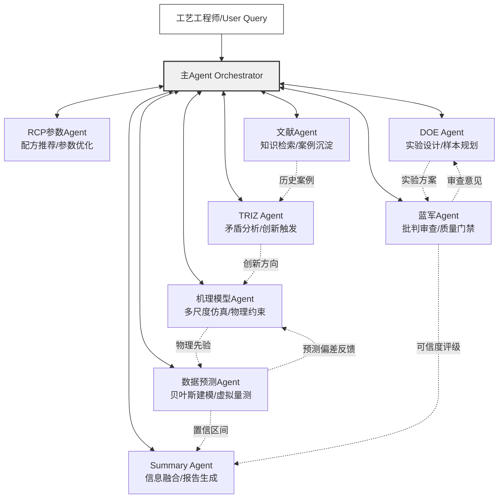
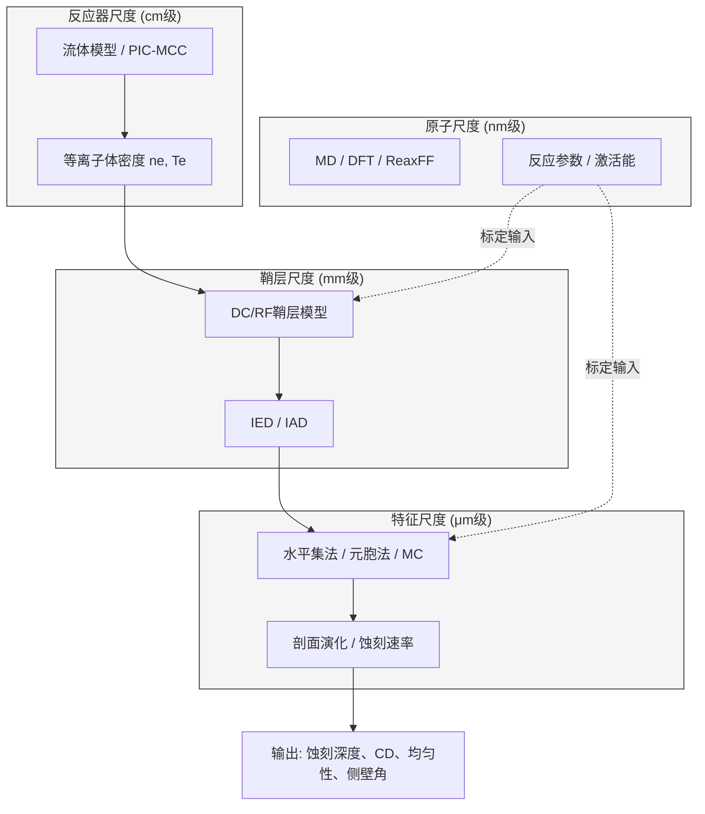
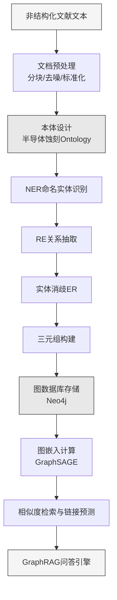
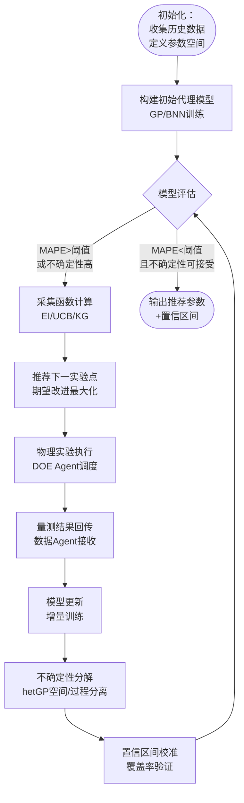
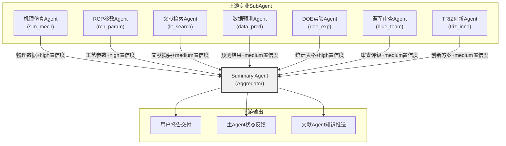
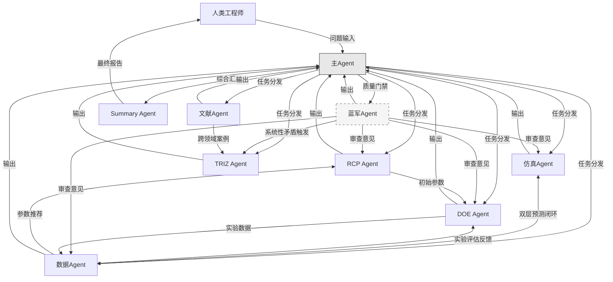
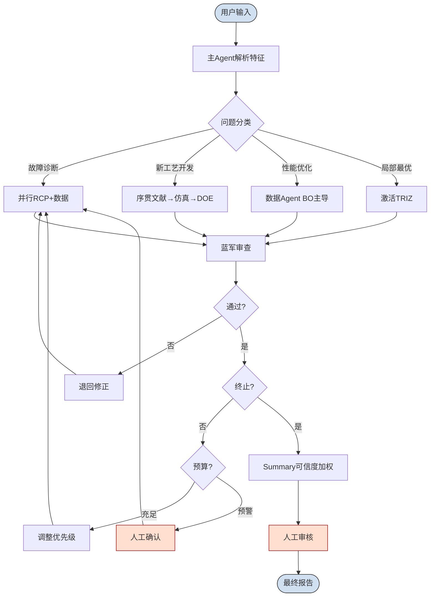

# 蚀刻多智能体系统 SubAgent 能力规划与架构设计

> **版本**: v1.0  
> **日期**: 2026-05-27  
> **编制**: 多智能体架构设计团队  
> **适用范围**: 半导体蚀刻工艺优化多智能体系统

---

# 1. 引言与系统愿景

## 1.1 背景与问题定义

### 1.1.1 半导体蚀刻工艺面临的核心挑战

半导体蚀刻工艺是集成电路制造中的核心环节，其本质是通过化学反应或物理轰击将晶圆表面的特定材料选择性地移除，以形成精确的图形结构。随着工艺节点进入3 nm及以下，蚀刻工艺面临的技术挑战呈指数级增长。过刻蚀（Over-etching）控制精度要求在亚纳米尺度，极微小的深度偏差即可导致器件电学性能的显著退化[^35^]。负载效应（Loading Effect）以三种形式严重影响工艺均匀性：宏观负载效应（Macro-loading）指不同图形密度区域间的蚀刻速率差异；微观负载效应（Micro-loading）指单个芯片内图形密度变化引起的速率不均；宽高比相关刻蚀（Aspect Ratio Dependent Etching, ARDE）指高深宽比结构中的离子输运受限导致的底部蚀刻速率下降[^30^]。此外，选择比（Selectivity）控制——即在刻蚀目标材料的同时保护掩模和下层材料——随着新材料体系的引入而愈发困难[^35^]。

这些技术挑战的背后，是蚀刻工艺参数空间的高维性与复杂性。Lam Research的归纳表明，先进等离子体蚀刻腔室配备了数十个独立可调节的"旋钮"（knobs），涵盖射频功率系统、气体系统、压力系统、温度系统及电极间距等类别，每个类别内含多个强耦合参数[^35^]。例如射频功率的升高虽可提升蚀刻速率，却同步降低选择比并增加物理损伤风险[^100^]。传统工艺优化依赖工程师经验和单因子实验（One-Factor-At-A-Time, OFAT）方法，但OFAT无法捕捉等离子体与化学过程中固有的多变量交互作用[^214^]，导致开发周期漫长——这一"巨大的工艺空间"直接转化为"漫长的开发周期"[^35^]。

实验成本构成另一重刚性约束。单次蚀刻实验的测试晶圆、耗材和设备机时成本可达数千美元[^167^]，而评估11个工艺参数的全因子设计需2048次运行[^214^]，穷尽式搜索在经济上完全不可行。

### 1.1.3 多智能体方法的价值主张

多智能体系统（Multi-Agent System, MAS）为上述困境提供了新的方法论路径。其核心价值建立在三个支柱之上。第一，专业化分工：各SubAgent聚焦特定能力域并行推进——机理仿真负责物理约束建模、贝叶斯预测负责统计优化、DOE负责实验规划、蓝军负责质量审查——实现问题分解与并行求解。第二，知识整合：通过标准化的消息协议将仿真数据、实验数据、文献知识和经验规则整合到统一决策框架中，弥合传统工艺优化中的知识碎片化问题。第三，迭代加速：贝叶斯优化已证实在5–8次迭代内收敛至合格工艺窗口，减少超过60%的测试晶圆消耗[^96^]；少样本测试时优化框架仅需5次迭代即可生成推荐配方，远低于资深工程师平均所需的84次迭代[^42^]。

## 1.2 架构愿景

### 1.2.1 设计目标

本报告设计一套面向半导体蚀刻工艺的主Agent+8 SubAgent协作系统，参照OpenCode平台的SubAgent设计模式[^294^]，构建集中调度、职责单一、上下文隔离的多智能体架构。

### 1.2.2 架构原则

系统遵循四项架构原则。第一，职责单一：每个SubAgent承担一个明确定义的功能角色——机理模型Agent专注于多尺度仿真建模，RCP参数Agent专注于配方优化，文献Agent专注于知识检索与沉淀，数据预测Agent专注于贝叶斯统计建模，DOE Agent专注于小样本实验设计，蓝军Agent专注于批判性审查与质量门禁，TRIZ Agent专注于创新矛盾分析，Summary Agent专注于信息综合与报告生成。第二，上下文隔离：各SubAgent之间不直接共享状态，所有交互通过主Agent的显式消息传递完成，确保推理可追溯。第三，结果压缩：每个SubAgent输出须经过结构化压缩（关键结论+置信度评分），减少上下文负载。第四，集中调度：主Agent作为唯一编排器（Orchestrator），负责任务分解、Agent调用与结果聚合，参考Critic-Reviewer模式中"生成-评估"协作范式[^261^]。

### 1.2.3 系统整体架构图

下图展示系统整体架构及8个SubAgent的功能定位与协作关系。



架构图中实线表示主Agent的调度指令与SubAgent的结果返回，虚线表示SubAgent间的协作信息流。机理模型Agent与数据预测Agent形成"物理引导的数据驱动"闭环：机理输出作为贝叶斯先验约束，预测偏差反馈用于模型校准。DOE Agent与蓝军Agent形成"设计-审查"闭环，蓝军在方案执行前进行质量门禁而非事后审查。TRIZ Agent作为"战略储备"，在系统陷入局部最优或遇到全新工艺场景时由主Agent激活，结合文献Agent的历史案例进行跨领域类比创新。Summary Agent基于各Agent的可信度评分生成加权综合报告，而非简单拼接文本。第2章至第9章将逐一详述各SubAgent的能力设计。

## 2. 机理模型（仿真）SubAgent

机理模型（仿真）SubAgent是蚀刻工艺多智能体系统的物理引擎，承担从第一性原理到工程近似的多尺度建模任务。该Agent的核心价值在于提供物理可解释的先验约束——其蚀刻速率预测、剖面演化轨迹和参数敏感性排序，是数据驱动模型的正则化基础，也是故障诊断中"从现象反推根因"的因果链条载体[^30^]。

### 2.1 技术能力设计

#### 2.1.1 多尺度仿真能力：反应器尺度→鞘层模型→特征尺度→原子尺度

蚀刻工艺仿真依空间尺度划分为四个层次：**反应器尺度**（Reactor Scale, cm级）、**鞘层尺度**（Sheath Scale, mm级）、**特征尺度**（Feature Scale, μm级）和**原子尺度**（Atomistic Scale, nm级）[^30^]。信息从反应器向特征单向流动——反应器尺度的等离子体参数通过鞘层模型传递为离子能量分布函数（Ion Energy Distribution, IED）和离子角度分布（Ion Angular Distribution, IAD），再驱动特征尺度的剖面演化[^30^]。



在**反应器尺度**，Agent根据工艺条件选择策略：常规CCP/ICP刻蚀采用基于连续性方程的**流体模型**，精度±20%，成本适中[^28^]；低压（<10 mTorr）、高电压条件下，粒子可在鞘层获得高达10 keV能量，非局域动理学效应不可忽略，需采用**PIC/MCC**方法[^27^]；介于两者之间时，**混合模型**（电子流体描述、离子粒子描述）可取得平衡，HPEM是其代表[^32^]。

在**鞘层尺度**，Agent支持两级建模：DC鞘层模型描述时间平均离子加速行为；RF鞘层模型考虑射频电场时间变化，关键参数ωτᵢ（射频频率与离子穿越鞘层时间乘积）决定离子能量分布的单峰/多峰结构[^30^]。

在**特征尺度**，**水平集法**将界面嵌入高维函数求解Hamilton-Jacobi方程，消除弦法拓扑奇异性，适合拐角和侧蚀[^158^][^185^]；**元胞自动机法**离散材料域为单元，通过蒙特卡洛追踪粒子入射和原子移除，可直接模拟再沉积和钝化层动力学[^174^][^158^]。GPU并行化实现（如K-SPEED）可将3D特征仿真加速一个数量级[^158^]。

在**原子尺度**，**分子动力学**（MD）模拟粒子轰击表面的微观过程[^128^]；**密度泛函理论**（DFT）计算反应激活能和路径[^131^][^133^]；**ReaxFF**反应力场在量子精度与经典效率间折中[^134^]。

| 仿真层级 | 空间尺度 | 核心方法 | 计算成本 | 典型精度 | 关键输出 |
|:---:|:---:|:---:|:---:|:---:|:---|
| 反应器尺度 | cm级 | 流体模型、PIC-MCC、混合模型 | 中—高 | ±10%—±20% | 等离子体密度、电子温度、电势分布 |
| 鞘层尺度 | mm级 | DC/RF鞘层模型 | 低—中 | ±15% | IED、IAD、鞘层电势降 |
| 特征尺度 | μm级 | 水平集法、元胞法、MC射线追踪 | 中—高 | ±10%—±15% | 剖面演化、CD、侧壁角、底部粗糙度 |
| 原子尺度 | nm级 | MD、DFT、ReaxFF | 很高 | 定性—半定量 | 激活能、反应路径、粘附系数 |

上表反映了精度-成本的根本权衡。Agent根据任务动态选择仿真层级：新工艺窗口探索以流体模型+水平集法的两级级联即可；HARC的bowing/twisting缺陷诊断，则需PIC/MCC+元胞法的全耦合计算链[^27^][^172^]。

#### 2.1.2 表面反应机理建模

表面反应机理决定仿真可信度。**Langmuir-Hinshelwood（L-H）模型**通过覆盖度变量自洽描述吸附-反应-脱附的竞争平衡，是求解返回通量和表面覆盖度的标准框架[^30^]。**离子增强蚀刻模型**将速率分解为化学蚀刻、物理溅射和离子增强蚀刻三部分叠加，其中离子增强蚀刻是各向异性的主要来源[^35^]。**聚合物钝化层动力学**处理氟碳等离子体中聚合物生长与消耗的竞争，SKM可与HPEM自洽耦合，同时模拟等离子体化学和表面化学[^32^]。

#### 2.1.3 负载效应仿真：Macro-loading/Micro-loading/ARDE

负载效应指蚀刻速率随蚀刻面积或结构变化的现象[^132^][^136^]。Agent定量模拟三级效应：**宏观负载效应**（Macro-loading，晶圆尺度）通过反应器尺度连续性方程耦合全局消耗项修正[^136^]；**微观负载效应**（Micro-loading，芯片尺度）耦合连续介质浓度求解器与特征模型，模拟局部图形密度差异导致的反应物非均匀输运[^136^]；**深宽比相关蚀刻**（ARDE）考虑高深宽比结构中离子阴影效应和中性粒子传输限制[^132^]。三级效应在多尺度耦合架构中同时求解，实现综合评估。

#### 2.1.4 代理模型与实时预测：PINN、RNN降阶模型、数字孪生

高保真仿真成本（数小时至数天）与产线实时决策（秒级）的矛盾通过代理模型解决。**物理信息神经网络**（PINNs）将物理约束以偏微分方程残差嵌入损失函数，使模型在稀疏数据下满足守恒定律[^65^]。**RNN降阶模型**基于LSTM/GRU学习蚀刻速率动态响应，TensorFlow代理模型可达RMSE<2 Å/min、R²=0.9966[^63^]，Xiao等人的RNN-ROM结合模型预测控制已获验证[^65^]。**数字孪生集成**方面，TEL的虚拟实验结合ML自动参数拟合大幅减少硅实验次数[^77^][^172^]；Lam Research在特定交接点实现99%情况下AI胜过人类工程师[^70^]。Agent输出代理模型的推理延迟应<100 ms以支持边缘部署[^63^]。

### 2.2 输入输出规范

#### 2.2.1 输入JSON Schema

输入包含工艺-设备-材料-目标完整描述，核心字段包括：`process_type`（CCP/ICP/ECR/RIE）、`etch_material`（Si/SiO₂/Si₃N₄/TiN等）、`gas_chemistry`（进气种类及流量）、`reactor_parameters`（压力、射频功率、偏置功率、温度等）、`feature_geometry`（沟槽宽度、深宽比、图形密度）、`simulation_request`（仿真类型、目标尺度、是否需要代理模型），以及可选的`calibration_data`（实验蚀刻速率、SEM图像等标定数据）。当提供实验数据时，Agent自动执行参数反演，通过贝叶斯优化或系统辨识法调整粘附系数、离子反射比等标定参数[^130^][^183^]。

#### 2.2.2 输出JSON Schema

输出包含六类核心字段：`etch_rate_nm_min`（预测蚀刻速率）；`uniformity`（晶圆内非均匀性1σ、局部CD变化）；`profile_evolution`（最终剖面SVG、侧壁角、bowing深度、底部粗糙度）；`loading_effect`（宏观/微观负载因子、ARDE系数）；`mechanism_analysis`（主导蚀刻机制、钝化层厚度、离子能量分布、表面覆盖度）；`parameter_sensitivity`（各参数敏感性得分排序）。此外包含`recommendations`（工艺建议列表）和`surrogate_model`（代理模型类型、精度指标、推理延迟）。敏感性排序直接服务DOE Agent的因子筛选——高敏感性参数选为主要因子，低敏感性参数固定为默认值以缩减搜索空间。

### 2.3 触发条件与协作关系

#### 2.3.1 触发条件

Agent激活由主Agent动态决策，覆盖四类场景：**新工艺开发请求**（process_type变更或新材料首次出现时，执行全尺度级联仿真，为DOE Agent提供先验）；**故障诊断请求**（产线出现bowing、notching、twisting或均匀性超标时，复现异常剖面并识别主导机制，输出至蓝军Agent交叉验证[^172^]）；**参数敏感性分析需求**（DOE/RCP Agent发起的系统性参数扫描，输出敏感性排序和响应面近似）；**数字孪生构建请求**（批量高保真仿真生成训练数据，训练代理模型后台异步执行）。

#### 2.3.2 上游依赖与下游贡献

| 上游Agent | 提供内容 | 用途 |
|:---|:---|:---|
| 主Agent | 任务指令、优先级、约束条件 | 确定仿真类型、精度等级和时间预算 |
| RCP Agent | 候选工艺参数组合 | 作为仿真输入条件，评估候选参数可行性 |
| 文献Agent | 反应机理、截面数据、先例工艺 | 构建表面反应模型的化学参数基础[^28^] |
| 数据Agent | 实验测量数据（蚀刻速率、均匀性、SEM剖面） | 模型标定与验证的基准数据[^130^] |

| 下游Agent | 提供内容 | 价值 |
|:---|:---|:---|
| 数据Agent | 物理约束先验（PINN损失项、贝叶斯先验分布） | 使数据驱动模型满足物理守恒，提升外推能力[^65^] |
| DOE Agent | 虚拟实验环境、参数敏感性排序 | 将实验搜索空间缩小60%以上[^173^] |
| 蓝军Agent | 可解释性依据（机理分析、参数影响链） | 为审查提供物理因果链替代纯统计论证[^70^] |
| 摘要Agent | 仿真结果、置信度评级 | 支撑最终报告的证据强度标注 |

机理Agent与数据Agent形成互补闭环：机理Agent输出的物理约束作为数据Agent的贝叶斯先验，数据Agent的预测偏差反馈给机理Agent用于校准。这种"物理引导的数据驱动"架构可在小样本条件下达到更优预测精度[^63^][^65^]。

| 工具/平台 | 开发方 | 核心方法 | 适用尺度 | 关键能力 | 技术成熟度 |
|:---|:---|:---|:---:|:---|:---:|
| COMSOL Multiphysics | COMSOL | 流体模型、玻尔兹曼方程 | 反应器/鞘层 | 内置等离子体模块，支持CCP/ICP多物理场耦合[^28^][^79^] | TRL 8-9 |
| ANSYS Fluent | ANSYS | CFD | 反应器 | 气流、热传递、等离子体耦合[^28^] | TRL 8-9 |
| VSim (Vorpal) | Tech-X | PIC/MCC | 反应器/鞘层 | 高非平衡等离子体动理学模拟[^28^] | TRL 6-7 |
| SEMulator3D | Coventor | 元胞/体素法 | 特征尺度 | MultiEtch模块支持多种负载效应同时模拟[^175^] | TRL 8-9 |
| Sentaurus Topography | Synopsys | 水平集/弦法 | 特征尺度 | 离子铣削、反应离子刻蚀等多模块[^169^] | TRL 7-8 |
| ViennaRay | 开源 | 射线追踪/MC | 特征尺度 | 计算粒子入射通量与角分布[^35^] | TRL 6-7 |
| HPEM | 学术研究 | 混合模型 | 反应器 | 等离子体-表面化学自洽耦合[^32^] | TRL 6-7 |
| BOLSIG+/LXCat | 开源 | 玻尔兹曼求解 | — | 电子碰撞截面与输运系数数据库[^28^] | TRL 8-9 |

上表选型遵循任务驱动原则：COMSOL/ANSYS Fluent用于反应器尺度工艺窗口探索，VSim用于低压高非平衡动理学分析；特征尺度上，SEMulator3D在同时模拟三级负载效应方面具独特优势[^175^]，Sentaurus Topography在传统RIE模块上更成熟[^169^]。Agent技术栈应支持上述工具无缝调用，输出统一转换为标准化JSON，使下游Agent无需关心底层仿真工具差异。

## 3. 设备RCP参数推荐SubAgent

设备RCP（Recipe Control Parameter，工艺配方控制参数）参数推荐SubAgent负责将工艺目标转化为可执行的设备控制指令。蚀刻工程师可用的工艺控制"旋钮"（knobs）涵盖RF功率、气体流量、腔室压力、电极温度等六大类参数，构成"tremendously large process space"[^35^]，传统OFAT（One-Factor-At-A-Time）方法需消耗80–120片晶圆[^60^]。该SubAgent通过整合参数知识库、规则引擎、敏感性分析模块和APC（Advanced Process Control）接口，将Recipe开发效率projected to提升60%以上。

### 3.1 技术能力设计

#### 3.1.1 RCP参数知识库管理

知识库设计遵循SEMI E42标准（Recipe Management Standard），该标准定义了Recipe标识格式`/CLASS/NAME;VERSION`（最多80字符）、对象配方与执行配方的分类体系，以及创建、存储、校验、版本控制等核心操作[^168^]。知识库采用三层架构：参数本体层维护核心工艺参数的约束定义；材料-设备映射层管理不同靶材（Si、SiO₂、SiN、Al、GaN、Mo等）的推荐气体化学体系；设备平台适配层存储各厂商设备的参数范围差异和偏移表。

**表1 核心蚀刻工艺参数分类表**

| 参数类别 | 具体参数 | 典型工作范围 | 功能描述 | 关联输出指标 |
|---------|---------|------------|---------|------------|
| RF功率系统 | ICP源功率（上电极） | 0–2000 W | 控制等离子体密度与离化率 | 刻蚀速率、均匀性 |
|  | Bias功率（下电极） | 0–500 W | 控制离子轰击能量与直流偏压 | 各向异性、选择比 |
|  | RF脉冲占空比/频率 | 可调 | 优化选择比与刻蚀速率平衡 | 侧壁形貌 |
| 气体系统 | 工艺气体种类 | SF₆、CF₄、CHF₃、C₄F₈等 | 提供反应活性粒子和轰击介质 | 化学选择性 |
|  | 各气体流量 | 0–500 sccm | 控制活性粒子浓度和反应速率 | 刻蚀速率 |
|  | 气体配比/混合比 | 按工艺需求定制 | 影响选择比和各向异性 | 钝化层厚度 |
| 压力系统 | 腔室压力 | 1–100 mTorr | 影响离子平均自由程和方向性 | 各向异性、选择比 |
| 温度系统 | 晶圆/下电极温度 | −100°C ~ +200°C | 影响反应速率和聚合物沉积 | 表面粗糙度 |
|  | 背氦冷却压力 | 10–1200 Pa | 控制晶圆背面热传导效率 | 温度均匀性 |
| 时间控制 | 刻蚀时间/循环数 | 秒级–分钟级 | 控制目标刻蚀深度 | 深度精度 |
| 机械参数 | 电极间距（Gap） | 70–120 mm | 影响等离子体分布均匀性 | 片内均匀性 |

上表整合了Lam Research技术文档[^35^]与多项ICP-RIE工艺研究[^100^][^104^]中的参数定义，共计11个控制维度。每个参数条目关联设备平台特定的字段映射——Lam Versys系列将ICP功率标记为"Source Power"，TEL Tactras系列使用"Coil Power"，在SEMI E42兼容层中统一为`icp_source_power_w`字段[^177^]。设备平台间同一Recipe的迁移必须经过范围裁剪和线性缩放。

#### 3.1.2 基于规则的Recipe推荐

规则引擎在缺乏历史数据时提供可解释的初始参数集，由三类规则构成。材料-气体映射规则基于已发表工艺数据库建立，如SiO₂刻蚀推荐CHF₃/Ar基化学（CHF₃分解产生的CF₂自由基与SiO₂反应生成挥发性SiF₄）[^36^]，Mo金属刻蚀选用Cl₂/O₂体系[^96^]。对于高纵横比（HAR）结构，引擎自动启用Bosch工艺的脉冲气体注入模式，在刻蚀步骤（SF₆基）和钝化步骤（C₄F₈基）之间循环[^103^]。参数约束检查模块验证硬约束（设备物理上限）、软约束（工艺经验范围）和互斥约束（安全性冲突）。经验公式模块提供初始估算，基本刻蚀时间公式为 $t = d_{target} / R_{estimated}$，其中$R_{estimated}$从知识库对应材料-设备组合的基准刻蚀速率获取；HAR结构需引入负载效应修正项[^35^]。

#### 3.1.3 参数敏感性分析

敏感性分析模块量化"如果调整参数X，结果Y如何变化"的问题，基于高斯过程回归（GPR）或核岭回归（KRR）构建输入-输出映射关系[^72^][^117^]。

**表2 关键参数-蚀刻结果映射表**

| 输入参数 | 调整方向 | 对刻蚀速率 | 对选择比 | 对各向异性 | 对表面粗糙度 | 主要耦合参数 |
|---------|---------|----------|---------|----------|------------|------------|
| ICP源功率 | ↑ | 显著增加 | 轻微降低 | 轻微改善 | 轻微增加 | Bias功率 |
| Bias功率 | ↑ | 增加 | 降低 | 显著改善 | 增加 | 压力 |
| 腔室压力 | ↓ | 轻微降低 | 降低 | 显著改善 | 降低 | Bias功率 |
| 钝化气体比例 | ↑ | 降低 | 显著提高 | 改善侧壁保护 | 降低 | RF功率 |
| 晶圆温度 | ↑ | 增加 | 与体系相关 | 轻微降低 | 增加风险 | 功率 |
| 气体总流量 | ↑ | 适度增加 | 轻微改善 | 中性 | 降低堆积 | 压力 |

上表综合多项系统表征结果[^29^][^35^][^100^]，揭示参数调整的多目标冲突性：Bias功率增加同时提高刻蚀速率和各向异性，但以牺牲选择比为代价。这种非线性耦合意味着单一参数最优值在多目标约束下往往不可行，必须依赖多目标优化寻找帕累托前沿。交互效应分析模块采用响应面方法（RSM）或GPR偏导数计算敏感性矩阵 $S_{ij} = \partial Y_i / \partial X_j$，以热图形式可视化工艺窗口——即满足所有规格约束的参数空间子集，其边界由约束交界面确定[^91^]。

#### 3.1.4 APC/R2R集成能力

APC/R2R（Run-to-Run）集成将静态Recipe推荐扩展为动态自适应调整。

**表3 APC控制层级与SubAgent对接关系表**

| APC层级 | 控制策略 | 延迟尺度 | 适用场景 | SubAgent对接方式 |
|---------|---------|---------|---------|----------------|
| Run-to-Run (R2R) | 批次间参数调整 | 分钟–小时 | 刻蚀CD控制、深度控制 | 生成EWMA调整后Recipe参数集 |
| Wafer-to-Wafer (W2W) | 晶圆间实时调整 | 30–60秒 | 光刻对准补偿、刻蚀修正 | 提供单晶圆级参数预测 |
| Within-Wafer | 晶圆内多区域调整 | 实时 | 多区域刻蚀 | 提供区域化参数模板 |
| Fault Detection (FDC) | 异常检测与保护 | 实时 | 所有设备腔室 | 接收报警，推荐恢复Recipe |

SubAgent在R2R层级的核心功能是与EWMA（Exponentially Weighted Moving Average）控制器对接。EWMA控制律为 $R_{n+1} = R_n + \lambda \cdot (Target - \hat{Y}_n)$，其中$R_n$为第$n$批次Recipe设定值，$\lambda \in (0,1]$为平滑系数[^160^]。SubAgent将控制器输出的$R_{n+1}$映射为完整Recipe参数集，并检查其是否在有效工艺窗口内。对于存在确定性漂移的场景，SubAgent支持dEWMA接口，通过趋势补偿项提高跟踪能力[^180^]。设备间匹配（Tool-to-Tool Matching）功能基于历史偏移表和数字孪生参考模型实现Recipe补偿[^178^]。

### 3.2 输入输出规范

#### 3.2.1 输入JSON Schema

输入JSON包含五个字段组：`request_type`定义请求类型（`recipe_recommendation`、`parameter_adjustment`、`sensitivity_analysis`、`recipe_transfer`）；`material_info`描述靶材、掩模材料、结构类型（沟槽/通孔/接触孔/栅极/侧墙/HAR）及关键尺寸；`process_target`指定目标深度、形貌、选择比、均匀性规格和刻蚀速率目标；`equipment_info`提供设备平台型号（支持Lam 9600/Versys、TEL Tactras、AMAT Centura、Oxford PlasmaLab 100等）、腔室ID、可用气体清单及子系统物理上限[^177^]；`context`携带问题类型（过刻蚀/欠刻蚀/弓形/微沟槽/负载效应等）、前序Recipe ID及量测反馈（实际CD、深度、选择比、剖面角）。`constraint`字段声明最大工艺时间、温度上限和禁用气体清单。

#### 3.2.2 输出JSON Schema

输出JSON包含六个字段组：`recommended_recipe`以分步骤格式组织参数，每步包含步骤类型（抽真空/气体稳定/刻蚀/过刻蚀/钝化/清洗）和完整参数集（压力、ICP功率、Bias功率、各气体流量、温度、背氦压力、时间及可选RF脉冲参数）；`predicted_results`提供刻蚀速率、选择比、剖面角和均匀性的预估值及置信度评级；`sensitivity_analysis`输出参数影响排序和交互效应矩阵；`process_window`给出关键参数的允许范围和最优值；`adjustment_rationale`以自然语言解释推荐逻辑；`warnings`列出约束违反或风险提示。

置信度判定依据包括：推荐参数与历史成功案例的相似度、代理模型预测误差（RMSE<2 Å/min时标记高置信度[^63^]）及参数组合是否位于已验证工艺窗口内。对于超出历史数据分布范围的外推场景，置信度自动降级为"低"并附带验证建议。

### 3.3 触发条件与协作关系

#### 3.3.1 触发条件

SubAgent的激活条件分为六类：**新Recipe开发**，针对全新材料-结构-设备组合从零构建初始参数集；**工艺问题修正**，基于问题-参数映射表生成调整方案（如"弓形→降低压力+降低Bias功率+增加钝化气体"）；**量测反馈偏离**，实际结果超规格时触发微调；**设备切换/匹配**，跨腔室或跨设备Recipe转移时应用平台适配规则和偏移数据；**APC控制器请求**，R2R系统定期请求下一批次的Recipe调整值；**DOE初始化**，为实验设计Agent提供初始参数中心点。

#### 3.3.2 上游依赖

SubAgent依赖三类上游输入。**主Agent指令**：主Agent通过`request_type`和`material_info`传递任务目标，SubAgent据此选择策略——常规优化使用规则+代理模型组合，紧急故障恢复优先匹配历史成功案例。**数据Agent的预测结果**：数据Agent提供的刻蚀速率预测和负载效应估计作为代理模型输入特征，在小样本场景下弥补本地训练数据不足。**文献Agent的相似案例**：文献Agent检索的已发表Recipe参数用于验证推荐合理性，如Mo刻蚀的Cl₂/O₂推荐需文献实验数据[^96^]交叉验证。

#### 3.3.3 下游贡献

SubAgent的输出为多Agent提供输入。**DOE Agent**：接收推荐参数集作为实验设计的中心点，Smart DOE方法仅需15–22片晶圆即可完成优化，较传统OFAT节省约80%试验成本[^60^]。**仿真Agent**：推荐参数范围作为仿真边界条件，仿真Agent执行物理验证后反馈结果，形成"推荐-仿真-验证"迭代闭环。**蓝军Agent**：完整推荐参数集（含调整逻辑和敏感性矩阵）提交审查，蓝军Agent基于约束规则验证安全操作范围、基于敏感性分析评估对量测误差的鲁棒性、基于物理规律审查调整逻辑。这种"参数透明+逻辑可追踪"设计使蓝军Agent有效执行质量门禁功能。

此外，SubAgent的Recipe输出经由SEMI E42兼容层与工厂MES对接，实现从研发到量产的部署流程，涵盖版本控制、审批工作流、设备互锁和差异可视化[^66^]。

## 4. 文献SubAgent

文献SubAgent是半导体蚀刻工艺多智能体系统中负责外部知识获取与管理的专用模块。其核心定位是填补系统知识边界——当内部知识库（设备RCP规则库、历史实验数据）无法覆盖新工艺场景时，通过多源文献检索、知识抽取与结构化、相似场景匹配及知识图谱构建四项能力，引入经过同行评审的科学知识[^17^]。从架构视角审视，文献SubAgent同时承担"知识入口"与"长期记忆"的双重角色：前者在冷启动阶段为其他Agent提供先验约束以缩小搜索空间，后者将每次成功优化案例沉淀为可复用的工艺智力资产[^120^]。

### 4.1 技术能力设计

#### 4.1.1 多源文献检索

检索能力覆盖学术文献与专利数据两大类。学术侧对接IEEE Xplore、ScienceDirect、Springer Link、SPIE Digital Library及ArXiv五个核心数据库。IEEE Xplore收录的IEEE Transactions on Semiconductor Manufacturing是半导体制造与等离子体刻蚀领域的权威来源[^23^]；ScienceDirect旗下的Journal of Vacuum Science & Technology覆盖了Bosch工艺与DRIE的基础机制研究[^22^]；ArXiv作为预印本服务器承载AI/ML在半导体工艺优化中的前沿探索[^23^]。专利侧通过KIPRIS（已收录3569件以上半导体AI技术相关专利[^116^]）、USPTO PatFT及EPO Espacenet三通道获取情报，为工艺监控技术的创新趋势分析提供知识产权维度的支撑。

**表1 文献数据库覆盖范围与检索特性对比**

| 数据库 | 文献类型 | 核心覆盖领域 | 预估收录量 | 检索方式 | 更新频率 |
|--------|---------|------------|----------|---------|---------|
| IEEE Xplore | 期刊/会议 | 半导体制造、等离子体科学 | 2000+篇 | API+关键词 | 周更新 |
| ScienceDirect | 期刊 | 真空科学、电化学刻蚀 | 3500+篇 | API+语义检索 | 日更新 |
| Springer Link | 期刊/书籍 | 神经计算、工艺优化 | 800+篇 | API+关键词 | 月更新 |
| SPIE Digital Library | 会议论文 | 光刻与刻蚀工艺 | 1500+篇 | API+全文检索 | 季更新 |
| ArXiv | 预印本 | AI/ML工艺优化前沿 | 200+篇 | API+RSS订阅 | 日更新 |
| KIPRIS | 专利 | 半导体AI技术专利 | 3569+件[^116^] | Web接口 | 周更新 |
| USPTO PatFT | 专利 | 美国刻蚀专利 | 12000+件 | Web接口 | 周更新 |
| EPO Espacenet | 专利 | 欧洲刻蚀专利 | 8000+件 | API+关键词 | 周更新 |

上表反映出各数据库在覆盖深度与更新频率上呈明显互补态势。检索策略据此设计为三层递进架构：语义检索层使用Specter2[^106^]或all-MiniLM-L6-v2嵌入模型将查询转化为768维向量，通过HNSW（Hierarchical Navigable Small World）近似最近邻算法检索语义相近文献[^80^]；关键词检索层基于BM25算法实现精确匹配，弥补语义检索在特定术语识别上的不足[^151^]；引文扩展层以种子文献为起点沿引用网络外扩两层，捕获语义检索可能遗漏的经典文献。三层架构在精确度与召回率之间形成互补——语义检索捕获意图相关但用词不同的文献，关键词检索确保关键术语精确命中，引文扩展则突破语义空间的边界限制。

#### 4.1.2 知识抽取与结构化

从PDF或原始文本提取可计算知识是文献SubAgent的核心处理环节，采用NER（命名实体识别）与RE（关系抽取）联合执行架构。目标实体类别包括材料（Si、SiO₂、GaN、Al₂O₃等）、工艺参数（RF功率、偏置电压、腔室压力、气体流量）、设备（ICP-RIE、DRIE、PECVD等）及性能指标（刻蚀速率、选择性、各向异性度、均匀性等）[^81^][^85^]。关系类型覆盖因果关系（"RF功率增加→刻蚀速率提升"）、条件关系（"在X气体配比下→获得Y选择性"）及组成关系（"Bosch工艺→刻蚀与钝化步骤交替"）。

**表2 知识抽取工具技术特性与适用场景对比**

| 工具/模型 | 技术路线 | NER精度 | 关系抽取 | 零样本能力 | 适用场景 | 主要局限 |
|----------|---------|--------|---------|----------|---------|---------|
| ChemDataExtractor | 规则匹配 | 高（规则覆盖时） | 有限 | 无 | 化学式、材料属性 | 规则编写耗时 |
| MatSciBERT | 领域预训练BERT | 中-高 | 中 | 低 | 材料文本分类与NER | 需微调 |
| BERT-PSIE | NER+RC Pipeline | 中 | 中 | 低 | 结构化信息抽取 | 需标注数据 |
| ChatExtract (GPT-4) | 提示工程 | 高 | 高 | 高 | 零样本灵活抽取 | 上下文长度有限 |
| LangChain RAG | 检索增强 | 40-50% P[^90^] | 中 | 中 | 大文档集提取 | Recall约20%[^90^] |
| Bi-GRU-GNN-CRF | 联合抽取 | 中-高 | 高 | 低 | KG批量构建 | 覆盖率80%[^198^] |

工具选型基于文献类型与精度需求动态匹配。ChatExtract（基于GPT-4）在综合评估中表现最优，Null-Precision超94%[^90^]，作为默认引擎处理非结构化摘要与全文。ChemDataExtractor作为规则引擎补充处理化学式等高度结构化内容。Bi-GRU-GNN-CRF联合抽取方法在批量三元组生成中知识覆盖率达80%[^198^]。抽取结果以结构化JSON输出，兼容DOE数据格式，下游DOE Agent可直接复用参数表进行实验设计[^192^]。

#### 4.1.3 相似场景匹配

面对新工艺材料或设备配置时，文献SubAgent通过CBR（Case-Based Reasoning）框架实现跨场景类比，遵循4R流程：Retrieve→Reuse→Revise→Retain[^111^]。Retrieve阶段采用多属性加权相似度模型：

$$K_s = a_{ml} \cdot k_{ml} + a_{mf} \cdot k_{mf} + a_{af} \cdot k_{af}$$

其中 $k_{ml}$、$k_{mf}$、$k_{af}$ 分别为材料类型、工艺方法、设备特征的匹配度，$a$ 为通过AHP（层次分析法）确定的权重系数[^114^]。最近邻法支持数值型参数的区间距离计算与分类型属性的模糊匹配[^111^]。图嵌入层采用sGEM（Siamese Graph Embedding Model）将工艺表示为语义图，通过孪生神经网络学习低维嵌入并以余弦相似度比较[^210^]，可捕获RF功率与气体流量耦合等隐式关联；GraphSAGE与Node2Vec用于知识图谱节点嵌入，结合向量检索与图拓扑推理提升跨文档召回率[^88^]。

#### 4.1.4 知识图谱构建

知识管理能力采用分阶段演进架构：第一阶段部署基线RAG，通过文档分块、向量化与相似度检索实现问答[^17^]；第二阶段升级至GraphRAG，构建半导体蚀刻领域知识图谱实现跨文档复杂推理。



半导体蚀刻本体涵盖四大概念域：材料域（衬底、掩模、气体前驱体）、工艺域（干法/湿法/等离子体刻蚀子类）、设备域（型号与配置参数）及性能域（刻蚀速率、选择性、各向异性度、均匀性）。本体设计参考半导体供应链知识图谱实践[^110^]与材料知识图谱（MKG）从15万篇论文中抽取的三元组模式[^145^]。GraphRAG相比基线RAG的核心优势在于"连接散点"能力——通过图遍历整合分散在多文献中的关联信息，回答需综合多源的复杂问题[^148^][^153^]。实证研究中GraphRAG的BERTScore与F1-score均显著优于VectorRAG基线[^110^]。

### 4.2 输入输出规范

#### 4.2.1 输入JSON Schema

输入由主Agent发起，包含四个核心字段。`query_type`枚举四种任务类型：similar_case_search（相似案例检索）、knowledge_extraction（知识抽取）、literature_synthesis（文献综合）、parameter_lookup（参数查询）。`process_description`定义蚀刻类型、材料系统、目标结构与设备信息。`parameters`包含输入参数（RF功率、偏置电压、压力、气体流量、温度）与输出要求（刻蚀速率、选择性、各向异性度、均匀性）的数值或区间描述[^192^]。`constraints`设置相似度阈值（默认0.7，基于Specter2实验数据[^106^]）、时间范围与期刊偏好。`context_from_other_agents`承载诊断Agent根因分析与设备Agent规格信息，用于检索关键词的语义扩展。

#### 4.2.2 输出JSON Schema

输出包含四个模块。`similar_cases`为匹配文献列表，每篇含相似度评分、匹配维度与结构化抽取知识。`knowledge_graph_insights`提供图谱推理结果与语义路径，使机理Agent可理解反应机理的上下文关联。`literature_summary`生成针对当前工艺问题的综述段落，标识研究空白与可操作建议[^108^]。`metadata`记录检索范围、筛选量与置信度等级。设计遵循"结果压缩"原则——仅返回最相关结构化发现而非完整中间过程[^149^]。

### 4.3 触发条件与协作关系

#### 4.3.1 触发条件

文献SubAgent采用"按需激活"策略。三类核心场景：**新工艺材料冷启动**，目标材料无历史记录时自动激活，判断逻辑`IF material NOT IN internal_kb THEN trigger`，对应内部知识边界扩展需求[^17^]；**跨领域类比需求**，系统需跨领域类比时激活，与TRIZ Agent创新触发关联，提供异质领域案例作为类比源[^120^]；**知识沉淀更新**，成功实验后将参数组合与解决过程结构化入库，条件`IF doe.status == success AND new_knowledge THEN trigger`，将文献Agent从被动查询工具升级为主动知识积累引擎[^152^]。

#### 4.3.2 上游依赖

上游输入来自主Agent任务指令与DOE Agent实验结果。文献SubAgent与诊断Agent、设备Agent形成并行协作——文献Agent检索类似设备工艺文献，设备Agent同步查询规格手册，结果在主Agent处聚合为完整方案[^120^]。主Agent据问题特征动态调度：新工艺开发优先文献Agent，性能提升优先数据Agent与TRIZ Agent[^151^]。

#### 4.3.3 下游贡献

输出流向三个下游Agent。**机理Agent**获反应机理参考，包括从QDB（Quantemol Database）提取的等离子体化学反应数据，可直接改进化学动力学模型[^20^]。**TRIZ Agent**获跨领域创新案例，当系统陷入局部最优时提供太阳能电池刻蚀、MEMS释放工艺等异质领域方案，协同产生跳出局部最优的创造性扰动。**Summary Agent**获引用支撑与证据强度标注，每条建议按文献引用数量、方法论质量与实验可复现性评估为高/中/低置信度，冲突观点以多方论证呈现[^108^]。

文献SubAgent遵循上下文隔离与无状态设计原则，每次调用独立执行，工作细节不污染主Agent上下文，确保系统在200,000 token以上长对话中维持研究计划的完整性[^149^][^152^]。

## 5. 数据（贝叶斯等预测方法）SubAgent

### 5.1 技术能力设计

数据预测SubAgent承担多智能体系统中的"统计推断引擎"角色，围绕贝叶斯统计框架构建，集成深度学习时序建模与小样本自适应方法，形成从虚拟量测、参数优化到跨腔室迁移的完整能力闭环。

#### 5.1.1 概率预测引擎

概率预测引擎的关键设计原则是：任何预测输出均须附带定量化不确定性估计，以支持下游Agent的风险感知决策。

**高斯过程回归（Gaussian Process Regression, GPR）蚀刻速率预测**。GPR是小样本条件下的基准预测模型，可提供概率化的预测分布。Lynn等（2012）首次将GPR应用于半导体蚀刻虚拟量测（Virtual Metrology, VM），滑动窗口GPR模型实现约1.15%的MAPE [^56^]。Wan和McLoone（2018）将GPR与Run-to-Run控制集成，利用预测方差动态调整EWMA控制器权重，显著提升控制鲁棒性 [^113^][^114^]。在多智能体系统中，GPR代理模型同时充当机理仿真Agent的快速替代模型（surrogate model），在毫秒级返回预测结果以支撑实时决策。

**贝叶斯神经网络（Bayesian Neural Network, BNN）不确定性量化**。BNN通过MC Dropout技术在推理阶段执行多次随机前向传递，区分偶然不确定性（aleatoric uncertainty，源于数据噪声）与认知不确定性（epistemic uncertainty，源于数据稀疏）。Kim等（2025）的验证表明，68.25%样本落在$\pm 1\sigma$内，23.81%在$\pm 2\sigma$内，仅7.94%超出$2\sigma$边界，置信区间校准度良好 [^95^]。

**异方差高斯过程（heteroscedastic Gaussian Process, hetGP）空间变异性分离**。传统GP假设全局同方差噪声，难以处理等离子体蚀刻中的复杂不确定性结构。Kim等（2025）的hetGP框架分别量化：(a) 晶圆表面空间变异性（spatial variability）；(b) 过程相关不确定性（源于腔室压力、气体流量和RF功率的波动）[^92^]。该分解使工程师可针对性地调整硬件配置或参数设定，而非笼统扩大工艺窗口。

#### 5.1.2 贝叶斯优化能力

贝叶斯优化（Bayesian Optimization, BO）通过代理模型与采集函数的迭代循环，在探索（exploration，采样高不确定性区域）与利用（exploitation，在已知最优区域精细搜索）之间动态权衡 [^96^][^125^]。

**工艺参数单目标优化**。新设备上线场景中，BO将调参建模为黑盒优化，通常5–8次迭代收敛，测试晶圆消耗减少60%以上 [^96^]。采集函数支持EI、UCB和KG，Agent可根据阶段自适应切换。

**多目标协同优化与Pareto前沿**。Hu等（2025）提出的物理信息贝叶斯优化（PIBO）框架将源功率与压力对工艺指标的定性物理关系作为先验整合到GP回归中，克服外推退化 [^44^]。PIBO输出Pareto前沿为RCP Agent提供参数权衡空间。

| 技术方法 | 小样本适配性 | 不确定性量化 | 计算效率 | 可解释性 | 推荐应用场景 |
|:---|:---|:---|:---|:---|:---|
| GPR/BO | ★★★★★ | ★★★★★ | ★★★☆☆ | ★★★★☆ | <50样本，需置信区间 |
| BNN | ★★★★☆ | ★★★★★ | ★★☆☆☆ | ★★☆☆☆ | 需区分偶然/认知不确定性 |
| hetGP | ★★★★☆ | ★★★★★ | ★★☆☆☆ | ★★★☆☆ | 复杂异方差噪声结构 |
| CRNN/LSTM | ★★☆☆☆ | ★★☆☆☆ | ★★★★☆ | ★★☆☆☆ | 大规模时序传感器数据 |
| 迁移学习 | ★★★★★ | ★★★☆☆ | ★★★★☆ | ★★★☆☆ | 跨腔室/跨工序适配 |

上表显示GPR/BO在小样本和不确定性量化维度表现突出，是Agent首选基础模型；BNN适合离线深度分析；hetGP专长于空间与过程不确定性的分离；CRNN/LSTM在实时虚拟量测中不可或缺；迁移学习（如CECCA）可将跨腔室重新训练需求降至最低。Agent应根据数据量、任务类型和实时性要求动态选择模型。

#### 5.1.3 小样本学习方法

新配方开发初期往往仅有十余组实验记录，Agent集成三类小样本方法确保数据稀疏条件下的有效预测。

**少样本测试时优化（FSTTO）与模型反馈学习（MFL）**。FSTTO通过迭代优化轻量级反向模型，实现无需重新训练的少样本配方生成。MFL仅需5次迭代即可生成合格配方，显著少于传统BO（≥20次）和高级工程师手动调参（平均84次）[^42^][^141^]。当DOE Agent确认历史数据少于20条时，自动触发FSTTO/MFL路径。

**元学习贝叶斯优化（MetaBO）**。MetaBO利用历史任务数据训练神经采集函数（Neural Acquisition Function, NAF），结合粒子群优化（PSO）的混合方法在实际半导体CVD工艺中表现最优 [^99^]。当系统积累5个以上相似工艺任务时，MetaBO将冷启动效率提升30%–50%。

**对比熵条件腔室适配（CECCA）**。CECCA通过对抗学习对齐源腔室与目标腔室的潜在表示域，解决"腔室到腔室变异"（chamber-to-chamber variation）问题 [^158^]。当预测漂移超过阈值时，CECCA仅需20–50条目标腔室标定数据即可完成适配。

| 方法 | 核心机制 | 迭代/数据需求 | 典型加速比 | 适用条件 |
|:---|:---|:---|:---|:---|
| FSTTO/MFL | 轻量级反向模型迭代优化 | 5次迭代 | vs.BO 4× | <10条历史数据 |
| MetaBO+PSO | 神经采集函数+跨任务元学习 | ≥5个历史任务 | 冷启动+30%–50% | 有相似任务积累 |
| CECCA | 对抗域自适应对齐腔室分布 | 20–50条标定数据 | 减少重复实验80%+ | 跨腔室迁移 |
| 标准BO | GP代理+EI/UCB采集函数 | 5–8次迭代 | vs.网格搜索10×+ | ≥10条初始数据 |
| QKAR（量子核回归） | 量子态特征映射 | ~159个样本 | 优于7种经典ML | 量子硬件可用（中期储备）|

FSTTO/MFL在<10条数据时效率最优；MetaBO适用于多任务环境；CECCA专攻腔室变异 [^158^]；标准BO在≥10条数据时最可靠。QKAR在GaN HEMT建模中优于7种经典算法 [^46^]，但依赖量子硬件成熟，属中期储备。

#### 5.1.4 虚拟量测集成

虚拟量测（Virtual Metrology, VM）通过计算模型估计关键晶圆特性，整合OES/PIM等原位传感器信息与历史工艺数据，以非侵入方式减少晶圆报废并改善工艺控制 [^48^][^56^]。

**OES/PIM多源传感器数据融合**。融合工艺配方数据与OES原位数据的VM模型准确度比单一数据源提高56% [^129^]。Agent接收OES光谱（426–777 nm范围）、PIM阻抗参数及腔室环境参数，执行时间对齐与PCA降维。

**时序预测与实时蚀刻深度预测**。LSTM网络支持异常检测与VM预测的联合学习 [^134^][^144^]；Time-LLM框架可从多通道传感器时序预测89个晶圆位置的蚀刻深度分布，实现"面预测" [^91^]。实时预测流程中，BNN经50次MC Dropout前向传递生成预测分布，覆盖分析后将深度估计值及$\pm 2\sigma$置信区间推送至监控Agent [^95^]。

### 5.2 输入输出规范

#### 5.2.1 输入JSON Schema

Agent接收四类输入：(1) **历史实验数据**，含工艺参数向量与量测结果（蚀刻速率、深度、CD、粗糙度Ra）；(2) **传感器时序数据**，OES光谱与PIM阻抗序列，要求时间戳对齐且采样率≥10 Hz；(3) **目标指标与约束**，含多目标函数、权重（$\sum w_i = 1.0$）及参数边界；(4) **物理先验知识**，来自机理Agent的定性约束，用于PIBO先验注入。

#### 5.2.2 输出JSON Schema

输出包含四个核心组件：(1) **预测值+置信区间**，以均值$\pm$标准差呈现，标注不确定性类型（偶然/认知）；(2) **优化推荐参数**，含期望改进最大的下一组参数；(3) **Pareto前沿**，多目标优化时输出非支配解集合；(4) **不确定性分解报告**，hetGP输出时包含空间与过程不确定性的分项量化。模型诊断元数据包括拟合优度（$R^2$、RMSE、MAPE）、置信区间校准度（95%/68%覆盖率）、特征重要性（SHAP值）及模型漂移预警。

### 5.3 触发条件与协作关系

#### 5.3.1 触发条件

Agent激活遵循三类条件。**数据驱动自动触发**：收到新实验数据（≥1条）时自动更新模型；实时传感器数据流到达时触发VM预测；模型不确定性超过阈值（平均$\sigma > 10\%$目标值）时触发采集函数计算 [^96^]。**场景化手动触发**：工程师可请求参数优化、结果预测、不确定性分析或跨腔室迁移。**周期性触发**：每日模型健康检查，每周完整重训练。

小样本判定逻辑：历史数据<20条且为新配方开发时，自动切换至FSTTO/MFL或MetaBO路径 [^42^]。

#### 5.3.2 上游依赖

**DOE Agent的实验数据**是最核心的训练数据来源，每次物理实验完成后推送参数-结果对驱动代理模型更新。**机理Agent的物理先验**（如功率与蚀刻速率关系）作为PIBO框架的先验知识注入GPR，克服纯数据驱动方法的外推退化 [^44^]。**文献Agent**提供相似任务的模型配置参考。上游数据缺失时，Agent输出`data_insufficient`状态码并回退至宽置信区间模式。

#### 5.3.3 下游贡献

Agent产出流向三个方向：**为RCP Agent提供参数推荐**，含最优参数组合、Pareto前沿及预期改进幅度；**为DOE Agent推荐下一实验点**，基于采集函数计算全局最优采样位置，是迭代闭环的关键环节 [^96^]；**为蓝军Agent提供预测置信度**，所有输出附带校准置信区间，蓝军据此评估可信度并触发深度审查 [^95^]。在并行协作中，数据Agent的GPR代理与机理Agent的物理仿真同时运行、相互验证——GPR提供毫秒级快速预测，物理仿真提供高保真精确结果，偏差触发模型校准 [^58^]。



上图展示贝叶斯优化迭代流程的完整闭环。流程从历史数据收集与参数空间定义起始，Agent构建初始GP代理模型并通过MAPE和不确定性指标评估。当精度未达标或不确定性过高时，采集函数计算期望改进最大的实验参数，经DOE Agent调度执行后量测结果回传用于模型更新。hetGP同步执行不确定性分解，将总不确定性拆分为空间变异性和过程相关不确定性，并通过覆盖率验证确保校准度。该循环通常5–8轮收敛 [^96^]。

## 6. DOE（小样本数据实验）SubAgent

### 6.1 技术能力设计

DOE SubAgent在系统中承担"实验调度中心"角色——它不仅生成统计最优的实验方案，更通过序贯迭代协调仿真验证、物理实验与模型更新的闭环，在实验资源受限（典型可用次数<30次）条件下以最小晶圆消耗获取最大参数-响应信息[^214^]。

#### 6.1.1 基础实验设计

基础实验设计层覆盖从因子筛选到响应面建模的完整方法论谱系。

**因子筛选阶段**，Plackett-Burman（PB）设计以最小实验量估计主效应：评估11个等离子体蚀刻参数的完整因子设计需 $2^{11} = 2048$ 次运行，PB设计仅需12次，节省约99.4%的实验资源[^214^]。部分因子设计（$2^{k-p}$）适用于因子数≤6且需兼顾二阶交互作用的场景，6因子全因子需64次，分辨率IV的部分因子仅需16次[^214^]。

**响应面设计阶段**，中心复合设计（CCD）通过补充轴点和中心点使运行次数随因子数 $k$ 按 $2^k + 2k + n_c$ 增长，适用于精确曲率估计[^214^]。Box-Behnken设计（BBD）消除极端设置，运行规模约为CCD的80%，在安全边界约束下更具实操优势[^214^][^332^]。

**D-最优设计**是小样本约束下的核心能力，通过最大化Fisher信息矩阵行列式 $|X'X|$ 降低回归系数估计方差，其D-效率定义为 $DE = 100 \times |X'X|^{1/p} / N$，其中 $p$ 为自由度总数，$N$ 为设计点数[^232^]。该设计支持任意指定模型和非标准约束空间，对蚀刻工艺的物理可行性边界尤为重要。

**混合实验设计**（Mixture Design）处理气体配比中组分之和固定的约束。TiW蚀刻的经典研究采用两阶段策略：第一阶段以部分因子筛选关键因子，第二阶段以SF$_6$、He和N$_2$分压为混合变量构建特殊三次模型[^273^][^301^]。

| 设计类型 | 运行次数（k因子） | 可估效应 | 最小适用样本量 | 典型应用场景 |
|:---|:---|:---|:---|:---|
| Plackett-Burman | k+1（最少12次） | 主效应 | 12次 | 11+候选因子的初筛[^214^] |
| 部分因子（$2^{k-p}$） | $2^{k-p}$ | 主效应+部分交互 | 8次 | 4-6因子交互作用探查[^214^] |
| CCD | $2^k+2k+n_c$ | 二阶模型全部项 | $2^k+2k+5$ | 精确曲率估计与模型验证[^214^] |
| BBD | $k^2+k+n_c$ | 二阶模型（无极端点） | $k^2+k+3$ | 安全边界约束下的RSM[^332^] |
| D-最优 | 用户指定N | 任意指定模型 | $p+2$ | 小样本约束、非标准模型[^232^] |
| 混合设计 | 依赖约束数 | 组分效应+Scheffe模型 | 与组分数相关 | 蚀刻气体配比优化[^273^] |

该表揭示了DOE SubAgent的设计选择逻辑：因子数>10时PB设计是唯一可行方案；预算<15次时D-最优设计通过牺牲正交性换取估计效率；气体配比问题必须使用混合设计以正确处理组分约束 $\sum x_i = 1$。

#### 6.1.2 序贯与自适应DOE

序贯DOE将大规模实验分解为多阶段递进的小规模序列，通过前一阶段数据动态调整后一阶段设计[^212^]。

**两阶段序贯策略**为工业标准：第一阶段以PB设计或 $2^{k-p}$ 部分因子筛选关键因子（通常从大量候选因子中识别3-5个关键变量）；第二阶段以CCD或BBD构建响应面并优化确认[^273^][^214^]。**高斯过程（GP）引导的序贯实验**将贝叶斯优化引入实验规划：GP代理模型提供预测值与不确定性估计，采集函数（如期望改进EI）平衡"利用"与"探索"[^167^]。GP的不确定性量化能力使Agent能将有限实验资源分配至信息增益最大的区域[^212^]。

**多重启贝叶斯优化**（MRBORI）针对传统BO对初始点敏感的问题，引入 $N$ 次独立随机重启，遗漏全局最优解的概率呈指数级衰减[^112^]。**人机协作策略**的实证研究表明，工程师在早期大参数空间探索中表现出色，算法在接近严格公差时效率更高，"人类优先-计算机收尾"策略可将达到目标的成本降低约50%[^224^][^342^]。

| 序贯阶段 | 设计方法 | 核心目标 | 样本量建议 | 决策依据 |
|:---|:---|:---|:---|:---|
| 第一阶段：因子筛选 | PB设计、$2^{k-p}$部分因子 | 识别关键因子 | 12-16次 | 因子数≥6时的效率考量[^214^] |
| 第二阶段：响应面建模 | CCD/BBD/D-最优 | 建立二次模型 | 15-25次 | 关键因子3-5的模型可估性[^214^] |
| 第三阶段：序贯优化 | GP+EI采集函数 | 收敛至最优窗口 | 10-20次 | 人机协作实证[^342^] |
| 第四阶段：确认实验 | 最优点附近重复 | 验证预测可靠性 | 3-5次 | 统计功效≥80%[^214^] |
| 备选：全周期MRBORI | 多重启BO+随机初始化 | 全局最优保证 | 20-40次 | 遗漏概率指数衰减[^112^] |

序贯DOE的核心价值在于将传统64-2048次运行的大规模实验压缩为总计40-70次的渐进序列。第四阶段的确认实验是统计上不可或缺的环节——仅当确认实验结果落入预测置信区间时，闭环方可宣告收敛。

#### 6.1.3 多目标约束优化

蚀刻工艺需在多冲突目标间平衡：高蚀刻速率往往牺牲选择性和轮廓控制[^212^]。

**Derringer-Suich期望函数法**将各响应映射至 $[0,1]$ 区间的个体期望度 $d_i$，以几何平均组合为总体期望度 $D = (\prod d_i)^{1/n}$[^341^]。DOE SubAgent支持三种期望度类型：望目特性（目标值型，如CD）、望大特性（如蚀刻速率）、望小特性（如表面粗糙度）[^341^][^330^]。**约束处理机制**内嵌物理边界（温度范围、压力上限、气体流量总和），对不可行区域赋予零概率。**多目标BO**将MRBORI扩展至Pareto前沿搜索，识别非支配解集供工程师根据生产需求灵活选择。

| 方法 | 优化策略 | Pareto前沿 | 约束处理 | 适用场景 | 计算复杂度 |
|:---|:---|:---|:---|:---|:---|
| Derringer-Suich期望函数 | 几何平均压缩为标量 | 间接（多起点扫描） | $d_i=0$处理硬约束 | 2-4响应、权重已知 | 低[^341^] |
| 多目标BO（Pareto-EI） | 超体积改进最大化 | 直接输出非支配集 | 支持约束GP | 3+响应、权衡待探索 | 高[^212^] |
| MRBORI多目标扩展 | N次重启+非支配排序 | 多重启合并前沿 | 惩罚函数法 | 高维空间、防局部最优 | 中-高[^112^] |
| 田口综合平衡法 | 信噪比加权 | 无 | 水平离散化间接处理 | 离散参数、稳健性优先 | 低[^305^] |

对于蚀刻最常见的双目标或三目标优化（蚀刻速率+选择性+均匀性），Derringer-Suich因计算效率和结果直观性通常为首选；目标数≥4时多目标BO的直接Pareto搜索更具优势。

#### 6.1.4 虚拟DOE（vDOE）

虚拟DOE通过数字孪生集成形成"虚拟预筛选→物理确认"的混合策略[^225^][^298^]。SEMulator3D已成功应用vDOE优化钨填充工艺，通过虚拟实验消除空洞后再执行硅验证[^225^]。DOE SubAgent的vDOE层包含三个模块：**仿真调用接口**将设计方案发送至仿真Agent获取预测响应；**虚实数据融合**将虚拟数据作为GP先验均值、物理实验数据校正偏差；**资源分配优化**根据仿真可信度动态调整虚拟与物理实验的预算比例。

### 6.2 输入输出规范

#### 6.2.1 输入JSON Schema

输入需包含完整实验上下文以支持Agent自主决策。**工艺上下文**（`process_context`）指定蚀刻类型（ICP-RIE/DRIE/ALE等）、材料体系和优化目标，`experiment_budget`是设计类型选择的最关键约束——预算<15次时强制路由至D-最优设计或序贯贝叶斯策略[^214^]。**因子定义**（`factors`）数组要求声明类型（连续/分类/混合物组分）、水平范围与约束；混合物须指定 `sum_constraint`（如总流量650 sccm），Agent据此自动调用混合设计[^273^]。**响应定义**（`responses`）指定优化方向、边界与权重[^341^]。**先验知识**（`prior_knowledge`）为可选字段，含历史数据和专家经验，用于引导GP先验或约束D-最优候选点集[^167^]。

#### 6.2.2 输出JSON Schema

输出以结构化JSON返回完整方案。**设计方案摘要**（`design_summary`）含设计类型、总运行次数、D-效率和别名结构，`power_analysis`给出预期统计功效[^214^]。**设计矩阵**（`design_matrix`）给出每轮实验的因子设置与随机化执行顺序，随机化是减少系统性偏差的基本原则[^214^]。**分析计划**（`analysis_plan`）预定义回归拟合、ANOVA、失拟检验和残差诊断的步骤与显著性水平[^341^]。**优化结果**（`optimization_result`）含最优参数组合、预测响应与置信区间，多响应场景返回期望度评分 $D \in [0,1]$[^341^]。**可视化输出**提供Pareto图、等高线图和优化路径图。

### 6.3 触发条件与协作关系

#### 6.3.1 触发条件

DOE SubAgent触发遵循"场景-优先级"双维度模型。**自动触发**：P0级——新蚀刻工艺开发启动时作为主Agent首批激活对象[^214^]；P1级——多目标优化需求（≥3响应）或实验预算<30次[^214^][^341^]；P2级——工艺窗口偏移需补偿性DOE。**人工触发**：工程师提交DOE任务、请求历史数据重分析或"最小实验量"优化。**不触发路由**：纯数据分析→数据预测Agent；实时控制→监控Agent；物理机理建模→仿真Agent。

#### 6.3.2 上游依赖

DOE SubAgent依赖三个上游输入：**仿真Agent**在vDOE模式下提供虚拟实验数据及置信度指标，构成贝叶斯先验[^225^]；**RCP Agent**提供候选参数集与可行范围，Agent验证范围是否覆盖足够响应变化区间后反馈扩展请求[^214^]；**文献Agent**提供相似工艺的历史DOE数据作为先验知识，显著减少冷启动阶段实验次数[^167^]。

#### 6.3.3 下游贡献

输出流向三个下游Agent：**数据Agent**接收设计矩阵和分析计划，运行表定义数据收集格式，实验数据回流驱动模型更新[^212^]；**蓝军Agent**在每次方案执行前进行质量门禁审查，评估统计充分性与收敛风险[^224^]；**人机协作接口**将统计设计转化为工程师可理解的执行清单与可视化输出，支持"人类优先-计算机收尾"模式下的工程师介入[^342^]。上述协作依赖DOE SubAgent内部的**状态机管理机制**：每次序贯迭代后更新全局状态（当前最优参数、剩余预算、收敛判定），自动触发下游工作流或向上游请求补充信息，直至确认实验验证通过或预算耗尽。

## 7. 蓝军（Review & 批判）SubAgent

### 7.1 技术能力设计

蓝军SubAgent的职能根植于Red Team/Blue Team方法论。NIST将红队定义为"被授权模拟潜在对手攻击能力的一组人员"[^272^]，蓝队则从防御者视角专注于检测和响应威胁[^263^]。在蚀刻工艺语境下，蓝军的目标转化为识别方案中的逻辑缺陷、假设偏差与风险盲点。HAAF框架提出的"红队探测暴露漏洞→蓝队加固干预→重新评估验证"迭代循环[^282^]，为蓝军能力设计提供了工程框架。蓝军的审查效能通过检测平均时间（MTTD）、响应平均时间（MTTR）以及错误方案拦截率[^263^]三类指标量化。

#### 7.1.1 逻辑一致性检查

逻辑一致性检查包含四个层级。**推理链验证**（P0）检查上游Agent方案的逻辑链条完整性，通过反向约束验证确保与生成路径的偏差独立性[^286^]。**矛盾检测**（P0）识别自相矛盾声明——如同时建议"提高RF功率以增大蚀刻速率"和"降低RF功率以保护选择比"而未提供切换逻辑。**量纲一致性**（P1）验证蚀刻速率（nm/min）、压力（mTorr）、功率（W）换算。**因果有效性评估**（P1）排除虚假相关。

#### 7.1.2 假设验证与风险评估

**隐含假设识别**（P0）挖掘未显式声明的前提——如"选择比恒定""温度均匀""流量精度±1%"等，逐一显式化并评估合理性。

风险评估采用FMEA（Failure Mode and Effects Analysis，失效模式与影响分析）框架，这是半导体制造业的核心风险评估工具[^267^]。FMEA通过三维度评分计算风险优先级数：

$$RPN = S \times O \times D$$

其中$S$为严重度（1–10分），$O$为发生度（1–10分），$D$为探测度（1–10分）。某蚀刻阶段FMEA实施6周内探针测试良率损失接近0%[^280^]。**边界条件评估**（P1）验证方案在极限深宽比、极端温度等边界条件下的有效性。

#### 7.1.3 事实核查与幻觉检测

**decompose-then-verify策略**将复杂声明分解为可独立验证的子声明[^216^]，蓝军将上游输出拆分为参数声明、因果断言和预测结论逐一验证。**跨Agent输出交叉验证**利用多Agent的独立推理路径进行一致性比对——若仿真Agent预测蚀刻速率为150 nm/min而数据Agent估算为300 nm/min，蓝军标记差异并触发调查。MAD框架为此提供了交替批判循环的架构[^213^]。**引用溯源检查**借鉴Hallucination Inspector的两层幻觉分类体系[^212^]，将引用声明与可信知识库匹配。

#### 7.1.4 批判性反馈生成

结构化批判应产生：通过/不通过裁决、带严重级别的问题清单及具体修正建议[^288^]。迭代精炼模式研究表明边际改善在第2轮后急剧下降，token成本线性增长[^289^]，默认3轮为最优平衡点。

表1汇总了蓝军六大核心能力群。

**表1 蓝军SubAgent核心能力矩阵**

| 能力群 | 子能力 | 优先级 | 蚀刻工艺典型应用场景 |
|:---|:---|:---:|:---|
| 逻辑一致性检查 | 推理链验证 | P0 | 检查从工艺目标到参数推荐的推理链条完整性 |
| | 矛盾检测 | P0 | 识别功率-速率-选择比三角关系中的自相矛盾 |
| | 量纲一致性 | P1 | 验证蚀刻速率(nm/min)、压力(mTorr)、功率(W)换算 |
| | 因果有效性评估 | P1 | 排除压力-速率关系的虚假因果归因 |
| 假设验证与识别 | 隐含假设挖掘 | P0 | 显式化"选择比恒定""温度均匀"等未声明假设 |
| | 假设合理性评估 | P0 | 评估假设在目标工艺窗口内的有效性 |
| | 边界条件检验 | P1 | 验证方案在深宽比>50:1等极限条件下的适用性 |
| | 敏感性分析 | P1 | 评估方案输出对关键假设变化的敏感程度 |
| 风险评估 | FMEA式失效分析 | P0 | 识别RF漂移、腔室污染、喷淋头侵蚀等失效模式 |
| | 风险优先级排序 | P0 | 按RPN=S×O×D模型排序，聚焦高RPN项 |
| | 连锁失效识别 | P1 | 发现单一失效的级联效应（如污染→微粒→短路） |
| | 工艺窗口评估 | P0 | 评估方案在安全工艺窗口内的稳健性 |
| 事实核查与幻觉检测 | 物理常数验证 | P0 | 验证SiO₂介电常数、Si蚀刻激活能等参数 |
| | 工艺参数范围核查 | P0 | 检查参数是否在物理可行范围内 |
| | 引用文献验证 | P1 | 验证SEMI标准、JEDEC规范的引用真实性[^321^] |
| | 数值合理性检查 | P0 | 检查计算结果的数量级合理性 |
| 完备性与覆盖性检查 | 需求覆盖度分析 | P0 | 检查方案是否覆盖所有工艺需求指标 |
| | 约束条件确认 | P0 | 确认设备能力限制、材料兼容性等约束满足性 |
| | 遗漏要素识别 | P1 | 识别方案中可能遗漏的关键因素 |
| | 可执行性评估 | P1 | 评估方案在实际产线上的可执行性 |
| 批判性反馈生成 | 结构化审查报告 | P0 | 生成包含问题-证据-建议的标准化JSON报告 |
| | 风险等级标注 | P0 | 对每个发现标注CRITICAL/HIGH/MEDIUM/LOW等级 |
| | 改进建议提供 | P0 | 提供具体可行的参数调整或方案修正建议 |
| | 共识/分歧追踪 | P1 | 记录与其他Agent的分歧点及理由 |

表1覆盖24项原子能力，P0优先级16项（占67%）。能力群遵循"逻辑一致性→假设验证→风险评估→事实核查→完备性检查→反馈生成"的递进链条。FMEA式失效分析与事实核查在蚀刻语境下具有最高实践价值，因蚀刻设备失效模式已有充分文献支撑[^267^]。

### 7.2 输入输出规范

#### 7.2.1 输入JSON Schema

蓝军输入接收三类信息：**待审查方案**（上游Agent的结构化输出）、**审查上下文**（原始工艺需求、晶圆规格、设备限制）以及**审查指令**（审查深度与焦点）。审查焦点支持逻辑、数据、安全三维度。表2定义了三级审查深度规范。

**表2 蓝军SubAgent审查深度分级规范**

| 维度 | 快速审查（Quick） | 标准审查（Standard） | 深度审查（Deep） |
|:---|:---|:---|:---|
| 目标响应时间 | ≤60秒 | ≤5分钟 | ≤15分钟 |
| 逻辑一致性范围 | 关键推理节点抽样 | 全推理链覆盖 | 全推理链+替代路径分析 |
| 假设验证深度 | 显式假设确认 | 显式+隐含假设识别 | 全假设谱系+敏感性分析 |
| FMEA覆盖范围 | 高风险失效模式扫描 | Top-5失效模式详析 | 全失效模式谱+连锁效应 |
| 事实核查强度 | 关键参数范围检查 | 核心参数+引用验证 | 全参数+引用+数值复核 |
| 完备性检查范围 | 需求覆盖度快速扫描 | 约束条件逐项确认 | 需求+约束+可执行性三维度 |
| 典型触发场景 | 低风险常规方案预审 | 标准流程中的质量门禁 | 新工艺开发/高风险参数变更 |
| 输出格式 | 简版报告（状态+Top-3问题） | 标准JSON报告 | 增强报告（含替代方案对比） |
| 迭代预算 | 1轮 | 最多2轮 | 最多3轮 |
| 终止条件 | 无HIGH级以上问题 | 综合评分≥70分 | 综合评分≥80分且RPN<200 |

涉及5个以上关联参数调整或超出典型工艺窗口的建议触发深度审查；中等复杂度触发标准审查；常规优化触发快速审查。

#### 7.2.2 输出JSON Schema

蓝军输出采用结构化JSON格式。**审查状态**为三值枚举：APPROVED、CONDITIONAL（有条件通过）、REJECTED。**综合评估**含0–100分评分（CRITICAL扣30分、HIGH扣15分、MEDIUM扣5分、LOW扣2分）、摘要和置信度。**发现清单**每项含类别（LOGIC_ERROR/ASSUMPTION_VIOLATION/RISK/INCOMPLETENESS/FACTUAL_ERROR）、严重级别、证据引用和修正建议。**风险评估**含FMEA条目（S/O/D与RPN），**假设验证结果**标注每条假设有效性。蓝军模型配置建议temperature=0.1以确保严谨性[^296^]，仅赋予只读工具权限，禁止直接修改方案[^294^]——"只审查不修改"原则确保审查者与修订者角色分离。

### 7.3 触发条件与协作关系

#### 7.3.1 触发条件

蓝军采用"过程节点触发"而非"任务完成触发"[^282^]，在关键流程节点嵌入质量门禁。**自动触发**包含四类场景：上游Agent完成方案后的默认触发；包含超安全范围参数时的即时触发；修订方案重新提交时的再审查触发；多Agent分歧时的辩论模式触发[^213^]。**手动触发**包含操作员显式请求和工艺变更后的周期性复查。终止条件包括：审查通过、最大迭代达3轮、高风险问题需人工干预[^289^]。

#### 7.3.2 上游依赖

蓝军审查重点随被审查Agent而异：对DOE Agent侧重参数合理性与统计有效性，对仿真Agent侧重模型假设，对RCP Agent侧重设备匹配与安全范围，对数据Agent侧重预测假设。

HCP-MAD框架的三阶段机制为多Agent审查提供参考[^213^]：异构共识验证（HCV）用于快速验证与早期终止，异构对偶辩论（HPAD）部署成对Agent相互批判，升级集体投票（ECT）聚合多元视角。蓝军在标准审查中扮演HCV验证者，深度审查中升级为HPAD批判参与者。

#### 7.3.3 下游贡献

蓝军的审查结果向三类下游接收方传递价值。**对Summary Agent**，审查结论与评分作为可信度加权因子——通过的方案获高权重，不通过的降级或排除。**对被审查Agent**，结构化审查报告构成修订指令，驱动"生成→审查→修订→再审查"的迭代循环[^271^]。**对主Agent**，高风险问题自动上报作为调度决策依据。半导体制造安全框架整合FMEA和FTA识别潜在故障点[^265^]，蓝军的风险评估输出可直接接入该框架。蓝军与其他Agent的协作遵循Purple Team原则[^274^]——批判的目的不是否定方案，而是推动整体质量提升[^282^]。

## 8. TRIZ（创新方法分析）SubAgent

### 8.1 技术能力设计

TRIZ（Theory of Inventive Problem Solving，发明问题解决理论）SubAgent在多智能体系统中定位为"创造性扰动源"。该Agent仅在特定创新触发场景下激活，为系统提供跳出局部最优所需的突破性思路[^282^][^361^]。TRIZ由Altshuller团队通过分析全球超过200万件专利创立，其核心假设是技术系统的进化遵循客观规律，突破性方案来自消除矛盾而非接受妥协[^248^][^348^]。

#### 8.1.1 矛盾分析与解决

TRIZ SubAgent将蚀刻工艺问题映射为39个标准工程参数之间的矛盾对，涵盖物理/几何参数（重量、长度、面积）和品质/功能参数（制造精度、可靠性、生产率等）[^239^][^241^]。识别"改善参数A导致参数B恶化"的技术矛盾后，系统自动查询39×39矛盾矩阵获取1–4条推荐发明原理[^238^][^320^]。

以3D NAND高深宽比沟槽蚀刻为例，"提高蚀刻速率"（改善参数：生产率#39）与"轮廓控制精度下降"（恶化参数：制造精度#29）构成技术矛盾，矩阵推荐原理3（局部质量）、原理15（动态化）和原理28（机械系统替代）[^257^][^283^]。SK Hynix在EFEM烟气滞留问题中，将问题建模为"排气口尺寸"与"内部空间限制"的技术矛盾，最终通过功能分析和发明原理应用解决了烟气排出问题[^255^]。

对于物理矛盾——同一参数上互斥的要求，如"等离子体能量既要高又要低"——系统应用四种分离原理：空间分离（不同区域施加不同能量密度）、时间分离（主蚀刻高功率/过蚀刻低功率）、条件分离（实时终点检测动态切换）、整体与局部分离（整体中等能量，局部辅助补偿）[^351^][^355^]。

#### 8.1.2 功能分析与因果链

功能分析（Function Analysis, FA）将蚀刻系统建模为组件及功能关系网络，识别三类功能：有用功能（等离子体提供蚀刻能量）、有害功能（等离子体损伤光刻胶掩模）、不足功能（气体分布均匀性未达理想状态）[^350^][^364^]。因果链分析（Cause-Effect Chain Analysis, CECA）通过连续追问"为什么"追溯根本原因。以蚀刻残留物为例，CECA路径为：残留物致短路 → 蚀刻剂传输受阻 → 侧壁沉积层阻碍 → 间隔层设计与蚀刻动力学不匹配[^257^]。终止条件为追溯到组织无法控制的外部因素或需改变基本物理/化学定律时停止。在台湾某半导体公司MCM/SiP组装案例中，FA与CECA联合应用将产量从接近0%提升至99%[^352^]。

#### 8.1.3 物场分析与标准解

物场分析（Su-Field）使用物质（S1, S2）和场（F）三元组建模系统功能行为。蚀刻场景中，S1为晶圆，S2为等离子体/蚀刻气体，F为电场/磁场/热场[^353^][^354^]。系统匹配76个标准解（分5大类：建立/破坏物场13个、增强物场23个、向超系统/微观级转化6个、检测与测量17个、简化策略17个）进行分类求解[^356^][^357^]。

系统组件裁剪（Trimming）将被裁剪组件的功能转移给其他组件，在不损失功能的前提下减少组件数量[^347^][^350^]。台湾半导体公司在CVD设备中应用该方法，实现元件数量减少83.3%、成本降低95%、运作能源减少99%[^347^]。

#### 8.1.4 进化趋势预测

TRIZ的8大技术系统进化法则（提高理想度、动态化、向微观级进化、自动化等）为蚀刻技术提供预测框架[^348^][^387^]。干法蚀刻工具的演进——RIE → 磁控RIE → ECR → ICP → 未来干扰电离源——验证了动态化法则的预测：每代演进均增加等离子体控制自由度[^385^]。

S曲线技术成熟度评估通过专利增长率、性能改进速率等参数，将技术定位在婴儿期、成长期、成熟期或衰退期[^379^][^386^]。评估结果为技术路线选择提供依据：婴儿期技术（如低温等离子体蚀刻）需DOE Agent大量探索，成熟期技术（如传统RIE）适合数据Agent参数微调。最终理想结果（Ideal Final Result, IFR）定义为"系统在不消耗额外资源下实现全部功能的目标状态"[^388^][^379^]。蚀刻工艺中的IFR表述为"晶圆自我选择性去除目标材料，无需外部能量和掩模"，为创新方向提供基准线。

### 8.2 输入输出规范

#### 8.2.1 输入JSON Schema

TRIZ SubAgent的输入Schema包含四个字段组。问题描述层：`problem_statement`（字符串，必选）承载工艺问题自然语言描述；`problem_context`（字符串，可选）补充环境和条件。系统信息层：`system_components`（字符串列表，可选）枚举物理组件；`component_functions`（字典，可选）记录功能描述。约束条件层：`technical_constraints`（字符串列表，可选）定义技术边界；`resource_constraints`（字符串列表，可选）限定可用资源。任务控制层：`task_type`（枚举，必选）指定分析类型，可选`contradiction_analysis` `solution_generation` `evolution_forecast` `trimming_analysis` `full_triz_process`；`depth_level`（枚举，可选，默认`standard`）取`basic`/`standard`/`advanced`。

#### 8.2.2 输出JSON Schema

输出Schema包含六个字段组。问题建模层`problem_modeling`（对象）返回功能分析和组件关系图。矛盾分析层`contradictions`（列表）返回技术矛盾（含改善/恶化参数）和物理矛盾（含互斥需求）。工具应用层`recommended_principles`（列表）返回推荐发明原理编号、名称及释义；`su_field_model`（对象）返回物场模型（如适用）。解决方案层`solutions`（列表）返回方案描述、所依据原理、可行性评估（高/中/低）和风险分析。方案评估层`ideality_score`（浮点数0–1）按公式$\text{Ideality} = \text{Benefits} / (\text{Harms} + \text{Costs})$评分；`evolution_insights`（字符串）在进化预测任务中返回S曲线定位和路线建议。执行日志层`reasoning_process`（字符串）记录可解释推理过程；`references`（列表）引用TRIZ知识和案例来源。

### 8.3 触发条件与协作关系

#### 8.3.1 触发条件

TRIZ SubAgent的激活遵循"战略储备"原则，分为三类触发条件。收敛停滞触发：当优化Agent连续$N$轮（默认$N=5$）未改善目标指标且陷入局部最优时激活。知识空白触发：遇到全新工艺材料或器件结构且知识库无先例时，由TRIZ通过矛盾分析生成初始假设。系统性矛盾触发：当蓝军Agent发现"改善X必然恶化Y"的不可调和矛盾且常规策略已穷尽时，直接传递矛盾定义至TRIZ SubAgent。不触发条件包括：纯参数优化问题（由DOE Agent处理）、数据充足且已有标准解法的问题。

#### 8.3.2 上游依赖

TRIZ SubAgent依赖两条上游链路。链路一接收蓝军Agent传递的系统性矛盾报告，包含改善参数、恶化参数、已尝试策略及效果，直接填充输入Schema的`contradictions`字段。链路二接收文献Agent的跨领域案例素材。TRIZ的核心优势之一是跨领域类比——将其他领域（化工催化、材料表面处理等）的同构矛盾解决方案迁移至蚀刻问题[^319^][^321^]。文献Agent负责构建语义网络映射这些跨领域类比关系。

#### 8.3.3 下游贡献

TRIZ SubAgent的分析结果向三个下游Agent传递价值。对DOE Agent：TRIZ推荐的分离原理（如时间分离）转化为分阶段参数设计任务，发明原理提供跳出常规参数空间的实验维度。对机理Agent："机械系统替代"等原理可转化为新反应路径建模假设，Su-Field模型为物理模型边界条件提供参考。对Summary Agent：多组解决方案及其理想度评分、可行性评估和风险分析构成报告中的"创新方案"章节，各方案均附带TRIZ原理依据和推理过程记录。

| TRIZ工具 | 核心功能 | 输入要求 | 半导体蚀刻适用场景 | 计算复杂度 |
|:---|:---|:---|:---|:---|
| 矛盾矩阵（39×39） | 技术矛盾→发明原理映射 | 改善/恶化参数编号 | 速率-选择性权衡、均匀性-复杂性平衡 | O(1)查表 |
| 分离原理（4种） | 物理矛盾化解 | 矛盾参数、互斥需求 | 等离子体能量高低兼顾 | O(1)规则匹配 |
| 功能分析（FA） | 组件功能分类 | 系统组件清单及交互 | 设备故障诊断、质量根因分析 | O(n²) |
| 因果链分析（CECA） | 根因追溯 | 表面问题描述 | 残留物机理、颗粒来源、设备失效 | O(k) |
| 物场分析（Su-Field） | 功能三元组建模 | S1/S2/F类型 | 等离子体-晶圆相互作用、概念设计 | O(76)匹配 |
| 系统裁剪（Trimming） | 组件精简与功能转移 | 组件图及功能列表 | 设备架构简化、成本削减 | 启发式O(n²) |
| 进化趋势分析 | 技术成熟度预测 | 专利/性能历史数据 | 下一代技术路线评估 | O(m) |
| ARIZ算法 | 系统化问题重构求解 | 完整问题描述、资源清单 | 复杂多矛盾耦合问题 | 固定9步流程 |

上表对比了TRIZ方法论体系中的8项核心工具。矛盾矩阵和分离原理因O(1)复杂度适合高频调用；功能分析与CECA组合在质量根因分析中有将产量从0%提升至99%的实证[^352^]；Trimming在设备架构简化中可实现83.3%元件削减[^347^]；进化趋势分析适合低频战略任务；ARIZ算法仅在`full_triz_process`任务和`advanced`深度下激活。

| 工艺环节 | 技术矛盾（改善 vs. 恶化） | 适用发明原理 | 置信度 |
|:---|:---|:---|:---|
| 蚀刻速率优化 | 生产率（#39）vs. 制造精度（#29） | #3局部质量, #28机械替代 | 高 |
| 选择性蚀刻 | 材料选择性（#35）vs. 蚀刻速率（#39） | #1分割, #32颜色改变 | 高 |
| 高深宽比蚀刻 | 深度/精度（#29）vs. 轮廓控制（#28） | #15动态化, #17维数变化 | 高 |
| 等离子体均匀性 | 均匀性（#30）vs. 设备复杂性（#36） | #24中介物, #3局部质量 | 中 |
| 颗粒控制 | 清洁度（#26）vs. 产量（#39） | #2抽取, #10预先作用 | 中 |
| 热管理 | 温度控制（#17）vs. 结构完整性（#14） | #35参数变化, #40复合材料 | 高 |
| 蚀刻残留物 | 制造精度（#29）vs. 有害因素（#31） | #10预先作用, #3局部质量 | 高 |
| 气隙间隔层 | 电容降低（#22）vs. 结构复杂性（#36） | #31多孔材料, #2抽取 | 高 |
| 选择性图案形成 | 间距缩减（#4）vs. 制造精度（#29） | #28机械替代, #2抽取 | 高 |

上表汇总了蚀刻工艺中9个典型环节的技术矛盾映射。"高"置信度条目有≥2个独立案例支撑[^255^][^257^][^258^][^259^][^283^]；"中"置信度条目基于单一行业报告。该映射表内嵌于TRIZ SubAgent知识库中作为矛盾识别初始模板，每项映射均关联Su-Field模型模板和跨领域类比案例索引。

## 9. Summary（信息综合和总结）SubAgent

### 9.1 技术能力设计

#### 9.1.1 多源信息融合：三层分层融合架构

Summary SubAgent在半导体蚀刻多智能体系统中承担Aggregator（聚合者）职能，其核心技术挑战在于如何有效融合来自7个专业SubAgent的异构信息。这些信息在置信度、粒度和表达形式上存在本质差异——从DOE实验Agent的结构化统计表格到TRIZ创新Agent的定性方案描述，从机理仿真Agent的高置信度物理数据到文献Agent的中等置信度技术摘要[^266^]。

为此，Summary SubAgent采用**三层分层融合架构（Data-Level → Feature-Level → Decision-Level Fusion）**，该架构起源于Bar-Shalom提出的概率数据互联滤波器理论[^266^]，经适配后用于多Agent信息融合场景。

**表1：信息融合层次架构**

| 融合层级 | 处理对象 | 核心技术 | 输入来源 | 输出形式 | 置信度处理 |
|:---|:---|:---|:---|:---|:---|
| 数据层融合 | 结构化数值数据（工艺参数、仿真结果、统计指标） | 加权平均、卡尔曼滤波、自适应加权 | DOE实验Agent、RCP参数Agent、机理仿真Agent | 归一化数值向量 | 直接继承原始置信度标记 |
| 特征层融合 | 半结构化信息（文献摘要、技术洞察、趋势分析） | 语义对齐、DPP（Determinantal Point Processes）内容选择[^262^]、向量嵌入 | 文献Agent、数据预测Agent、领域知识Agent | 特征向量+重要性排序 | 基于引用支撑度重新评估 |
| 决策层融合 | 定性判断（创新方案、批判评估、综合建议） | D-S证据理论、MetaCrit五步综合法[^299^]、共识构建 | TRIZ创新Agent、蓝军Agent、所有Agent的结论项 | 结构化决策报告 | 蓝军审查评级加权调整 |

数据层融合面向具有明确物理量纲的工艺参数，如蚀刻速率（etch rate）、选择比（selectivity）和均匀性（uniformity）等数值指标。该层采用联邦滤波（Federal Filtering, FF）策略[^266^]，当某一Agent输出异常时可自动隔离故障源，避免污染整体融合结果。特征层融合处理文献摘要和技术洞察等半结构化文本，采用内容选择策略将文档集合缩减为原子关键点，再利用DPP算法实现多样化内容选取[^262^]。决策层融合处于架构顶层，负责调和定性判断间的冲突，其技术核心为MetaCrit五步综合法：共识识别（Collect Consensus）→冲突调和（Reconcile Conflicts）→独特信息提取（Gather Unique Facts）→综合集成（Merge）→终稿生成（Produce Final Answer）[^299^]。

三层架构的执行顺序遵循自下而上的原则，但并非严格串行：数据层和特征层的处理可在各Agent输出到达时异步启动，决策层则须等待前两层完成且所有上游Agent输出就绪后方可触发。这种设计平衡了实时性与融合质量——低层融合提供快速响应能力，高层融合保障综合判断的完备性。

#### 9.1.2 可信度加权报告生成

Summary SubAgent的报告生成机制区别于简单的文本拼接，其采用**可信度加权综合策略**，该策略源于洞察5提出的"证据强度"标注理念，融合三个维度的可信度信号[^5^]。

**第一维度为预测置信区间加权。**数据预测Agent输出的每个预测值均附带有置信区间（Confidence Interval），Summary SubAgent将该区间的宽度转换为权重因子：区间越窄表明模型确定性越高，对应权重越大。设预测值$p_i$的95%置信区间为$[L_i, U_i]$，则其权重系数$w_i^{pred}$定义为：

$$w_i^{pred} = \frac{1}{1 + \ln(1 + \frac{U_i - L_i}{|p_i|})}$$

该公式确保相对误差较小的预测获得更高权重，同时通过$\ln$函数抑制极端值的影响。

**第二维度为蓝军审查评级融合。**蓝军Agent对各项建议和结论进行独立审查，输出"通过/有条件通过/不通过"三级评级。该评级映射为权重修正因子$\alpha_i^{blue} \in \{1.0, 0.6, 0.2\}$，直接乘以对应信息项的基础权重[^3^]。这一设计体现了洞察3所述的蓝军"质量门禁"定位——蓝军的审查结果不仅影响单项建议的可信度，还通过级联效应影响整体报告的可靠性评级。

**第三维度为引用支撑度评估。**文献Agent提供的每条引用均标注来源类型（学术论文/技术报告/行业博客）和发表年份。Summary SubAgent基于来源权威性（T1源权重0.3、T2源权重0.15）和时效性（近2年权重1.0、2-5年权重0.7、5年以上权重0.4）计算引用支撑度得分$w_i^{cite}$，该得分作为对应结论的附加可信度信号。

三项信号经归一化后合成为综合可信度评分$W_i = \text{normalize}(w_i^{pred} \cdot \alpha_i^{blue} \cdot w_i^{cite})$，最终报告中每条关键发现均标注该评分的离散化等级——高（$W_i \geq 0.7$）、中（$0.3 \leq W_i < 0.7$）、低（$W_i < 0.3$）。

#### 9.1.3 冲突解决与决策支持

多Agent系统在信息丰富的同时必然伴随观点冲突。Summary SubAgent的冲突处理机制参考Madam-RAG框架[^338^]，采用"辩论-综合"模式：当检测到两个及以上Agent的结论存在矛盾时，系统不立即进行裁决，而是将冲突观点并列呈现，并标注各方所持证据的强度等级。

冲突检测的触发条件包括：（1）数值型结论的偏差超过预设阈值（如参数建议值差异>10%）；（2）定性判断的语义对立（如"应增加功率"与"应降低功率"）；（3）蓝军Agent主动报告的系统性矛盾[^338^]。

对于可调和冲突，Summary SubAgent启动MetaCrit框架的第二步"冲突调和"流程，尝试通过补充上下文信息或引入第三方Agent（如领域知识Agent）的约束条件达成折中方案。对于不可调和冲突，系统采用**多方呈现（Multi-perspective Presentation）**策略：在报告中同时列出各方观点，标注各自的证据强度和适用边界条件，并设置"需人工裁决"标记[^299^]。

报告输出采用**双格式架构**：Executive Summary（执行摘要，200-300字）面向工艺管理层，聚焦核心结论、关键建议和风险提示；Detailed Analysis（详细分析，1000-1500字）面向工艺工程师，提供完整的多维度分析、交叉验证过程和技术附录[^303^]。两格式独立生成以避免单请求超时——先调用LLM生成Executive Summary，再基于该摘要的语义框架展开Detailed Analysis，这种分阶段生成策略参考了NVIDIA报告生成Agent的实现模式[^314^]。

#### 9.1.4 知识沉淀与持续学习

Summary SubAgent的每次综合过程均产生可复用的工艺知识。系统通过**成功案例自动归档**机制，将经蓝军审查通过且在实际工艺中验证有效的参数组合、问题解决方案和决策路径存入工艺知识库。归档内容包含原始查询、各Agent贡献摘要、最终综合结论以及验证结果（如蚀刻均匀性改善百分比），形成完整的决策追溯链。

知识沉淀功能与文献Agent协作实现闭环：Summary SubAgent识别出的新知识（如"某参数组合在3nm节点取得>95%均匀性"）经格式化后推送至文献Agent，由其更新知识图谱和语义索引[^6^]。同时，系统维护**历史决策追溯**索引，支持按工艺节点（node）、材料类型、问题类别等维度检索过往决策案例，为相似问题的快速响应提供参考。

### 9.2 输入输出规范

#### 9.2.1 输入JSON Schema

Summary SubAgent的输入为所有上游SubAgent完成各自任务后的结构化输出，外加用户原始查询和系统运行上下文。输入Schema采用统一信封格式：

```json
{
  "session_id": "会话唯一标识",
  "user_query": "用户原始查询文本",
  "system_context": {"node": "工艺节点", "material": "材料类型", "priority": "优先级"},
  "agent_outputs": [
    {
      "agent_id": "agent唯一标识符",
      "agent_name": "Agent名称",
      "task_type": "任务类型",
      "timestamp": "ISO格式时间戳",
      "confidence_level": "high|medium|low",
      "output_summary": {
        "key_findings": ["核心发现列表"],
        "conclusions": "主要结论文本",
        "recommendations": ["建议列表"]
      },
      "detailed_output": "详细输出（支持Markdown）",
      "supporting_data": {"tables": [], "figures": [], "parameters": {}},
      "uncertainties": ["不确定性声明列表"],
      "references": ["引用文献列表"],
      "conflicts_with": {"agent_id": "", "conflict_description": "", "resolution_suggestion": ""}
    }
  ],
  "trigger_type": "auto_complete|timeout|manual|revision"
}
```

上游7个SubAgent的输出分别通过`agent_id`字段标识：机理仿真（`sim_mech`）、RCP参数（`rcp_param`）、文献检索（`lit_search`）、数据预测（`data_pred`）、DOE实验（`doe_exp`）、蓝军审查（`blue_team`）、TRIZ创新（`triz_inno`）。每个Agent的`confidence_level`字段直接影响9.1.2节所述的可信度加权计算。

#### 9.2.2 输出JSON Schema

```json
{
  "report_id": "报告唯一标识",
  "generated_at": "ISO格式时间戳",
  "report": {
    "executive_summary": {"key_findings": [], "prioritized_recommendations": [], "risk_warnings": []},
    "detailed_analysis": {"per_agent_sections": {}, "cross_validation": {}, "conflicts": []},
    "decision_recommendations": {"parameters": [], "next_experiments": [], "risk_mitigation": []}
  },
  "credibility_annotation": {"overall_score": 0.0, "per_finding_scores": {}},
  "action_items": [{"item": "", "priority": "", "owner": "", "due": ""}],
  "knowledge_deposit": {"new_findings": [], "suggested_kg_updates": []},
  "meta_info": {"agent_contributions": {}, "conflict_log": [], "unresolved_issues": []}
}
```

**表2：输出格式模板**

| 字段 | 类型 | 说明 | 生成方式 | 必填 |
|:---|:---|:---|:---|:---|
| `report.executive_summary` | Object | 执行摘要（200-300字），含核心发现、优先建议、风险提示 | 独立LLM调用，温度参数0.3 | 是 |
| `report.detailed_analysis.per_agent_sections` | Object | 各Agent贡献综述（7个子节） | Map-Reduce管线分节生成[^315^] | 是 |
| `report.detailed_analysis.cross_validation` | Object | 共识发现、冲突识别、不确定性声明 | 三层融合架构自动产出 | 是 |
| `report.decision_recommendations` | Object | 参数建议、后续实验方向、风险缓解措施 | 基于加权可信度排序 | 是 |
| `credibility_annotation` | Object | 整体可信度评分（0-1）及各发现评分 | 三维度加权公式计算 | 是 |
| `action_items` | Array | 行动项清单（含优先级、负责人、截止时间） | 从recommendations自动提取 | 否 |
| `knowledge_deposit` | Object | 新知识发现及知识图谱更新建议 | 与文献Agent协作生成 | 否 |
| `meta_info.agent_contributions` | Object | 各Agent贡献度统计 | 基于引用频次和权重计算 | 是 |
| `meta_info.conflict_log` | Array | 冲突日志（含解决状态） | 冲突检测模块自动记录 | 是 |
| `meta_info.unresolved_issues` | Array | 未解决问题列表（需人工裁决） | 不可调和冲突项收集 | 是 |

输出模板的设计遵循决策支持系统的信息呈现原则：数据须转化为可操作的洞察（actionable information），采用KPI指标衡量整体性能，并提供从概览到细节的钻取能力[^302^]。`action_items`字段将分析结论直接转化为可执行任务，缩短从报告到行动的决策链路。`credibility_annotation`字段则体现可信度加权报告生成的核心理念——每条建议不再仅是观点陈述，而是附带量化可靠性评级的证据驱动结论[^5^]。`knowledge_deposit`字段虽未标记为必填，但在周期性知识沉淀触发时自动生成，支撑系统的持续学习能力。

### 9.3 触发条件与协作关系

#### 9.3.1 触发条件

Summary SubAgent的触发条件分为三类。**第一类为自动触发**：当所有7个上游SubAgent均返回输出后，主Agent向Summary SubAgent发送`auto_complete`触发信号。该模式为最常规的工作流程，对应Google多Agent设计模式中的Parallel Fan-out/Gather模式[^294^]。**第二类为超时触发**：若预设等待时间（默认10分钟）内仍有Agent未返回，Summary SubAgent基于已收集的输出启动"降级综合"——缺失Agent的信息被标注为"数据缺失"，其余Agent输出按正常流程融合[^266^]。**第三类为手动触发**，包括用户直接请求最终报告、主Agent要求修订报告，以及蓝军Agent识别重大冲突时的紧急报告生成[^299^]。

此外，系统设置**周期性知识沉淀触发**（每完成10次综合报告或每自然周），自动触发`knowledge_deposit`生成流程，将近期成功案例归档至工艺知识库。

#### 9.3.2 上游依赖

Summary SubAgent是所有专业SubAgent的信息汇聚点，其上游依赖关系如下：



该信息流图体现了Mixture-of-Agents（MoA）架构的核心思想：多个Proposer Agent（上游7个专业Agent）并行生成多样化候选输出，Aggregator LLM（Summary SubAgent）综合所有输出为单一高质量响应[^327^]。图中标注的置信度等级并非固定值，而是各Agent在典型场景下的默认输出等级——实际运行时可根据任务特征动态调整。权重分配遵循表1所列的融合层级原则：高置信度数据源（DOE实验、机理仿真、RCP参数）在数据层融合中占主导地位，中置信度信息源（文献、蓝军、TRIZ）主要参与特征层和决策层的融合过程。

上游Agent按必要性分为两组：**必要Agent**（机理仿真、RCP参数、DOE实验）缺失时将显著降低报告可靠性，系统会显式标注"缺少实验验证"或"缺少物理模型支撑"等警告；**可选Agent**（文献、数据预测、蓝军、TRIZ）缺失时报告仍可生成，但对应维度（如前瞻性分析、风险识别、创新建议）的覆盖度下降。

#### 9.3.3 下游贡献

Summary SubAgent的下游输出服务于三个对象。**面向最终用户（蚀刻工艺工程师）**，提供可直接用于生产决策的工艺参数建议、风险识别和行动项清单。报告的可信度标注使用户能够区分高置信度建议（可直接采纳）和低置信度建议（需进一步验证）。**面向主Agent**，Summary SubAgent反馈各SubAgent的工作质量指标（贡献度、置信度一致性、冲突频率等），这些数据用于主Agent的动态优先级调度决策——如某Agent持续输出低置信度结果，主Agent可在后续任务中降低其优先级或触发参数重配置[^7^]。**面向文献Agent**，Summary SubAgent推送经综合验证的新工艺知识和成功案例，支持知识图谱的增量更新[^6^]。

Summary SubAgent在多智能体协作网络中处于信息流的终末节点，但其功能不仅是被动汇总——通过可信度加权、冲突检测和知识沉淀三项机制，Summary SubAgent将离散的专业分析转化为可执行的工艺决策建议，同时将每次综合过程的隐性知识显式归档，为系统的持续演进提供数据基础。

## 10. Agent协作机制与主Agent调度策略

前九章分别完成了蚀刻多智能体系统（Etching MAS）中8个专业SubAgent的能力设计。本章构建系统级集成方案，设计跨Agent信息流转架构与主Agent动态调度策略。

### 10.1 信息流转架构

#### 10.1.1 协作拓扑：星型与局部直连的混合架构

蚀刻MAS采用星型拓扑（Star Topology）与局部直连（Peer-to-Peer）相结合的混合架构：主Agent作为中央调度节点负责任务分发与结果聚合，同时允许强耦合SubAgent间建立双向直连通道以降低延迟。星型拓扑的优势在于调度逻辑集中化，主Agent掌握全局任务状态，可基于问题特征动态调整调用顺序，这与Coordinator-Dispatcher模式[^294^]一致[^287^]。但纯星型拓扑在高频交互场景下产生不必要的转发开销，因此系统为三对高耦合Agent建立局部直连。

| 拓扑类型 | 适用协作关系 | 延迟 | 可扩展性 | 调度复杂度 |
|:---:|:---|:---:|:---:|:---:|
| 星型（主Agent中转） | 主Agent ↔ 各SubAgent | $O(2)$ 跳 | 高 | 低 |
| 局部直连 | 仿真 ↔ 数据（双层预测闭环） | $O(1)$ 跳 | 低 | 中 |
| 局部直连 | DOE ↔ 数据（实验评估反馈） | $O(1)$ 跳 | 低 | 中 |
| 广播直连 | 蓝军 → 所有Agent（质量门禁） | $O(1)$ 跳 | 中 | 高 |

仿真Agent与数据Agent的直连实现"双层预测闭环"：仿真输出作为数据Agent的贝叶斯先验，数据Agent的预测偏差反馈至仿真Agent校准模型[^44^][^56^]。DOE Agent与数据Agent的直连支持虚拟实验快速评估[^96^]。蓝军Agent以广播形式向所有Agent分发审查信号，实现过程节点触发的质量门禁[^261^]。混合架构在高频交互路径上减少50%转发跳数，同时保留集中式调度的全局可见性。

#### 10.1.2 上下文传递机制

跨Agent信息交换采用三层标准化机制。输入标准化层将异构输出（VTK场分布、GP数值对、结构化审查报告）转换为统一JSON中间表示，包含`content`、`source_agent`、`confidence`、`timestamp`四个必填字段及类型特定扩展字段（如数值型的`uncertainty`、审查型的`severity`），参考多源信息融合的数据层融合方法[^266^]。结果压缩层通过Map-Reduce摘要管线[^315^][^319^]将原始输出压缩至预设token预算，仿真Agent保留关键物理量范围与约束边界，数据Agent保留预测均值与置信区间，典型压缩比30%-60%。关键信息保留层确保三类信息不被丢弃：设备参数物理边界的硬约束、预测结果的不确定性标记[^92^]以及Agent结论冲突时的矛盾标识[^299^]。

#### 10.1.3 并行与串行策略

独立Agent并行执行适用于输入互不依赖的场景：故障诊断时RCP Agent与数据Agent并行——前者基于规则库检索历史故障配方，后者同步分析传感器时序异常；新工艺开发初期文献Agent、仿真Agent与RCP Agent可并行启动。有依赖关系时串行执行：DOE方案须经蓝军审查方可执行，TRIZ创新须基于蓝军发现的系统性矛盾触发。蓝军Agent设计为"过程节点触发"而非"任务完成触发"[^282^]，在DOE执行前、仿真结果发布后、RCP推荐生效前三个节点介入，设置快速检查（~2K tokens）、标准审查（~10K tokens）、深度审查（~30K tokens）三级深度[^267^]。未通过门禁的方案退回修正后需重新审查。



### 10.2 主Agent动态调度

#### 10.2.1 问题-Agent匹配矩阵

主Agent将输入问题映射至合适的SubAgent组合，匹配矩阵以问题类型为行、Agent优先级为列，定义不同场景的激活策略。

| 问题类型 | RCP | 数据 | DOE | 仿真 | 文献 | TRIZ | 蓝军 | Summary |
|:---|:---:|:---:|:---:|:---:|:---:|:---:|:---:|:---:|
| 紧急故障诊断 | **P0** | **P0** | P2 | P2 | P3 | — | **P1** | P1 |
| 新工艺开发 | P1 | P1 | **P0** | **P0** | **P0** | P2 | **P1** | P1 |
| 性能渐进优化 | P1 | **P0** | P1 | P2 | P2 | **P1** | **P1** | P1 |
| 局部最优突破 | P2 | P1 | P2 | P2 | P1 | **P0** | P2 | P1 |
| 知识沉淀查询 | P2 | P2 | P2 | P1 | **P0** | P2 | — | P1 |

注：P0=必须激活，P1=高优先级，P2=条件激活，P3=低优先级，"—"=不激活。

矩阵设计遵循两个原则。互补能力覆盖原则：故障诊断场景中RCP Agent的规则库检索与数据Agent的异常检测并行，前者利用历史经验快速定位已知模式，后者通过统计方法发现新异常。资源效率原则：TRIZ Agent作为"战略储备"[^248^]，仅在蓝军发现系统性矛盾或其他Agent陷入局部最优超N=3轮时激活，避免常规优化中浪费token。紧急故障采用"双轨并行+蓝军门禁"策略；新工艺开发采用"序贯DOE主导"策略——文献建立基线[^214^]、仿真构建模型、DOE序贯迭代（筛选→RSM→优化）[^212^]；性能优化采用"数据驱动+创新触发"策略——数据Agent主导的贝叶斯优化快速收敛[^96^]，若陷入局部最优则激活TRIZ提供创造性扰动。

#### 10.2.2 动态优先级算法

主Agent维护三个决策模块。问题特征路由器基于关键词匹配、输入数据类型和历史案例相似度分类问题，置信度低于0.7时并行探索两个最可能的Agent组合，首轮后确定主路径。迭代历史策略优化器在每轮结束时评估各Agent输出的边际改进率，Agent $i$ 在第 $t$ 轮的优先级权重更新为 $w_i^{(t)} = w_i^{(t-1)} \cdot (1 + \alpha \cdot \Delta q_i^{(t)})$，其中 $\Delta q_i^{(t)}$ 为质量改进率，$\alpha$ 为学习率（默认0.2）。资源预算管理器设置任务级预算（默认100K tokens）与Agent级预算，消耗超50%时触发预警，可采取缩减审查深度、跳过低优先级Agent或请求人工确认等策略。研究表明人类在开发早期表现出色而算法在接近目标公差时效率更高[^342^]，故初期保留较高人类介入预算，收敛阶段倾斜至自动化Agent。

#### 10.2.3 人机协作接口

系统设置三个人机交互节点：任务启动确认（主Agent生成调度计划，用户确认后执行）；高风险决策审批（超出历史参数范围120%的变更、蓝军判定"高风险但通过"的边际方案、TRIZ提出的非常规结构修改须人工批准，遵循human first-computer last策略可将成本降低约50%[^342^][^344^]）；结果发布前审核（Summary报告以草稿形式呈现，工程师可修改权重、补充知识或要求重新分析，反馈记录用于优化后续调度）。



### 10.3 系统集成与实施路线图

#### 10.3.1 技术栈建议

Agent框架层推荐OpenCode（支持Critic-Reviewer模式SubAgent配置）[^294^]或LangGraph（支持循环工作流），须满足并行执行、条件路由和人机介入挂起恢复三要求。仿真后端层推荐COMSOL Multiphysics（反应器尺度等离子体仿真，支持CCP/ICP模拟）[^28^][^79^]与SEMulator3D（特征尺度3D工艺仿真）[^175^]，通过Python API集成。ML框架层推荐scikit-opt实现基础贝叶斯优化，BoTorch支持复杂GP建模，高斯过程回归为标杆预测技术（MAPE~1.15%）[^56^]。

#### 10.3.2 分阶段实施路线

| 阶段 | 时间 | 部署Agent | 核心目标 | 预期效果 |
|:---:|:---:|:---|:---|:---|
| Phase 1 | 1-2月 | RCP+数据+DOE+蓝军（4 Agent） | BO≤8轮收敛、蓝军覆盖率100% | 故障响应↓40%、实验成本↓30% |
| Phase 2 | 3-4月 | +仿真+文献+TRIZ（7 Agent） | 双层预测闭环、GraphRAG知识库 | 预测精度↑15%、开发周期↓25% |
| Phase 3 | 5-6月 | +Summary（完整8 Agent） | 可信度加权报告、调度自适应 | 人工干预↓50%、质量评分≥4.0/5.0 |

Phase 1验证基准：BO在5-8次迭代内收敛至合格工艺窗口[^96^]，蓝军无遗漏拦截高风险参数。Phase 2完整运行双层预测闭环[^44^]，GraphRAG支持跨文档复杂推理[^148^][^153^]，TRIZ集成蓝军矛盾信号自动触发。Phase 3启用可信度加权报告生成，综合数据Agent置信区间、蓝军审查评级和文献引用支撑度标注建议置信度[^299^]，主Agent积累运行数据为后续强化学习训练调度模型奠定基础。

#### 10.3.3 评估指标

系统通过三类指标量化评估。工艺优化效率指标：达到目标工艺窗口所需实验次数（基线纯人工20-84次[^342^]）和单次优化wall-clock时间。实验成本降低指标：测试晶圆消耗量对比基线与机台占用时间，vDOE技术预计减少30%-60%物理实验[^225^]。方案质量评分：蓝军审查通过率（目标>95%）与资深工艺工程师五分制评分（Phase 3目标≥4.0/5.0），评估体系参考Critic-Reviewer设计模式[^261^]将蓝军审查作为方案质量的硬约束。评估数据持续采集形成反馈闭环，每两周小批量评估、每季度全面评估，驱动调度策略持续改进。