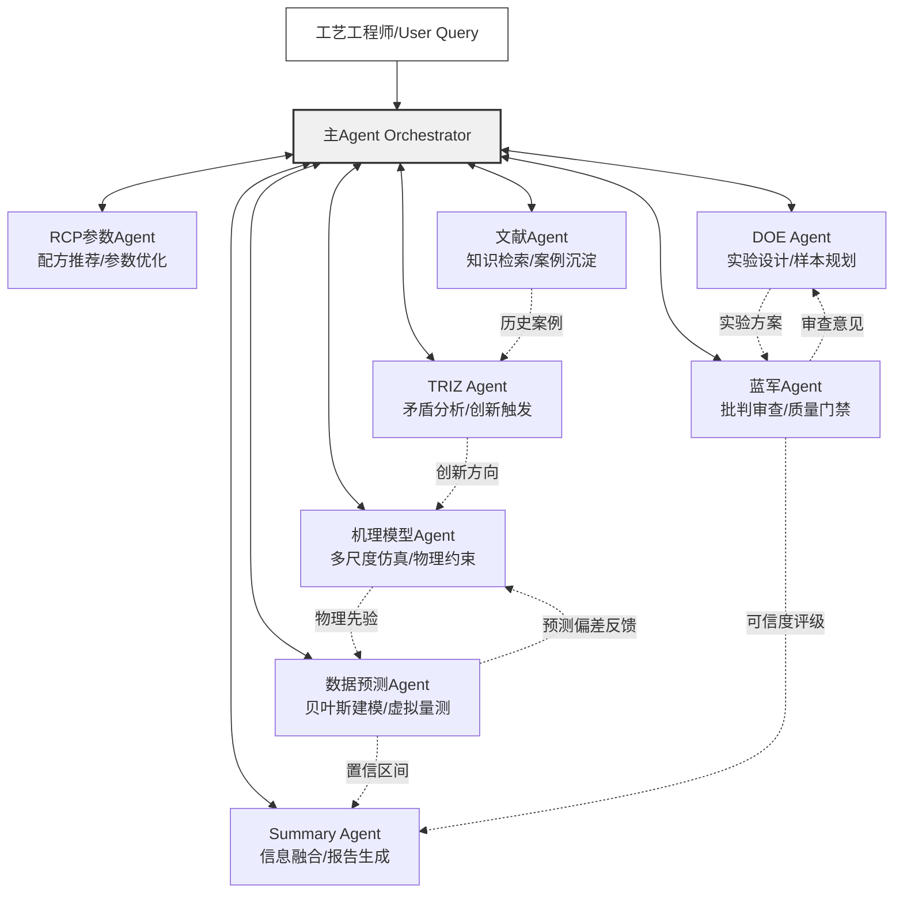

# 1. 引言与系统愿景

## 1.1 背景与问题定义

### 1.1.1 半导体蚀刻工艺面临的核心挑战

半导体蚀刻工艺是集成电路制造中的核心环节，其本质是通过化学反应或物理轰击将晶圆表面的特定材料选择性地移除，以形成精确的图形结构。随着工艺节点进入3 nm及以下，蚀刻工艺面临的技术挑战呈指数级增长。过刻蚀（Over-etching）控制精度要求在亚纳米尺度，极微小的深度偏差即可导致器件电学性能的显著退化[^35^]。负载效应（Loading Effect）以三种形式严重影响工艺均匀性：宏观负载效应（Macro-loading）指不同图形密度区域间的蚀刻速率差异；微观负载效应（Micro-loading）指单个芯片内图形密度变化引起的速率不均；宽高比相关刻蚀（Aspect Ratio Dependent Etching, ARDE）指高深宽比结构中的离子输运受限导致的底部蚀刻速率下降[^30^]。此外，选择比（Selectivity）控制——即在刻蚀目标材料的同时保护掩模和下层材料——随着新材料体系的引入而愈发困难[^35^]。

这些技术挑战的背后，是蚀刻工艺参数空间的高维性与复杂性。Lam Research的归纳表明，先进等离子体蚀刻腔室配备了数十个独立可调节的"旋钮"（knobs），涵盖射频功率系统、气体系统、压力系统、温度系统及电极间距等类别，每个类别内含多个强耦合参数[^35^]。例如射频功率的升高虽可提升蚀刻速率，却同步降低选择比并增加物理损伤风险[^100^]。传统工艺优化依赖工程师经验和单因子实验（One-Factor-At-A-Time, OFAT）方法，但OFAT无法捕捉等离子体与化学过程中固有的多变量交互作用[^214^]，导致开发周期漫长——这一"巨大的工艺空间"直接转化为"漫长的开发周期"[^35^]。

实验成本构成另一重刚性约束。单次蚀刻实验的测试晶圆、耗材和设备机时成本可达数千美元[^167^]，而评估11个工艺参数的全因子设计需2048次运行[^214^]，穷尽式搜索在经济上完全不可行。

### 1.1.3 多智能体方法的价值主张

多智能体系统（Multi-Agent System, MAS）为上述困境提供了新的方法论路径。其核心价值建立在三个支柱之上。第一，专业化分工：各SubAgent聚焦特定能力域并行推进——机理仿真负责物理约束建模、贝叶斯预测负责统计优化、DOE负责实验规划、蓝军负责质量审查——实现问题分解与并行求解。第二，知识整合：通过标准化的消息协议将仿真数据、实验数据、文献知识和经验规则整合到统一决策框架中，弥合传统工艺优化中的知识碎片化问题。第三，迭代加速：贝叶斯优化已证实在5–8次迭代内收敛至合格工艺窗口，减少超过60%的测试晶圆消耗[^96^]；少样本测试时优化框架仅需5次迭代即可生成推荐配方，远低于资深工程师平均所需的84次迭代[^42^]。

## 1.2 架构愿景

### 1.2.1 设计目标

本报告设计一套面向半导体蚀刻工艺的主Agent+8 SubAgent协作系统，参照OpenCode平台的SubAgent设计模式[^294^]，构建集中调度、职责单一、上下文隔离的多智能体架构。

### 1.2.2 架构原则

系统遵循四项架构原则。第一，职责单一：每个SubAgent承担一个明确定义的功能角色——机理模型Agent专注于多尺度仿真建模，RCP参数Agent专注于配方优化，文献Agent专注于知识检索与沉淀，数据预测Agent专注于贝叶斯统计建模，DOE Agent专注于小样本实验设计，蓝军Agent专注于批判性审查与质量门禁，TRIZ Agent专注于创新矛盾分析，Summary Agent专注于信息综合与报告生成。第二，上下文隔离：各SubAgent之间不直接共享状态，所有交互通过主Agent的显式消息传递完成，确保推理可追溯。第三，结果压缩：每个SubAgent输出须经过结构化压缩（关键结论+置信度评分），减少上下文负载。第四，集中调度：主Agent作为唯一编排器（Orchestrator），负责任务分解、Agent调用与结果聚合，参考Critic-Reviewer模式中"生成-评估"协作范式[^261^]。

### 1.2.3 系统整体架构图

下图展示系统整体架构及8个SubAgent的功能定位与协作关系。

架构图中实线表示主Agent的调度指令与SubAgent的结果返回，虚线表示SubAgent间的协作信息流。机理模型Agent与数据预测Agent形成"物理引导的数据驱动"闭环：机理输出作为贝叶斯先验约束，预测偏差反馈用于模型校准。DOE Agent与蓝军Agent形成"设计-审查"闭环，蓝军在方案执行前进行质量门禁而非事后审查。TRIZ Agent作为"战略储备"，在系统陷入局部最优或遇到全新工艺场景时由主Agent激活，结合文献Agent的历史案例进行跨领域类比创新。Summary Agent基于各Agent的可信度评分生成加权综合报告，而非简单拼接文本。第2章至第9章将逐一详述各SubAgent的能力设计。
