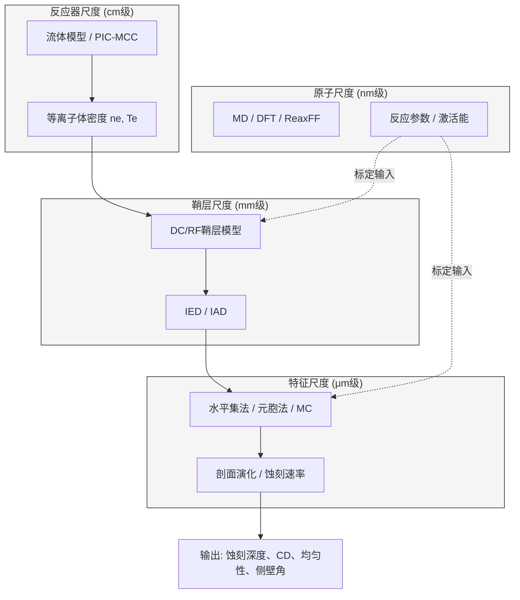

## 2. 机理模型（仿真）SubAgent

机理模型（仿真）SubAgent是蚀刻工艺多智能体系统的物理引擎，承担从第一性原理到工程近似的多尺度建模任务。该Agent的核心价值在于提供物理可解释的先验约束——其蚀刻速率预测、剖面演化轨迹和参数敏感性排序，是数据驱动模型的正则化基础，也是故障诊断中"从现象反推根因"的因果链条载体[^30^]。

### 2.1 技术能力设计

#### 2.1.1 多尺度仿真能力：反应器尺度→鞘层模型→特征尺度→原子尺度

蚀刻工艺仿真依空间尺度划分为四个层次：**反应器尺度**（Reactor Scale, cm级）、**鞘层尺度**（Sheath Scale, mm级）、**特征尺度**（Feature Scale, μm级）和**原子尺度**（Atomistic Scale, nm级）[^30^]。信息从反应器向特征单向流动——反应器尺度的等离子体参数通过鞘层模型传递为离子能量分布函数（Ion Energy Distribution, IED）和离子角度分布（Ion Angular Distribution, IAD），再驱动特征尺度的剖面演化[^30^]。

在**反应器尺度**，Agent根据工艺条件选择策略：常规CCP/ICP刻蚀采用基于连续性方程的**流体模型**，精度±20%，成本适中[^28^]；低压（<10 mTorr）、高电压条件下，粒子可在鞘层获得高达10 keV能量，非局域动理学效应不可忽略，需采用**PIC/MCC**方法[^27^]；介于两者之间时，**混合模型**（电子流体描述、离子粒子描述）可取得平衡，HPEM是其代表[^32^]。

在**鞘层尺度**，Agent支持两级建模：DC鞘层模型描述时间平均离子加速行为；RF鞘层模型考虑射频电场时间变化，关键参数ωτᵢ（射频频率与离子穿越鞘层时间乘积）决定离子能量分布的单峰/多峰结构[^30^]。

在**特征尺度**，**水平集法**将界面嵌入高维函数求解Hamilton-Jacobi方程，消除弦法拓扑奇异性，适合拐角和侧蚀[^158^][^185^]；**元胞自动机法**离散材料域为单元，通过蒙特卡洛追踪粒子入射和原子移除，可直接模拟再沉积和钝化层动力学[^174^][^158^]。GPU并行化实现（如K-SPEED）可将3D特征仿真加速一个数量级[^158^]。

在**原子尺度**，**分子动力学**（MD）模拟粒子轰击表面的微观过程[^128^]；**密度泛函理论**（DFT）计算反应激活能和路径[^131^][^133^]；**ReaxFF**反应力场在量子精度与经典效率间折中[^134^]。

| 仿真层级 | 空间尺度 | 核心方法 | 计算成本 | 典型精度 | 关键输出 |
|:---:|:---:|:---:|:---:|:---:|:---|
| 反应器尺度 | cm级 | 流体模型、PIC-MCC、混合模型 | 中—高 | ±10%—±20% | 等离子体密度、电子温度、电势分布 |
| 鞘层尺度 | mm级 | DC/RF鞘层模型 | 低—中 | ±15% | IED、IAD、鞘层电势降 |
| 特征尺度 | μm级 | 水平集法、元胞法、MC射线追踪 | 中—高 | ±10%—±15% | 剖面演化、CD、侧壁角、底部粗糙度 |
| 原子尺度 | nm级 | MD、DFT、ReaxFF | 很高 | 定性—半定量 | 激活能、反应路径、粘附系数 |

上表反映了精度-成本的根本权衡。Agent根据任务动态选择仿真层级：新工艺窗口探索以流体模型+水平集法的两级级联即可；HARC的bowing/twisting缺陷诊断，则需PIC/MCC+元胞法的全耦合计算链[^27^][^172^]。

#### 2.1.2 表面反应机理建模

表面反应机理决定仿真可信度。**Langmuir-Hinshelwood（L-H）模型**通过覆盖度变量自洽描述吸附-反应-脱附的竞争平衡，是求解返回通量和表面覆盖度的标准框架[^30^]。**离子增强蚀刻模型**将速率分解为化学蚀刻、物理溅射和离子增强蚀刻三部分叠加，其中离子增强蚀刻是各向异性的主要来源[^35^]。**聚合物钝化层动力学**处理氟碳等离子体中聚合物生长与消耗的竞争，SKM可与HPEM自洽耦合，同时模拟等离子体化学和表面化学[^32^]。

#### 2.1.3 负载效应仿真：Macro-loading/Micro-loading/ARDE

负载效应指蚀刻速率随蚀刻面积或结构变化的现象[^132^][^136^]。Agent定量模拟三级效应：**宏观负载效应**（Macro-loading，晶圆尺度）通过反应器尺度连续性方程耦合全局消耗项修正[^136^]；**微观负载效应**（Micro-loading，芯片尺度）耦合连续介质浓度求解器与特征模型，模拟局部图形密度差异导致的反应物非均匀输运[^136^]；**深宽比相关蚀刻**（ARDE）考虑高深宽比结构中离子阴影效应和中性粒子传输限制[^132^]。三级效应在多尺度耦合架构中同时求解，实现综合评估。

#### 2.1.4 代理模型与实时预测：PINN、RNN降阶模型、数字孪生

高保真仿真成本（数小时至数天）与产线实时决策（秒级）的矛盾通过代理模型解决。**物理信息神经网络**（PINNs）将物理约束以偏微分方程残差嵌入损失函数，使模型在稀疏数据下满足守恒定律[^65^]。**RNN降阶模型**基于LSTM/GRU学习蚀刻速率动态响应，TensorFlow代理模型可达RMSE<2 Å/min、R²=0.9966[^63^]，Xiao等人的RNN-ROM结合模型预测控制已获验证[^65^]。**数字孪生集成**方面，TEL的虚拟实验结合ML自动参数拟合大幅减少硅实验次数[^77^][^172^]；Lam Research在特定交接点实现99%情况下AI胜过人类工程师[^70^]。Agent输出代理模型的推理延迟应<100 ms以支持边缘部署[^63^]。

### 2.2 输入输出规范

#### 2.2.1 输入JSON Schema

输入包含工艺-设备-材料-目标完整描述，核心字段包括：`process_type`（CCP/ICP/ECR/RIE）、`etch_material`（Si/SiO₂/Si₃N₄/TiN等）、`gas_chemistry`（进气种类及流量）、`reactor_parameters`（压力、射频功率、偏置功率、温度等）、`feature_geometry`（沟槽宽度、深宽比、图形密度）、`simulation_request`（仿真类型、目标尺度、是否需要代理模型），以及可选的`calibration_data`（实验蚀刻速率、SEM图像等标定数据）。当提供实验数据时，Agent自动执行参数反演，通过贝叶斯优化或系统辨识法调整粘附系数、离子反射比等标定参数[^130^][^183^]。

#### 2.2.2 输出JSON Schema

输出包含六类核心字段：`etch_rate_nm_min`（预测蚀刻速率）；`uniformity`（晶圆内非均匀性1σ、局部CD变化）；`profile_evolution`（最终剖面SVG、侧壁角、bowing深度、底部粗糙度）；`loading_effect`（宏观/微观负载因子、ARDE系数）；`mechanism_analysis`（主导蚀刻机制、钝化层厚度、离子能量分布、表面覆盖度）；`parameter_sensitivity`（各参数敏感性得分排序）。此外包含`recommendations`（工艺建议列表）和`surrogate_model`（代理模型类型、精度指标、推理延迟）。敏感性排序直接服务DOE Agent的因子筛选——高敏感性参数选为主要因子，低敏感性参数固定为默认值以缩减搜索空间。

### 2.3 触发条件与协作关系

#### 2.3.1 触发条件

Agent激活由主Agent动态决策，覆盖四类场景：**新工艺开发请求**（process_type变更或新材料首次出现时，执行全尺度级联仿真，为DOE Agent提供先验）；**故障诊断请求**（产线出现bowing、notching、twisting或均匀性超标时，复现异常剖面并识别主导机制，输出至蓝军Agent交叉验证[^172^]）；**参数敏感性分析需求**（DOE/RCP Agent发起的系统性参数扫描，输出敏感性排序和响应面近似）；**数字孪生构建请求**（批量高保真仿真生成训练数据，训练代理模型后台异步执行）。

#### 2.3.2 上游依赖与下游贡献

| 上游Agent | 提供内容 | 用途 |
|:---|:---|:---|
| 主Agent | 任务指令、优先级、约束条件 | 确定仿真类型、精度等级和时间预算 |
| RCP Agent | 候选工艺参数组合 | 作为仿真输入条件，评估候选参数可行性 |
| 文献Agent | 反应机理、截面数据、先例工艺 | 构建表面反应模型的化学参数基础[^28^] |
| 数据Agent | 实验测量数据（蚀刻速率、均匀性、SEM剖面） | 模型标定与验证的基准数据[^130^] |

| 下游Agent | 提供内容 | 价值 |
|:---|:---|:---|
| 数据Agent | 物理约束先验（PINN损失项、贝叶斯先验分布） | 使数据驱动模型满足物理守恒，提升外推能力[^65^] |
| DOE Agent | 虚拟实验环境、参数敏感性排序 | 将实验搜索空间缩小60%以上[^173^] |
| 蓝军Agent | 可解释性依据（机理分析、参数影响链） | 为审查提供物理因果链替代纯统计论证[^70^] |
| 摘要Agent | 仿真结果、置信度评级 | 支撑最终报告的证据强度标注 |

机理Agent与数据Agent形成互补闭环：机理Agent输出的物理约束作为数据Agent的贝叶斯先验，数据Agent的预测偏差反馈给机理Agent用于校准。这种"物理引导的数据驱动"架构可在小样本条件下达到更优预测精度[^63^][^65^]。

| 工具/平台 | 开发方 | 核心方法 | 适用尺度 | 关键能力 | 技术成熟度 |
|:---|:---|:---|:---:|:---|:---:|
| COMSOL Multiphysics | COMSOL | 流体模型、玻尔兹曼方程 | 反应器/鞘层 | 内置等离子体模块，支持CCP/ICP多物理场耦合[^28^][^79^] | TRL 8-9 |
| ANSYS Fluent | ANSYS | CFD | 反应器 | 气流、热传递、等离子体耦合[^28^] | TRL 8-9 |
| VSim (Vorpal) | Tech-X | PIC/MCC | 反应器/鞘层 | 高非平衡等离子体动理学模拟[^28^] | TRL 6-7 |
| SEMulator3D | Coventor | 元胞/体素法 | 特征尺度 | MultiEtch模块支持多种负载效应同时模拟[^175^] | TRL 8-9 |
| Sentaurus Topography | Synopsys | 水平集/弦法 | 特征尺度 | 离子铣削、反应离子刻蚀等多模块[^169^] | TRL 7-8 |
| ViennaRay | 开源 | 射线追踪/MC | 特征尺度 | 计算粒子入射通量与角分布[^35^] | TRL 6-7 |
| HPEM | 学术研究 | 混合模型 | 反应器 | 等离子体-表面化学自洽耦合[^32^] | TRL 6-7 |
| BOLSIG+/LXCat | 开源 | 玻尔兹曼求解 | — | 电子碰撞截面与输运系数数据库[^28^] | TRL 8-9 |

上表选型遵循任务驱动原则：COMSOL/ANSYS Fluent用于反应器尺度工艺窗口探索，VSim用于低压高非平衡动理学分析；特征尺度上，SEMulator3D在同时模拟三级负载效应方面具独特优势[^175^]，Sentaurus Topography在传统RIE模块上更成熟[^169^]。Agent技术栈应支持上述工具无缝调用，输出统一转换为标准化JSON，使下游Agent无需关心底层仿真工具差异。
