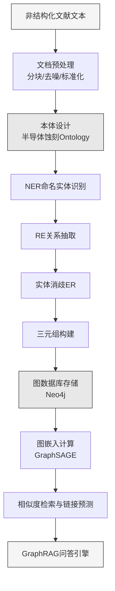

## 4. 文献SubAgent

文献SubAgent是半导体蚀刻工艺多智能体系统中负责外部知识获取与管理的专用模块。其核心定位是填补系统知识边界——当内部知识库（设备RCP规则库、历史实验数据）无法覆盖新工艺场景时，通过多源文献检索、知识抽取与结构化、相似场景匹配及知识图谱构建四项能力，引入经过同行评审的科学知识[^17^]。从架构视角审视，文献SubAgent同时承担"知识入口"与"长期记忆"的双重角色：前者在冷启动阶段为其他Agent提供先验约束以缩小搜索空间，后者将每次成功优化案例沉淀为可复用的工艺智力资产[^120^]。

### 4.1 技术能力设计

#### 4.1.1 多源文献检索

检索能力覆盖学术文献与专利数据两大类。学术侧对接IEEE Xplore、ScienceDirect、Springer Link、SPIE Digital Library及ArXiv五个核心数据库。IEEE Xplore收录的IEEE Transactions on Semiconductor Manufacturing是半导体制造与等离子体刻蚀领域的权威来源[^23^]；ScienceDirect旗下的Journal of Vacuum Science & Technology覆盖了Bosch工艺与DRIE的基础机制研究[^22^]；ArXiv作为预印本服务器承载AI/ML在半导体工艺优化中的前沿探索[^23^]。专利侧通过KIPRIS（已收录3569件以上半导体AI技术相关专利[^116^]）、USPTO PatFT及EPO Espacenet三通道获取情报，为工艺监控技术的创新趋势分析提供知识产权维度的支撑。

**表1 文献数据库覆盖范围与检索特性对比**

| 数据库 | 文献类型 | 核心覆盖领域 | 预估收录量 | 检索方式 | 更新频率 |
|--------|---------|------------|----------|---------|---------|
| IEEE Xplore | 期刊/会议 | 半导体制造、等离子体科学 | 2000+篇 | API+关键词 | 周更新 |
| ScienceDirect | 期刊 | 真空科学、电化学刻蚀 | 3500+篇 | API+语义检索 | 日更新 |
| Springer Link | 期刊/书籍 | 神经计算、工艺优化 | 800+篇 | API+关键词 | 月更新 |
| SPIE Digital Library | 会议论文 | 光刻与刻蚀工艺 | 1500+篇 | API+全文检索 | 季更新 |
| ArXiv | 预印本 | AI/ML工艺优化前沿 | 200+篇 | API+RSS订阅 | 日更新 |
| KIPRIS | 专利 | 半导体AI技术专利 | 3569+件[^116^] | Web接口 | 周更新 |
| USPTO PatFT | 专利 | 美国刻蚀专利 | 12000+件 | Web接口 | 周更新 |
| EPO Espacenet | 专利 | 欧洲刻蚀专利 | 8000+件 | API+关键词 | 周更新 |

上表反映出各数据库在覆盖深度与更新频率上呈明显互补态势。检索策略据此设计为三层递进架构：语义检索层使用Specter2[^106^]或all-MiniLM-L6-v2嵌入模型将查询转化为768维向量，通过HNSW（Hierarchical Navigable Small World）近似最近邻算法检索语义相近文献[^80^]；关键词检索层基于BM25算法实现精确匹配，弥补语义检索在特定术语识别上的不足[^151^]；引文扩展层以种子文献为起点沿引用网络外扩两层，捕获语义检索可能遗漏的经典文献。三层架构在精确度与召回率之间形成互补——语义检索捕获意图相关但用词不同的文献，关键词检索确保关键术语精确命中，引文扩展则突破语义空间的边界限制。

#### 4.1.2 知识抽取与结构化

从PDF或原始文本提取可计算知识是文献SubAgent的核心处理环节，采用NER（命名实体识别）与RE（关系抽取）联合执行架构。目标实体类别包括材料（Si、SiO₂、GaN、Al₂O₃等）、工艺参数（RF功率、偏置电压、腔室压力、气体流量）、设备（ICP-RIE、DRIE、PECVD等）及性能指标（刻蚀速率、选择性、各向异性度、均匀性等）[^81^][^85^]。关系类型覆盖因果关系（"RF功率增加→刻蚀速率提升"）、条件关系（"在X气体配比下→获得Y选择性"）及组成关系（"Bosch工艺→刻蚀与钝化步骤交替"）。

**表2 知识抽取工具技术特性与适用场景对比**

| 工具/模型 | 技术路线 | NER精度 | 关系抽取 | 零样本能力 | 适用场景 | 主要局限 |
|----------|---------|--------|---------|----------|---------|---------|
| ChemDataExtractor | 规则匹配 | 高（规则覆盖时） | 有限 | 无 | 化学式、材料属性 | 规则编写耗时 |
| MatSciBERT | 领域预训练BERT | 中-高 | 中 | 低 | 材料文本分类与NER | 需微调 |
| BERT-PSIE | NER+RC Pipeline | 中 | 中 | 低 | 结构化信息抽取 | 需标注数据 |
| ChatExtract (GPT-4) | 提示工程 | 高 | 高 | 高 | 零样本灵活抽取 | 上下文长度有限 |
| LangChain RAG | 检索增强 | 40-50% P[^90^] | 中 | 中 | 大文档集提取 | Recall约20%[^90^] |
| Bi-GRU-GNN-CRF | 联合抽取 | 中-高 | 高 | 低 | KG批量构建 | 覆盖率80%[^198^] |

工具选型基于文献类型与精度需求动态匹配。ChatExtract（基于GPT-4）在综合评估中表现最优，Null-Precision超94%[^90^]，作为默认引擎处理非结构化摘要与全文。ChemDataExtractor作为规则引擎补充处理化学式等高度结构化内容。Bi-GRU-GNN-CRF联合抽取方法在批量三元组生成中知识覆盖率达80%[^198^]。抽取结果以结构化JSON输出，兼容DOE数据格式，下游DOE Agent可直接复用参数表进行实验设计[^192^]。

#### 4.1.3 相似场景匹配

面对新工艺材料或设备配置时，文献SubAgent通过CBR（Case-Based Reasoning）框架实现跨场景类比，遵循4R流程：Retrieve→Reuse→Revise→Retain[^111^]。Retrieve阶段采用多属性加权相似度模型：

$$K_s = a_{ml} \cdot k_{ml} + a_{mf} \cdot k_{mf} + a_{af} \cdot k_{af}$$

其中 $k_{ml}$、$k_{mf}$、$k_{af}$ 分别为材料类型、工艺方法、设备特征的匹配度，$a$ 为通过AHP（层次分析法）确定的权重系数[^114^]。最近邻法支持数值型参数的区间距离计算与分类型属性的模糊匹配[^111^]。图嵌入层采用sGEM（Siamese Graph Embedding Model）将工艺表示为语义图，通过孪生神经网络学习低维嵌入并以余弦相似度比较[^210^]，可捕获RF功率与气体流量耦合等隐式关联；GraphSAGE与Node2Vec用于知识图谱节点嵌入，结合向量检索与图拓扑推理提升跨文档召回率[^88^]。

#### 4.1.4 知识图谱构建

知识管理能力采用分阶段演进架构：第一阶段部署基线RAG，通过文档分块、向量化与相似度检索实现问答[^17^]；第二阶段升级至GraphRAG，构建半导体蚀刻领域知识图谱实现跨文档复杂推理。

半导体蚀刻本体涵盖四大概念域：材料域（衬底、掩模、气体前驱体）、工艺域（干法/湿法/等离子体刻蚀子类）、设备域（型号与配置参数）及性能域（刻蚀速率、选择性、各向异性度、均匀性）。本体设计参考半导体供应链知识图谱实践[^110^]与材料知识图谱（MKG）从15万篇论文中抽取的三元组模式[^145^]。GraphRAG相比基线RAG的核心优势在于"连接散点"能力——通过图遍历整合分散在多文献中的关联信息，回答需综合多源的复杂问题[^148^][^153^]。实证研究中GraphRAG的BERTScore与F1-score均显著优于VectorRAG基线[^110^]。

### 4.2 输入输出规范

#### 4.2.1 输入JSON Schema

输入由主Agent发起，包含四个核心字段。`query_type`枚举四种任务类型：similar_case_search（相似案例检索）、knowledge_extraction（知识抽取）、literature_synthesis（文献综合）、parameter_lookup（参数查询）。`process_description`定义蚀刻类型、材料系统、目标结构与设备信息。`parameters`包含输入参数（RF功率、偏置电压、压力、气体流量、温度）与输出要求（刻蚀速率、选择性、各向异性度、均匀性）的数值或区间描述[^192^]。`constraints`设置相似度阈值（默认0.7，基于Specter2实验数据[^106^]）、时间范围与期刊偏好。`context_from_other_agents`承载诊断Agent根因分析与设备Agent规格信息，用于检索关键词的语义扩展。

#### 4.2.2 输出JSON Schema

输出包含四个模块。`similar_cases`为匹配文献列表，每篇含相似度评分、匹配维度与结构化抽取知识。`knowledge_graph_insights`提供图谱推理结果与语义路径，使机理Agent可理解反应机理的上下文关联。`literature_summary`生成针对当前工艺问题的综述段落，标识研究空白与可操作建议[^108^]。`metadata`记录检索范围、筛选量与置信度等级。设计遵循"结果压缩"原则——仅返回最相关结构化发现而非完整中间过程[^149^]。

### 4.3 触发条件与协作关系

#### 4.3.1 触发条件

文献SubAgent采用"按需激活"策略。三类核心场景：**新工艺材料冷启动**，目标材料无历史记录时自动激活，判断逻辑`IF material NOT IN internal_kb THEN trigger`，对应内部知识边界扩展需求[^17^]；**跨领域类比需求**，系统需跨领域类比时激活，与TRIZ Agent创新触发关联，提供异质领域案例作为类比源[^120^]；**知识沉淀更新**，成功实验后将参数组合与解决过程结构化入库，条件`IF doe.status == success AND new_knowledge THEN trigger`，将文献Agent从被动查询工具升级为主动知识积累引擎[^152^]。

#### 4.3.2 上游依赖

上游输入来自主Agent任务指令与DOE Agent实验结果。文献SubAgent与诊断Agent、设备Agent形成并行协作——文献Agent检索类似设备工艺文献，设备Agent同步查询规格手册，结果在主Agent处聚合为完整方案[^120^]。主Agent据问题特征动态调度：新工艺开发优先文献Agent，性能提升优先数据Agent与TRIZ Agent[^151^]。

#### 4.3.3 下游贡献

输出流向三个下游Agent。**机理Agent**获反应机理参考，包括从QDB（Quantemol Database）提取的等离子体化学反应数据，可直接改进化学动力学模型[^20^]。**TRIZ Agent**获跨领域创新案例，当系统陷入局部最优时提供太阳能电池刻蚀、MEMS释放工艺等异质领域方案，协同产生跳出局部最优的创造性扰动。**Summary Agent**获引用支撑与证据强度标注，每条建议按文献引用数量、方法论质量与实验可复现性评估为高/中/低置信度，冲突观点以多方论证呈现[^108^]。

文献SubAgent遵循上下文隔离与无状态设计原则，每次调用独立执行，工作细节不污染主Agent上下文，确保系统在200,000 token以上长对话中维持研究计划的完整性[^149^][^152^]。
