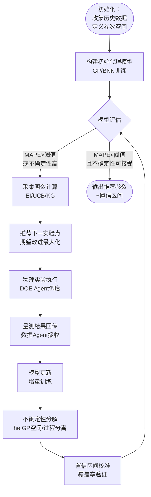

## 5. 数据（贝叶斯等预测方法）SubAgent

### 5.1 技术能力设计

数据预测SubAgent承担多智能体系统中的"统计推断引擎"角色，围绕贝叶斯统计框架构建，集成深度学习时序建模与小样本自适应方法，形成从虚拟量测、参数优化到跨腔室迁移的完整能力闭环。

#### 5.1.1 概率预测引擎

概率预测引擎的关键设计原则是：任何预测输出均须附带定量化不确定性估计，以支持下游Agent的风险感知决策。

**高斯过程回归（Gaussian Process Regression, GPR）蚀刻速率预测**。GPR是小样本条件下的基准预测模型，可提供概率化的预测分布。Lynn等（2012）首次将GPR应用于半导体蚀刻虚拟量测（Virtual Metrology, VM），滑动窗口GPR模型实现约1.15%的MAPE [^56^]。Wan和McLoone（2018）将GPR与Run-to-Run控制集成，利用预测方差动态调整EWMA控制器权重，显著提升控制鲁棒性 [^113^][^114^]。在多智能体系统中，GPR代理模型同时充当机理仿真Agent的快速替代模型（surrogate model），在毫秒级返回预测结果以支撑实时决策。

**贝叶斯神经网络（Bayesian Neural Network, BNN）不确定性量化**。BNN通过MC Dropout技术在推理阶段执行多次随机前向传递，区分偶然不确定性（aleatoric uncertainty，源于数据噪声）与认知不确定性（epistemic uncertainty，源于数据稀疏）。Kim等（2025）的验证表明，68.25%样本落在$\pm 1\sigma$内，23.81%在$\pm 2\sigma$内，仅7.94%超出$2\sigma$边界，置信区间校准度良好 [^95^]。

**异方差高斯过程（heteroscedastic Gaussian Process, hetGP）空间变异性分离**。传统GP假设全局同方差噪声，难以处理等离子体蚀刻中的复杂不确定性结构。Kim等（2025）的hetGP框架分别量化：(a) 晶圆表面空间变异性（spatial variability）；(b) 过程相关不确定性（源于腔室压力、气体流量和RF功率的波动）[^92^]。该分解使工程师可针对性地调整硬件配置或参数设定，而非笼统扩大工艺窗口。

#### 5.1.2 贝叶斯优化能力

贝叶斯优化（Bayesian Optimization, BO）通过代理模型与采集函数的迭代循环，在探索（exploration，采样高不确定性区域）与利用（exploitation，在已知最优区域精细搜索）之间动态权衡 [^96^][^125^]。

**工艺参数单目标优化**。新设备上线场景中，BO将调参建模为黑盒优化，通常5–8次迭代收敛，测试晶圆消耗减少60%以上 [^96^]。采集函数支持EI、UCB和KG，Agent可根据阶段自适应切换。

**多目标协同优化与Pareto前沿**。Hu等（2025）提出的物理信息贝叶斯优化（PIBO）框架将源功率与压力对工艺指标的定性物理关系作为先验整合到GP回归中，克服外推退化 [^44^]。PIBO输出Pareto前沿为RCP Agent提供参数权衡空间。

| 技术方法 | 小样本适配性 | 不确定性量化 | 计算效率 | 可解释性 | 推荐应用场景 |
|:---|:---|:---|:---|:---|:---|
| GPR/BO | ★★★★★ | ★★★★★ | ★★★☆☆ | ★★★★☆ | <50样本，需置信区间 |
| BNN | ★★★★☆ | ★★★★★ | ★★☆☆☆ | ★★☆☆☆ | 需区分偶然/认知不确定性 |
| hetGP | ★★★★☆ | ★★★★★ | ★★☆☆☆ | ★★★☆☆ | 复杂异方差噪声结构 |
| CRNN/LSTM | ★★☆☆☆ | ★★☆☆☆ | ★★★★☆ | ★★☆☆☆ | 大规模时序传感器数据 |
| 迁移学习 | ★★★★★ | ★★★☆☆ | ★★★★☆ | ★★★☆☆ | 跨腔室/跨工序适配 |

上表显示GPR/BO在小样本和不确定性量化维度表现突出，是Agent首选基础模型；BNN适合离线深度分析；hetGP专长于空间与过程不确定性的分离；CRNN/LSTM在实时虚拟量测中不可或缺；迁移学习（如CECCA）可将跨腔室重新训练需求降至最低。Agent应根据数据量、任务类型和实时性要求动态选择模型。

#### 5.1.3 小样本学习方法

新配方开发初期往往仅有十余组实验记录，Agent集成三类小样本方法确保数据稀疏条件下的有效预测。

**少样本测试时优化（FSTTO）与模型反馈学习（MFL）**。FSTTO通过迭代优化轻量级反向模型，实现无需重新训练的少样本配方生成。MFL仅需5次迭代即可生成合格配方，显著少于传统BO（≥20次）和高级工程师手动调参（平均84次）[^42^][^141^]。当DOE Agent确认历史数据少于20条时，自动触发FSTTO/MFL路径。

**元学习贝叶斯优化（MetaBO）**。MetaBO利用历史任务数据训练神经采集函数（Neural Acquisition Function, NAF），结合粒子群优化（PSO）的混合方法在实际半导体CVD工艺中表现最优 [^99^]。当系统积累5个以上相似工艺任务时，MetaBO将冷启动效率提升30%–50%。

**对比熵条件腔室适配（CECCA）**。CECCA通过对抗学习对齐源腔室与目标腔室的潜在表示域，解决"腔室到腔室变异"（chamber-to-chamber variation）问题 [^158^]。当预测漂移超过阈值时，CECCA仅需20–50条目标腔室标定数据即可完成适配。

| 方法 | 核心机制 | 迭代/数据需求 | 典型加速比 | 适用条件 |
|:---|:---|:---|:---|:---|
| FSTTO/MFL | 轻量级反向模型迭代优化 | 5次迭代 | vs.BO 4× | <10条历史数据 |
| MetaBO+PSO | 神经采集函数+跨任务元学习 | ≥5个历史任务 | 冷启动+30%–50% | 有相似任务积累 |
| CECCA | 对抗域自适应对齐腔室分布 | 20–50条标定数据 | 减少重复实验80%+ | 跨腔室迁移 |
| 标准BO | GP代理+EI/UCB采集函数 | 5–8次迭代 | vs.网格搜索10×+ | ≥10条初始数据 |
| QKAR（量子核回归） | 量子态特征映射 | ~159个样本 | 优于7种经典ML | 量子硬件可用（中期储备）|

FSTTO/MFL在<10条数据时效率最优；MetaBO适用于多任务环境；CECCA专攻腔室变异 [^158^]；标准BO在≥10条数据时最可靠。QKAR在GaN HEMT建模中优于7种经典算法 [^46^]，但依赖量子硬件成熟，属中期储备。

#### 5.1.4 虚拟量测集成

虚拟量测（Virtual Metrology, VM）通过计算模型估计关键晶圆特性，整合OES/PIM等原位传感器信息与历史工艺数据，以非侵入方式减少晶圆报废并改善工艺控制 [^48^][^56^]。

**OES/PIM多源传感器数据融合**。融合工艺配方数据与OES原位数据的VM模型准确度比单一数据源提高56% [^129^]。Agent接收OES光谱（426–777 nm范围）、PIM阻抗参数及腔室环境参数，执行时间对齐与PCA降维。

**时序预测与实时蚀刻深度预测**。LSTM网络支持异常检测与VM预测的联合学习 [^134^][^144^]；Time-LLM框架可从多通道传感器时序预测89个晶圆位置的蚀刻深度分布，实现"面预测" [^91^]。实时预测流程中，BNN经50次MC Dropout前向传递生成预测分布，覆盖分析后将深度估计值及$\pm 2\sigma$置信区间推送至监控Agent [^95^]。

### 5.2 输入输出规范

#### 5.2.1 输入JSON Schema

Agent接收四类输入：(1) **历史实验数据**，含工艺参数向量与量测结果（蚀刻速率、深度、CD、粗糙度Ra）；(2) **传感器时序数据**，OES光谱与PIM阻抗序列，要求时间戳对齐且采样率≥10 Hz；(3) **目标指标与约束**，含多目标函数、权重（$\sum w_i = 1.0$）及参数边界；(4) **物理先验知识**，来自机理Agent的定性约束，用于PIBO先验注入。

#### 5.2.2 输出JSON Schema

输出包含四个核心组件：(1) **预测值+置信区间**，以均值$\pm$标准差呈现，标注不确定性类型（偶然/认知）；(2) **优化推荐参数**，含期望改进最大的下一组参数；(3) **Pareto前沿**，多目标优化时输出非支配解集合；(4) **不确定性分解报告**，hetGP输出时包含空间与过程不确定性的分项量化。模型诊断元数据包括拟合优度（$R^2$、RMSE、MAPE）、置信区间校准度（95%/68%覆盖率）、特征重要性（SHAP值）及模型漂移预警。

### 5.3 触发条件与协作关系

#### 5.3.1 触发条件

Agent激活遵循三类条件。**数据驱动自动触发**：收到新实验数据（≥1条）时自动更新模型；实时传感器数据流到达时触发VM预测；模型不确定性超过阈值（平均$\sigma > 10\%$目标值）时触发采集函数计算 [^96^]。**场景化手动触发**：工程师可请求参数优化、结果预测、不确定性分析或跨腔室迁移。**周期性触发**：每日模型健康检查，每周完整重训练。

小样本判定逻辑：历史数据<20条且为新配方开发时，自动切换至FSTTO/MFL或MetaBO路径 [^42^]。

#### 5.3.2 上游依赖

**DOE Agent的实验数据**是最核心的训练数据来源，每次物理实验完成后推送参数-结果对驱动代理模型更新。**机理Agent的物理先验**（如功率与蚀刻速率关系）作为PIBO框架的先验知识注入GPR，克服纯数据驱动方法的外推退化 [^44^]。**文献Agent**提供相似任务的模型配置参考。上游数据缺失时，Agent输出`data_insufficient`状态码并回退至宽置信区间模式。

#### 5.3.3 下游贡献

Agent产出流向三个方向：**为RCP Agent提供参数推荐**，含最优参数组合、Pareto前沿及预期改进幅度；**为DOE Agent推荐下一实验点**，基于采集函数计算全局最优采样位置，是迭代闭环的关键环节 [^96^]；**为蓝军Agent提供预测置信度**，所有输出附带校准置信区间，蓝军据此评估可信度并触发深度审查 [^95^]。在并行协作中，数据Agent的GPR代理与机理Agent的物理仿真同时运行、相互验证——GPR提供毫秒级快速预测，物理仿真提供高保真精确结果，偏差触发模型校准 [^58^]。

上图展示贝叶斯优化迭代流程的完整闭环。流程从历史数据收集与参数空间定义起始，Agent构建初始GP代理模型并通过MAPE和不确定性指标评估。当精度未达标或不确定性过高时，采集函数计算期望改进最大的实验参数，经DOE Agent调度执行后量测结果回传用于模型更新。hetGP同步执行不确定性分解，将总不确定性拆分为空间变异性和过程相关不确定性，并通过覆盖率验证确保校准度。该循环通常5–8轮收敛 [^96^]。
