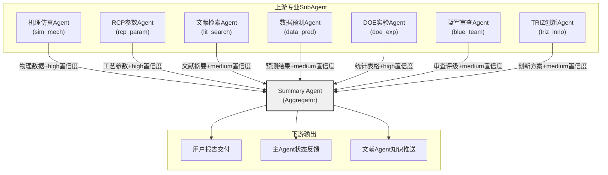

## 9. Summary（信息综合和总结）SubAgent

### 9.1 技术能力设计

#### 9.1.1 多源信息融合：三层分层融合架构

Summary SubAgent在半导体蚀刻多智能体系统中承担Aggregator（聚合者）职能，其核心技术挑战在于如何有效融合来自7个专业SubAgent的异构信息。这些信息在置信度、粒度和表达形式上存在本质差异——从DOE实验Agent的结构化统计表格到TRIZ创新Agent的定性方案描述，从机理仿真Agent的高置信度物理数据到文献Agent的中等置信度技术摘要[^266^]。

为此，Summary SubAgent采用**三层分层融合架构（Data-Level → Feature-Level → Decision-Level Fusion）**，该架构起源于Bar-Shalom提出的概率数据互联滤波器理论[^266^]，经适配后用于多Agent信息融合场景。

**表1：信息融合层次架构**

| 融合层级 | 处理对象 | 核心技术 | 输入来源 | 输出形式 | 置信度处理 |
|:---|:---|:---|:---|:---|:---|
| 数据层融合 | 结构化数值数据（工艺参数、仿真结果、统计指标） | 加权平均、卡尔曼滤波、自适应加权 | DOE实验Agent、RCP参数Agent、机理仿真Agent | 归一化数值向量 | 直接继承原始置信度标记 |
| 特征层融合 | 半结构化信息（文献摘要、技术洞察、趋势分析） | 语义对齐、DPP（Determinantal Point Processes）内容选择[^262^]、向量嵌入 | 文献Agent、数据预测Agent、领域知识Agent | 特征向量+重要性排序 | 基于引用支撑度重新评估 |
| 决策层融合 | 定性判断（创新方案、批判评估、综合建议） | D-S证据理论、MetaCrit五步综合法[^299^]、共识构建 | TRIZ创新Agent、蓝军Agent、所有Agent的结论项 | 结构化决策报告 | 蓝军审查评级加权调整 |

数据层融合面向具有明确物理量纲的工艺参数，如蚀刻速率（etch rate）、选择比（selectivity）和均匀性（uniformity）等数值指标。该层采用联邦滤波（Federal Filtering, FF）策略[^266^]，当某一Agent输出异常时可自动隔离故障源，避免污染整体融合结果。特征层融合处理文献摘要和技术洞察等半结构化文本，采用内容选择策略将文档集合缩减为原子关键点，再利用DPP算法实现多样化内容选取[^262^]。决策层融合处于架构顶层，负责调和定性判断间的冲突，其技术核心为MetaCrit五步综合法：共识识别（Collect Consensus）→冲突调和（Reconcile Conflicts）→独特信息提取（Gather Unique Facts）→综合集成（Merge）→终稿生成（Produce Final Answer）[^299^]。

三层架构的执行顺序遵循自下而上的原则，但并非严格串行：数据层和特征层的处理可在各Agent输出到达时异步启动，决策层则须等待前两层完成且所有上游Agent输出就绪后方可触发。这种设计平衡了实时性与融合质量——低层融合提供快速响应能力，高层融合保障综合判断的完备性。

#### 9.1.2 可信度加权报告生成

Summary SubAgent的报告生成机制区别于简单的文本拼接，其采用**可信度加权综合策略**，该策略源于洞察5提出的"证据强度"标注理念，融合三个维度的可信度信号[^5^]。

**第一维度为预测置信区间加权。**数据预测Agent输出的每个预测值均附带有置信区间（Confidence Interval），Summary SubAgent将该区间的宽度转换为权重因子：区间越窄表明模型确定性越高，对应权重越大。设预测值$p_i$的95%置信区间为$[L_i, U_i]$，则其权重系数$w_i^{pred}$定义为：

$$w_i^{pred} = \frac{1}{1 + \ln(1 + \frac{U_i - L_i}{|p_i|})}$$

该公式确保相对误差较小的预测获得更高权重，同时通过$\ln$函数抑制极端值的影响。

**第二维度为蓝军审查评级融合。**蓝军Agent对各项建议和结论进行独立审查，输出"通过/有条件通过/不通过"三级评级。该评级映射为权重修正因子$\alpha_i^{blue} \in \{1.0, 0.6, 0.2\}$，直接乘以对应信息项的基础权重[^3^]。这一设计体现了洞察3所述的蓝军"质量门禁"定位——蓝军的审查结果不仅影响单项建议的可信度，还通过级联效应影响整体报告的可靠性评级。

**第三维度为引用支撑度评估。**文献Agent提供的每条引用均标注来源类型（学术论文/技术报告/行业博客）和发表年份。Summary SubAgent基于来源权威性（T1源权重0.3、T2源权重0.15）和时效性（近2年权重1.0、2-5年权重0.7、5年以上权重0.4）计算引用支撑度得分$w_i^{cite}$，该得分作为对应结论的附加可信度信号。

三项信号经归一化后合成为综合可信度评分$W_i = \text{normalize}(w_i^{pred} \cdot \alpha_i^{blue} \cdot w_i^{cite})$，最终报告中每条关键发现均标注该评分的离散化等级——高（$W_i \geq 0.7$）、中（$0.3 \leq W_i < 0.7$）、低（$W_i < 0.3$）。

#### 9.1.3 冲突解决与决策支持

多Agent系统在信息丰富的同时必然伴随观点冲突。Summary SubAgent的冲突处理机制参考Madam-RAG框架[^338^]，采用"辩论-综合"模式：当检测到两个及以上Agent的结论存在矛盾时，系统不立即进行裁决，而是将冲突观点并列呈现，并标注各方所持证据的强度等级。

冲突检测的触发条件包括：（1）数值型结论的偏差超过预设阈值（如参数建议值差异>10%）；（2）定性判断的语义对立（如"应增加功率"与"应降低功率"）；（3）蓝军Agent主动报告的系统性矛盾[^338^]。

对于可调和冲突，Summary SubAgent启动MetaCrit框架的第二步"冲突调和"流程，尝试通过补充上下文信息或引入第三方Agent（如领域知识Agent）的约束条件达成折中方案。对于不可调和冲突，系统采用**多方呈现（Multi-perspective Presentation）**策略：在报告中同时列出各方观点，标注各自的证据强度和适用边界条件，并设置"需人工裁决"标记[^299^]。

报告输出采用**双格式架构**：Executive Summary（执行摘要，200-300字）面向工艺管理层，聚焦核心结论、关键建议和风险提示；Detailed Analysis（详细分析，1000-1500字）面向工艺工程师，提供完整的多维度分析、交叉验证过程和技术附录[^303^]。两格式独立生成以避免单请求超时——先调用LLM生成Executive Summary，再基于该摘要的语义框架展开Detailed Analysis，这种分阶段生成策略参考了NVIDIA报告生成Agent的实现模式[^314^]。

#### 9.1.4 知识沉淀与持续学习

Summary SubAgent的每次综合过程均产生可复用的工艺知识。系统通过**成功案例自动归档**机制，将经蓝军审查通过且在实际工艺中验证有效的参数组合、问题解决方案和决策路径存入工艺知识库。归档内容包含原始查询、各Agent贡献摘要、最终综合结论以及验证结果（如蚀刻均匀性改善百分比），形成完整的决策追溯链。

知识沉淀功能与文献Agent协作实现闭环：Summary SubAgent识别出的新知识（如"某参数组合在3nm节点取得>95%均匀性"）经格式化后推送至文献Agent，由其更新知识图谱和语义索引[^6^]。同时，系统维护**历史决策追溯**索引，支持按工艺节点（node）、材料类型、问题类别等维度检索过往决策案例，为相似问题的快速响应提供参考。

### 9.2 输入输出规范

#### 9.2.1 输入JSON Schema

Summary SubAgent的输入为所有上游SubAgent完成各自任务后的结构化输出，外加用户原始查询和系统运行上下文。输入Schema采用统一信封格式：

```json
{
  "session_id": "会话唯一标识",
  "user_query": "用户原始查询文本",
  "system_context": {"node": "工艺节点", "material": "材料类型", "priority": "优先级"},
  "agent_outputs": [
    {
      "agent_id": "agent唯一标识符",
      "agent_name": "Agent名称",
      "task_type": "任务类型",
      "timestamp": "ISO格式时间戳",
      "confidence_level": "high|medium|low",
      "output_summary": {
        "key_findings": ["核心发现列表"],
        "conclusions": "主要结论文本",
        "recommendations": ["建议列表"]
      },
      "detailed_output": "详细输出（支持Markdown）",
      "supporting_data": {"tables": [], "figures": [], "parameters": {}},
      "uncertainties": ["不确定性声明列表"],
      "references": ["引用文献列表"],
      "conflicts_with": {"agent_id": "", "conflict_description": "", "resolution_suggestion": ""}
    }
  ],
  "trigger_type": "auto_complete|timeout|manual|revision"
}
```

上游7个SubAgent的输出分别通过`agent_id`字段标识：机理仿真（`sim_mech`）、RCP参数（`rcp_param`）、文献检索（`lit_search`）、数据预测（`data_pred`）、DOE实验（`doe_exp`）、蓝军审查（`blue_team`）、TRIZ创新（`triz_inno`）。每个Agent的`confidence_level`字段直接影响9.1.2节所述的可信度加权计算。

#### 9.2.2 输出JSON Schema

```json
{
  "report_id": "报告唯一标识",
  "generated_at": "ISO格式时间戳",
  "report": {
    "executive_summary": {"key_findings": [], "prioritized_recommendations": [], "risk_warnings": []},
    "detailed_analysis": {"per_agent_sections": {}, "cross_validation": {}, "conflicts": []},
    "decision_recommendations": {"parameters": [], "next_experiments": [], "risk_mitigation": []}
  },
  "credibility_annotation": {"overall_score": 0.0, "per_finding_scores": {}},
  "action_items": [{"item": "", "priority": "", "owner": "", "due": ""}],
  "knowledge_deposit": {"new_findings": [], "suggested_kg_updates": []},
  "meta_info": {"agent_contributions": {}, "conflict_log": [], "unresolved_issues": []}
}
```

**表2：输出格式模板**

| 字段 | 类型 | 说明 | 生成方式 | 必填 |
|:---|:---|:---|:---|:---|
| `report.executive_summary` | Object | 执行摘要（200-300字），含核心发现、优先建议、风险提示 | 独立LLM调用，温度参数0.3 | 是 |
| `report.detailed_analysis.per_agent_sections` | Object | 各Agent贡献综述（7个子节） | Map-Reduce管线分节生成[^315^] | 是 |
| `report.detailed_analysis.cross_validation` | Object | 共识发现、冲突识别、不确定性声明 | 三层融合架构自动产出 | 是 |
| `report.decision_recommendations` | Object | 参数建议、后续实验方向、风险缓解措施 | 基于加权可信度排序 | 是 |
| `credibility_annotation` | Object | 整体可信度评分（0-1）及各发现评分 | 三维度加权公式计算 | 是 |
| `action_items` | Array | 行动项清单（含优先级、负责人、截止时间） | 从recommendations自动提取 | 否 |
| `knowledge_deposit` | Object | 新知识发现及知识图谱更新建议 | 与文献Agent协作生成 | 否 |
| `meta_info.agent_contributions` | Object | 各Agent贡献度统计 | 基于引用频次和权重计算 | 是 |
| `meta_info.conflict_log` | Array | 冲突日志（含解决状态） | 冲突检测模块自动记录 | 是 |
| `meta_info.unresolved_issues` | Array | 未解决问题列表（需人工裁决） | 不可调和冲突项收集 | 是 |

输出模板的设计遵循决策支持系统的信息呈现原则：数据须转化为可操作的洞察（actionable information），采用KPI指标衡量整体性能，并提供从概览到细节的钻取能力[^302^]。`action_items`字段将分析结论直接转化为可执行任务，缩短从报告到行动的决策链路。`credibility_annotation`字段则体现可信度加权报告生成的核心理念——每条建议不再仅是观点陈述，而是附带量化可靠性评级的证据驱动结论[^5^]。`knowledge_deposit`字段虽未标记为必填，但在周期性知识沉淀触发时自动生成，支撑系统的持续学习能力。

### 9.3 触发条件与协作关系

#### 9.3.1 触发条件

Summary SubAgent的触发条件分为三类。**第一类为自动触发**：当所有7个上游SubAgent均返回输出后，主Agent向Summary SubAgent发送`auto_complete`触发信号。该模式为最常规的工作流程，对应Google多Agent设计模式中的Parallel Fan-out/Gather模式[^294^]。**第二类为超时触发**：若预设等待时间（默认10分钟）内仍有Agent未返回，Summary SubAgent基于已收集的输出启动"降级综合"——缺失Agent的信息被标注为"数据缺失"，其余Agent输出按正常流程融合[^266^]。**第三类为手动触发**，包括用户直接请求最终报告、主Agent要求修订报告，以及蓝军Agent识别重大冲突时的紧急报告生成[^299^]。

此外，系统设置**周期性知识沉淀触发**（每完成10次综合报告或每自然周），自动触发`knowledge_deposit`生成流程，将近期成功案例归档至工艺知识库。

#### 9.3.2 上游依赖

Summary SubAgent是所有专业SubAgent的信息汇聚点，其上游依赖关系如下：



该信息流图体现了Mixture-of-Agents（MoA）架构的核心思想：多个Proposer Agent（上游7个专业Agent）并行生成多样化候选输出，Aggregator LLM（Summary SubAgent）综合所有输出为单一高质量响应[^327^]。图中标注的置信度等级并非固定值，而是各Agent在典型场景下的默认输出等级——实际运行时可根据任务特征动态调整。权重分配遵循表1所列的融合层级原则：高置信度数据源（DOE实验、机理仿真、RCP参数）在数据层融合中占主导地位，中置信度信息源（文献、蓝军、TRIZ）主要参与特征层和决策层的融合过程。

上游Agent按必要性分为两组：**必要Agent**（机理仿真、RCP参数、DOE实验）缺失时将显著降低报告可靠性，系统会显式标注"缺少实验验证"或"缺少物理模型支撑"等警告；**可选Agent**（文献、数据预测、蓝军、TRIZ）缺失时报告仍可生成，但对应维度（如前瞻性分析、风险识别、创新建议）的覆盖度下降。

#### 9.3.3 下游贡献

Summary SubAgent的下游输出服务于三个对象。**面向最终用户（蚀刻工艺工程师）**，提供可直接用于生产决策的工艺参数建议、风险识别和行动项清单。报告的可信度标注使用户能够区分高置信度建议（可直接采纳）和低置信度建议（需进一步验证）。**面向主Agent**，Summary SubAgent反馈各SubAgent的工作质量指标（贡献度、置信度一致性、冲突频率等），这些数据用于主Agent的动态优先级调度决策——如某Agent持续输出低置信度结果，主Agent可在后续任务中降低其优先级或触发参数重配置[^7^]。**面向文献Agent**，Summary SubAgent推送经综合验证的新工艺知识和成功案例，支持知识图谱的增量更新[^6^]。

Summary SubAgent在多智能体协作网络中处于信息流的终末节点，但其功能不仅是被动汇总——通过可信度加权、冲突检测和知识沉淀三项机制，Summary SubAgent将离散的专业分析转化为可执行的工艺决策建议，同时将每次综合过程的隐性知识显式归档，为系统的持续演进提供数据基础。
