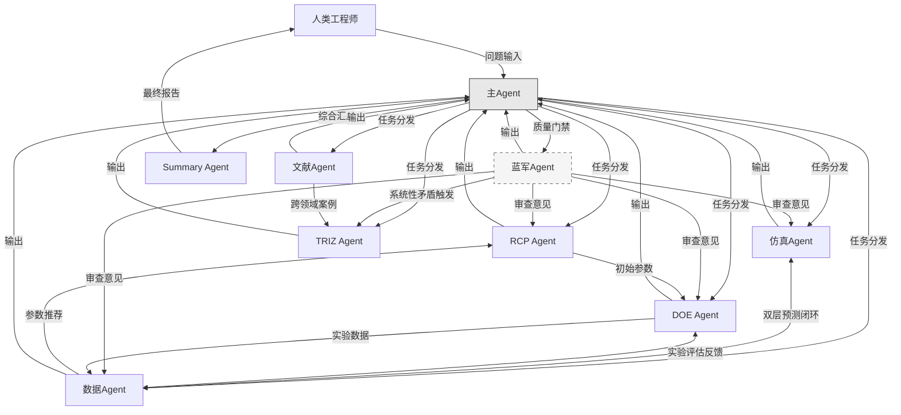
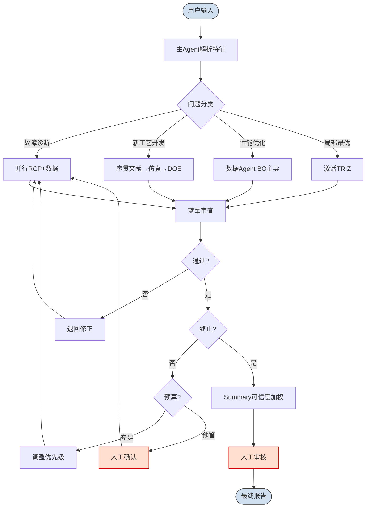

## 10. Agent协作机制与主Agent调度策略

前九章分别完成了蚀刻多智能体系统（Etching MAS）中8个专业SubAgent的能力设计。本章构建系统级集成方案，设计跨Agent信息流转架构与主Agent动态调度策略。

### 10.1 信息流转架构

#### 10.1.1 协作拓扑：星型与局部直连的混合架构

蚀刻MAS采用星型拓扑（Star Topology）与局部直连（Peer-to-Peer）相结合的混合架构：主Agent作为中央调度节点负责任务分发与结果聚合，同时允许强耦合SubAgent间建立双向直连通道以降低延迟。星型拓扑的优势在于调度逻辑集中化，主Agent掌握全局任务状态，可基于问题特征动态调整调用顺序，这与Coordinator-Dispatcher模式[^294^]一致[^287^]。但纯星型拓扑在高频交互场景下产生不必要的转发开销，因此系统为三对高耦合Agent建立局部直连。

| 拓扑类型 | 适用协作关系 | 延迟 | 可扩展性 | 调度复杂度 |
|:---:|:---|:---:|:---:|:---:|
| 星型（主Agent中转） | 主Agent ↔ 各SubAgent | $O(2)$ 跳 | 高 | 低 |
| 局部直连 | 仿真 ↔ 数据（双层预测闭环） | $O(1)$ 跳 | 低 | 中 |
| 局部直连 | DOE ↔ 数据（实验评估反馈） | $O(1)$ 跳 | 低 | 中 |
| 广播直连 | 蓝军 → 所有Agent（质量门禁） | $O(1)$ 跳 | 中 | 高 |

仿真Agent与数据Agent的直连实现"双层预测闭环"：仿真输出作为数据Agent的贝叶斯先验，数据Agent的预测偏差反馈至仿真Agent校准模型[^44^][^56^]。DOE Agent与数据Agent的直连支持虚拟实验快速评估[^96^]。蓝军Agent以广播形式向所有Agent分发审查信号，实现过程节点触发的质量门禁[^261^]。混合架构在高频交互路径上减少50%转发跳数，同时保留集中式调度的全局可见性。

#### 10.1.2 上下文传递机制

跨Agent信息交换采用三层标准化机制。输入标准化层将异构输出（VTK场分布、GP数值对、结构化审查报告）转换为统一JSON中间表示，包含`content`、`source_agent`、`confidence`、`timestamp`四个必填字段及类型特定扩展字段（如数值型的`uncertainty`、审查型的`severity`），参考多源信息融合的数据层融合方法[^266^]。结果压缩层通过Map-Reduce摘要管线[^315^][^319^]将原始输出压缩至预设token预算，仿真Agent保留关键物理量范围与约束边界，数据Agent保留预测均值与置信区间，典型压缩比30%-60%。关键信息保留层确保三类信息不被丢弃：设备参数物理边界的硬约束、预测结果的不确定性标记[^92^]以及Agent结论冲突时的矛盾标识[^299^]。

#### 10.1.3 并行与串行策略

独立Agent并行执行适用于输入互不依赖的场景：故障诊断时RCP Agent与数据Agent并行——前者基于规则库检索历史故障配方，后者同步分析传感器时序异常；新工艺开发初期文献Agent、仿真Agent与RCP Agent可并行启动。有依赖关系时串行执行：DOE方案须经蓝军审查方可执行，TRIZ创新须基于蓝军发现的系统性矛盾触发。蓝军Agent设计为"过程节点触发"而非"任务完成触发"[^282^]，在DOE执行前、仿真结果发布后、RCP推荐生效前三个节点介入，设置快速检查（~2K tokens）、标准审查（~10K tokens）、深度审查（~30K tokens）三级深度[^267^]。未通过门禁的方案退回修正后需重新审查。

### 10.2 主Agent动态调度

#### 10.2.1 问题-Agent匹配矩阵

主Agent将输入问题映射至合适的SubAgent组合，匹配矩阵以问题类型为行、Agent优先级为列，定义不同场景的激活策略。

| 问题类型 | RCP | 数据 | DOE | 仿真 | 文献 | TRIZ | 蓝军 | Summary |
|:---|:---:|:---:|:---:|:---:|:---:|:---:|:---:|:---:|
| 紧急故障诊断 | **P0** | **P0** | P2 | P2 | P3 | — | **P1** | P1 |
| 新工艺开发 | P1 | P1 | **P0** | **P0** | **P0** | P2 | **P1** | P1 |
| 性能渐进优化 | P1 | **P0** | P1 | P2 | P2 | **P1** | **P1** | P1 |
| 局部最优突破 | P2 | P1 | P2 | P2 | P1 | **P0** | P2 | P1 |
| 知识沉淀查询 | P2 | P2 | P2 | P1 | **P0** | P2 | — | P1 |

注：P0=必须激活，P1=高优先级，P2=条件激活，P3=低优先级，"—"=不激活。

矩阵设计遵循两个原则。互补能力覆盖原则：故障诊断场景中RCP Agent的规则库检索与数据Agent的异常检测并行，前者利用历史经验快速定位已知模式，后者通过统计方法发现新异常。资源效率原则：TRIZ Agent作为"战略储备"[^248^]，仅在蓝军发现系统性矛盾或其他Agent陷入局部最优超N=3轮时激活，避免常规优化中浪费token。紧急故障采用"双轨并行+蓝军门禁"策略；新工艺开发采用"序贯DOE主导"策略——文献建立基线[^214^]、仿真构建模型、DOE序贯迭代（筛选→RSM→优化）[^212^]；性能优化采用"数据驱动+创新触发"策略——数据Agent主导的贝叶斯优化快速收敛[^96^]，若陷入局部最优则激活TRIZ提供创造性扰动。

#### 10.2.2 动态优先级算法

主Agent维护三个决策模块。问题特征路由器基于关键词匹配、输入数据类型和历史案例相似度分类问题，置信度低于0.7时并行探索两个最可能的Agent组合，首轮后确定主路径。迭代历史策略优化器在每轮结束时评估各Agent输出的边际改进率，Agent $i$ 在第 $t$ 轮的优先级权重更新为 $w_i^{(t)} = w_i^{(t-1)} \cdot (1 + \alpha \cdot \Delta q_i^{(t)})$，其中 $\Delta q_i^{(t)}$ 为质量改进率，$\alpha$ 为学习率（默认0.2）。资源预算管理器设置任务级预算（默认100K tokens）与Agent级预算，消耗超50%时触发预警，可采取缩减审查深度、跳过低优先级Agent或请求人工确认等策略。研究表明人类在开发早期表现出色而算法在接近目标公差时效率更高[^342^]，故初期保留较高人类介入预算，收敛阶段倾斜至自动化Agent。

#### 10.2.3 人机协作接口

系统设置三个人机交互节点：任务启动确认（主Agent生成调度计划，用户确认后执行）；高风险决策审批（超出历史参数范围120%的变更、蓝军判定"高风险但通过"的边际方案、TRIZ提出的非常规结构修改须人工批准，遵循human first-computer last策略可将成本降低约50%[^342^][^344^]）；结果发布前审核（Summary报告以草稿形式呈现，工程师可修改权重、补充知识或要求重新分析，反馈记录用于优化后续调度）。

### 10.3 系统集成与实施路线图

#### 10.3.1 技术栈建议

Agent框架层推荐OpenCode（支持Critic-Reviewer模式SubAgent配置）[^294^]或LangGraph（支持循环工作流），须满足并行执行、条件路由和人机介入挂起恢复三要求。仿真后端层推荐COMSOL Multiphysics（反应器尺度等离子体仿真，支持CCP/ICP模拟）[^28^][^79^]与SEMulator3D（特征尺度3D工艺仿真）[^175^]，通过Python API集成。ML框架层推荐scikit-opt实现基础贝叶斯优化，BoTorch支持复杂GP建模，高斯过程回归为标杆预测技术（MAPE~1.15%）[^56^]。

#### 10.3.2 分阶段实施路线

| 阶段 | 时间 | 部署Agent | 核心目标 | 预期效果 |
|:---:|:---:|:---|:---|:---|
| Phase 1 | 1-2月 | RCP+数据+DOE+蓝军（4 Agent） | BO≤8轮收敛、蓝军覆盖率100% | 故障响应↓40%、实验成本↓30% |
| Phase 2 | 3-4月 | +仿真+文献+TRIZ（7 Agent） | 双层预测闭环、GraphRAG知识库 | 预测精度↑15%、开发周期↓25% |
| Phase 3 | 5-6月 | +Summary（完整8 Agent） | 可信度加权报告、调度自适应 | 人工干预↓50%、质量评分≥4.0/5.0 |

Phase 1验证基准：BO在5-8次迭代内收敛至合格工艺窗口[^96^]，蓝军无遗漏拦截高风险参数。Phase 2完整运行双层预测闭环[^44^]，GraphRAG支持跨文档复杂推理[^148^][^153^]，TRIZ集成蓝军矛盾信号自动触发。Phase 3启用可信度加权报告生成，综合数据Agent置信区间、蓝军审查评级和文献引用支撑度标注建议置信度[^299^]，主Agent积累运行数据为后续强化学习训练调度模型奠定基础。

#### 10.3.3 评估指标

系统通过三类指标量化评估。工艺优化效率指标：达到目标工艺窗口所需实验次数（基线纯人工20-84次[^342^]）和单次优化wall-clock时间。实验成本降低指标：测试晶圆消耗量对比基线与机台占用时间，vDOE技术预计减少30%-60%物理实验[^225^]。方案质量评分：蓝军审查通过率（目标>95%）与资深工艺工程师五分制评分（Phase 3目标≥4.0/5.0），评估体系参考Critic-Reviewer设计模式[^261^]将蓝军审查作为方案质量的硬约束。评估数据持续采集形成反馈闭环，每两周小批量评估、每季度全面评估，驱动调度策略持续改进。
