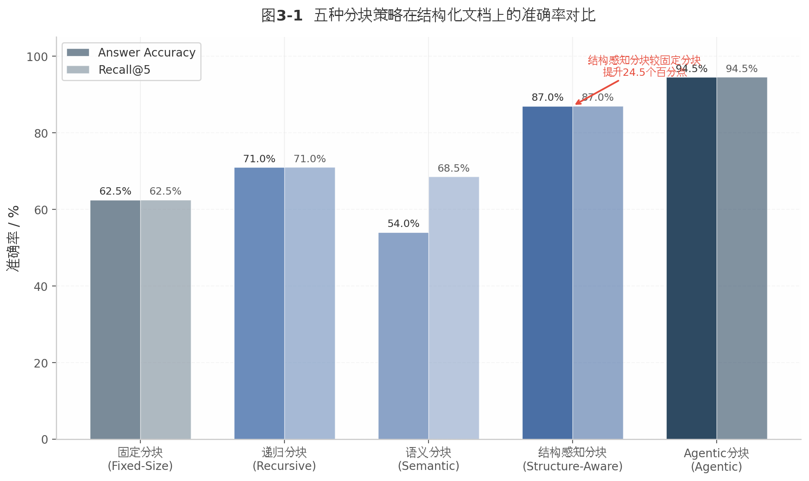
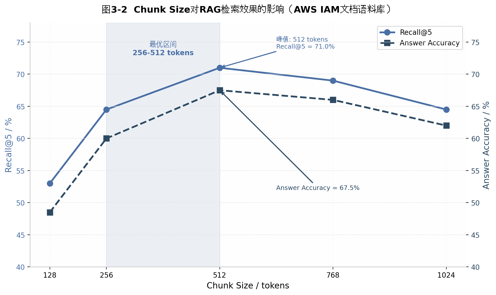
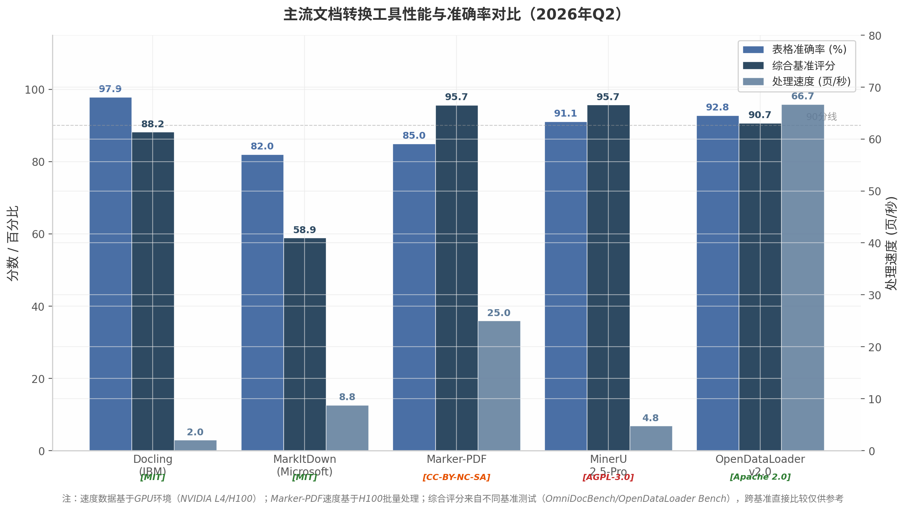
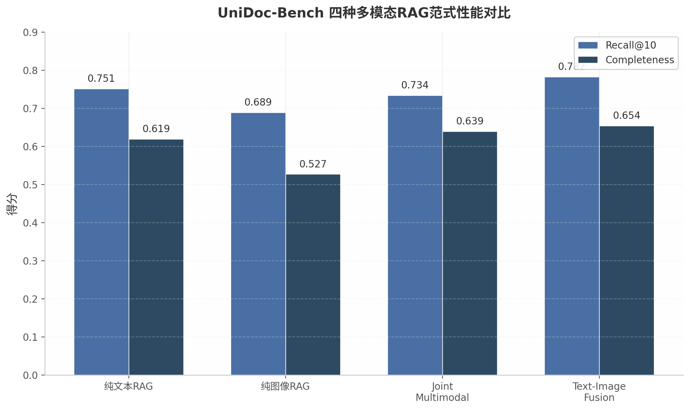
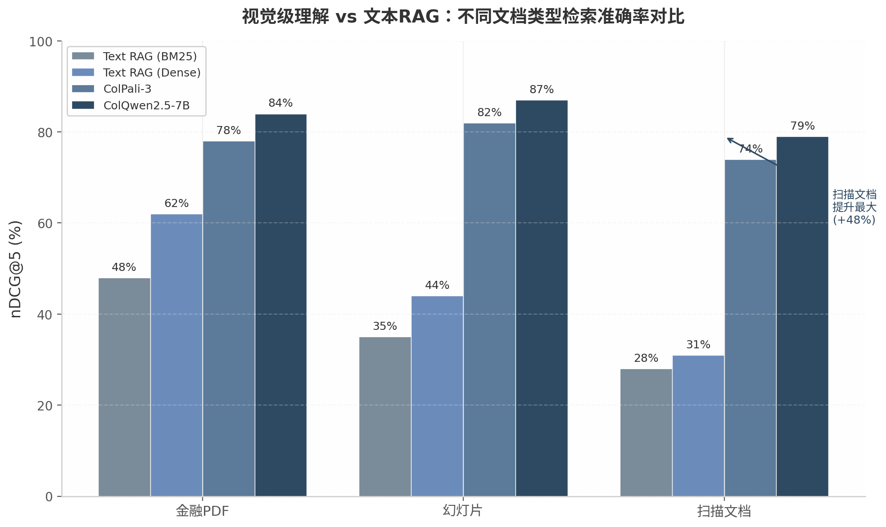
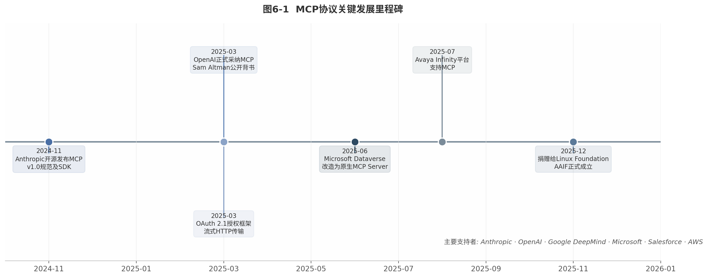
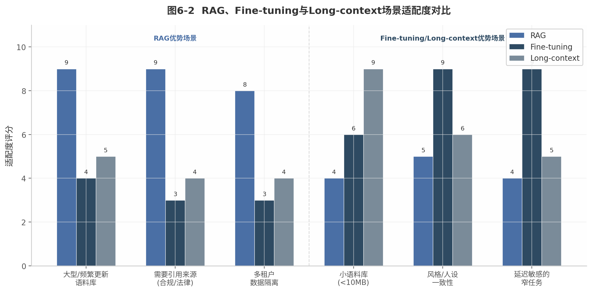
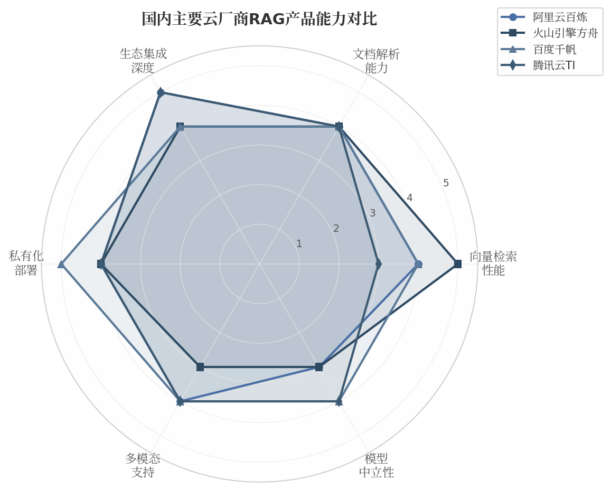
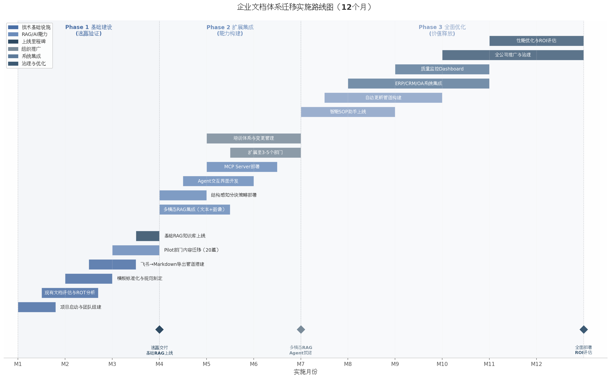

# 企业SOP文档构建方案调研报告

> 调研时间：2026年6月
> 调研范围：文档格式、编辑工具、RAG技术、转换管道、多模态处理、Agent交互、实施路径
> 核心目标：兼顾人类编辑友好与AI处理友好（RAG/Agent），偏向人类需求

---

# 执行摘要

## 调研背景与目标

随着企业标准操作程序（Standard Operating Procedure, SOP）数字化进程的加速，文档系统面临一个根本性矛盾：人类编辑的最优格式与AI处理的最优格式并不一致。一方面，图文并茂的SOP文档需要富文本编辑器提供所见即所得（What You See Is What You Get, WYSIWYG）的体验；另一方面，基于检索增强生成（Retrieval-Augmented Generation, RAG）和AI Agent的文档处理管道高度依赖结构化的Markdown格式。本报告围绕这一核心矛盾，覆盖文档格式、编辑工具、RAG分块策略、格式转换管道、多模态处理、Agent交互模式、实施路径与TCO分析等九大维度，旨在为100人规模的中国企业构建兼顾人类编辑体验与AI处理能力的SOP文档体系提供循证决策依据。

## 核心结论

**推荐采用"WYSIWYG编辑 → Markdown存储 → 多格式输出"三层混合架构。** 该架构在编辑体验、AI友好度、可维护性、成本效益和可扩展性五维度量化评估中综合得分8.2分（满分10分），显著优于纯Word/PDF（4.7分）、纯Git+Markdown（7.2分）及单一商业SaaS方案（Notion 6.1分、Confluence 6.2分）^1^ ^2^。架构的核心设计以Markdown作为单一事实来源（Single Source of Truth），前端通过富文本编辑器服务人类创作，后端经由自动化转换管道输出AI友好的结构化Markdown，同时通过Pandoc等工具实现向PDF、DOCX、HTML等多格式的无损发布 ^3^。

在人类编辑平台的选择上，**飞书文档是中国企业SOP场景的首选**，其20维度加权综合评分为8.50分（满分10分），领先Confluence（8.45分）、Notion（7.15分）、腾讯文档（6.85分）和语雀（6.55分）^4^。飞书的核心优势在于块编辑器架构、多维表格集成（单表支持1000万行）、与飞书IM深度联动形成的SOP生命周期管理闭环，以及2026年5月正式上线的原生Markdown导出功能——该功能使飞书到Markdown的转换保真度达到约90%（简单文档），从根本上消除了中国企业采用混合文档方案的最大平台锁定障碍 ^5^ ^6^。

一个贯穿全报告的关键发现是：**文档结构规范的重要性超过格式选择本身。** 在RAG效果的决定因素中，分块策略（Chunking）的质量贡献度高达35%，超过重排序（28%）和上下文增强（22%），是RAG系统中最大的单一影响因素 ^7^。基于Markdown标题层级的结构感知分块（Hierarchical Chunking）准确率可达87%，远超固定大小分块的60-65% ^8^；配合元数据前缀融合嵌入技术，检索命中率（Hit Rate@10）可达0.925 ^9^ ^10^。这意味着，企业应当优先确保SOP文档具备清晰的标题层级、独立完整的段落和一致的元数据Schema，而非在格式选择上过度纠结。

## 关键数据

**转换工具生态已高度成熟。** Microsoft MarkItDown在DOCX到Markdown转换中达到82%的F1分数，处理速度约为每百页12秒 ^11^；IBM Docling在复杂表格场景下达到97.9%的单元格准确率 ^12^；MinerU 2.5-Pro以1.2B参数在OmniDocBench v1.6上取得95.69分，超越GPT-4o和Qwen2.5-VL-72B ^13^。这些工具使"人编辑富文本、AI读Markdown"的双轨制管道在技术和成本上均完全可行。

**多模态RAG的text-image fusion策略经大规模基准验证为最优方案。** Salesforce AI Research构建的UniDoc-Bench（70K真实PDF页面、1,600人工验证QA对）明确验证，text-image fusion策略（0.654）显著优于纯文本（0.619）、纯图像（0.527）和联合多模态嵌入（0.639）方案 ^14^。在金融PDF场景中，视觉级RAG的nDCG@5达到84%，较传统密集文本RAG的62%高出22个百分点 ^15^ ^16^。这意味着SOP文档中的截图、流程图和设备照片不再需要单独提取和手动标注，整页视觉理解技术可直接处理图文并茂的SOP。

**MCP（Model Context Protocol）协议已成为Agent与文档交互的事实标准。** Anthropic推出并于2025年12月捐赠给Linux Foundation AAIF后，OpenAI、Google和Microsoft已全面支持该协议 ^17^ ^18^。Docling、飞书等平台已提供MCP Server实现，DesktopCommanderMCP支持DOCX的完整CRUD操作 ^19^ ^20^。然而安全威胁不容忽视：Tool Poisoning攻击成功率高达72.8%，CVE-2025-6514（CVSS 9.6）等严重漏洞表明Agent文档交互的安全防护必须同步建设 ^21^ ^22^。

**100人团队5年总拥有成本（Total Cost of Ownership, TCO）差异显著。** 开源自托管方案约$370,000，Confluence Premium约$460,000，Notion Business约$685,000 ^23^ ^24^。开源方案的主要成本为人力（运维占TCO的81%），商业方案的主要成本为订阅费（占TCO的70%以上）。当团队规模扩大至500人时，开源方案的TCO优势可扩大至2-3倍。

**中国企业面临"信创要求+AI需求"的双重时间压力。** 国资委79号文要求2027年前央企国企核心系统实现100%信创替代 ^25^，文档类场景国产化替代成功率不足41%，显著低于OLTP交易类（76%）。国内RAG方案中，阿里云百炼提供最完整的多模态知识库能力，自动调用qwen3-vl-embedding实现视觉理解 ^26^；火山引擎、百度千帆和MaxKB（飞致云，GitHub Star 20K+、企业付费客户1000+）构成多层次国产化替代方案 ^27^。

**实施路径建议采用3/6/12月渐进式路线。** 第1-3个月完成最小可行产品（MVP）部署，第4-6个月实现管道自动化和AI增强，第7-12个月全面推广 ^28^。实际部署数据显示，配备适当变更管理的AI知识系统6个月采纳率可达85%，而传统企业搜索实施仅为34% ^29^。某全球IT服务企业部署RAG知识助手后，员工搜索时间从9分钟降至47秒，92%的问题无需升级即可解决 ^30^。SOP数字化转型的ROI极为可观：单份SOP创建投入约$200，按年节省520工时计算，ROI可达12,900% ^31^ ^32^；中型制造商第1年可实现86%的ROI，到第2年累计ROI达173% ^33^。

---

## 1. 需求分析：人与AI的双重需求拆解

企业SOP（Standard Operating Procedure，标准操作程序）文档系统的选型面临一个根本性张力：人类编辑者追求直观、高效、协作友好的创作体验，而AI系统需要结构化、语义清晰、机器可解析的输入格式。在图文并茂的设备操作场景中，这一张力尤为突出——工程师需插入大量截图、设备照片和流程图以确保操作可复现，同时企业期望这些知识能被RAG（Retrieval-Augmented Generation，检索增强生成）系统和AI Agent高效利用。本章从人类编辑与AI处理两条主线出发，系统拆解双重需求的内涵、冲突与平衡路径。

### 1.1 人类编辑需求分析

#### 1.1.1 工程师核心诉求：所见即所得编辑、图片/表格便捷插入、版本控制、协作审阅

工程师群体对SOP编辑工具的核心诉求集中在四个维度。**所见即所得（WYSIWYG, What You See Is What You Get）**编辑体验位列首位。调研表明，Markdown基础语法学习曲线虽短（15—30分钟），但涉及表格、图片等高级功能时延长至1—2小时 ^34^。更关键的是，原生Markdown表格编辑被广泛评价为"awful"——"保持列对齐极其繁琐，添加一列意味着重新格式化每一行" ^4^；图片插入的"截图→保存→写路径→验证"工作流同样被视为耗时且易错 ^4^。

**富媒体便捷插入**是第二项核心诉求。设备SOP高度依赖视觉元素——操作界面截图（定位按钮/菜单）、设备照片（识别部件）、流程图（展示决策分支）以及参数表格（汇总设置项）。当前主流平台差异明显：飞书文档支持拖拽插入图片但不支持精确调整尺寸和浮动排版 ^35^；飞书的多维表格单表支持1{,}000万行，提供公式计算和视图转换 ^36^，在企业SOP表格场景中表现最优。

第三，**版本控制与协作审阅**。2025年协作编辑状态报告显示，65%的受访者将协作工具评为"极其重要"或"非常重要" ^12^。SOP的合规属性要求完整记录"谁在何时做了什么修改"并支持一键回滚。Confluence提供无限页面历史 ^37^，飞书支持版本记录与快速回滚 ^38^，而Notion Plus仅7天版本历史，存在治理风险 ^37^。

#### 1.1.2 图文并茂SOP的特殊需求：截图插入、设备照片、流程图/示意图、表格步骤

设备SOP区别于普通文本知识的核心特征是**高图文密度**。在图表工具方面，Mermaid在Markdown嵌入和LLM（Large Language Model，大语言模型）兼容性方面优于PlantUML，适合快速流程图和序列图；PlantUML则在复杂UML场景下更强 ^39^。在表格方面，SOP步骤常以"步骤编号+操作描述+预期结果+注意事项"的表格形式组织，但原生Markdown不支持合并单元格、跨行/跨列——这对复杂设备参数表构成限制。

#### 1.1.3 企业级需求：权限管理、审批工作流、审计追踪、移动端支持

SOP的治理层面需求涵盖四个维度。**权限管理**要求支持空间级和页面级访问控制，Confluence可支持150{,}000用户/站点 ^40^。**审批工作流**是合规核心——飞书通过审批应用支持自定义多节点并行审批 ^41^；Confluence配合Comala插件提供Draft→SOP→SOP Validation→Published四阶段模板，并支持符合FDA 21 CFR Part 11的电子签名 ^42^ ^43^。**移动端支持**对现场作业至关重要，飞书支持完整离线编辑和Apple Pencil手写批注，采用"离线优先"策略确保弱网可用 ^44^ ^45^。

### 1.2 AI处理需求分析

#### 1.2.1 RAG检索需求：结构清晰利于分块、标题层级完整、元数据丰富、检索精度高

RAG系统对文档结构高度敏感。基于Markdown标题层级的结构感知分块准确率达87%，固定大小分块仅为60—65% ^8^；标题层次分块相比固定分块有30—49%的准确率提升 ^1^ ^2^。分块策略占RAG最终答案准确率的35%，是最大单一影响因素。元数据集成同样关键——递归分块配合TF-IDF加权嵌入达82.5%精度 ^46^，前缀融合嵌入Hit Rate@10达0.925 ^46^。这意味着SOP文档需在YAML Front Matter中嵌入丰富元数据（标题、部门、版本、标签、状态），同时服务人类导航和AI检索过滤。

#### 1.2.2 Agent交互需求：结构化格式便于解析、MCP支持、function calling兼容、直接CRUD操作

MCP（Model Context Protocol，模型上下文协议）已成为Agent与文档交互的事实标准，获OpenAI、Google、Microsoft全面支持，Docling和飞书等平台已提供MCP Server。DesktopCommanderMCP支持DOCX完整CRUD，Adeu实现docx与Markdown双向翻译。这意味着文档正从被动被读取的对象转变为主动可被Agent操作的对象。短期内HITL（Human-in-the-Loop，人在环路）审核仍不可或缺——HITL文档工作流达99.9%准确率，纯AI系统为92% ^47^。

#### 1.2.3 文件解析需求：格式统一减少信息丢失、图片内容可理解、表格结构保留

转换工具生态的成熟度决定了AI友好化的可行性。MarkItDown F1准确率82%，速度12秒/百页 ^11^；Docling达88% F1，表格单元格准确率97.9% ^12^；Pandoc支持40+种格式互转 ^3^。多模态RAG的成熟进一步降低了图片处理门槛：text-image fusion策略在UniDoc-Bench验证中最优（0.654），Qwen3-VL-Embedding在MMEB-V2排名第一，使得SOP中的截图和设备照片可直接被AI理解而无需手动标注。

| AI处理维度 | 对文档格式的核心要求 | 量化影响 | 推荐实践 |
|-----------|-------------------|---------|---------|
| RAG分块 | 清晰标题层级（H1—H3）、独立完整段落 | 标题层次分块比固定分块提升30—49% ^1^ ^2^| 强制使用Markdown标题语法划分章节 |
| 元数据检索 | 丰富YAML Front Matter（部门/版本/标签/状态） | 元数据集成+结构化分块达82.5%精度 ^46^| 制定SOP文档元数据Schema标准 |
| Agent解析 | 结构化Markdown、MCP兼容接口 | Markdown减少67—90% token消耗 ^48^ ^49^| Markdown作为存储格式，MCP Server作为访问接口 |
| 表格保留 | 标准Markdown表格或HTML回退 | Docling表格单元格准确率97.9% ^12^| 保持表格结构简单，避免复杂合并单元格 |
| 图片理解 | 图片路径可解析、多模态RAG支持 | 视觉RAG比文本RAG高22个百分点 | 使用相对路径存储图片，配合多模态Embedding |

上表汇总了AI处理对SOP文档的五项核心要求。五项要求之间存在内在关联：清晰的标题层级同时服务分块质量和人类导航；丰富的元数据同时服务检索过滤和文档治理；Markdown统一格式同时降低Agent解析难度和版本控制复杂度。因此，"结构规范"而非"格式选择"本身，才是连接人类需求与AI需求的最小公分母。

### 1.3 需求冲突与平衡策略

#### 1.3.1 核心矛盾：Markdown对AI友好但对人类编辑不友好

交叉验证确认了一个核心矛盾：Markdown对AI最友好（减少67—90% token消耗 ^48^ ^49^、RAG准确率提升35% ^50^），但对人类编辑（尤其图文并茂的SOP）不够友好——表格编辑"awful"、图片插入"friction高" ^4^。飞书/Notion等富文本平台在图片/表格编辑方面全面领先于原生Markdown编辑器 ^37^。

| 需求维度 | 人类优先级 | AI优先级 | 冲突强度 | 当前最优妥协方案 |
|---------|-----------|---------|---------|---------------|
| WYSIWYG编辑体验 | 极高 | 无 | 无冲突 | 富文本编辑器（飞书/Notion） |
| 图片拖拽插入 | 极高 | 中 | **中等** | WYSIWYG编辑器自动生成Markdown图片链接 |
| 表格可视化编辑 | 高 | 中 | **高** | 图形化表格编辑器+标准Markdown表格输出 |
| 版本控制与审计 | 高 | 低 | 低冲突 | Git或平台原生版本历史 |
| 实时协作 | 高 | 无 | 无冲突 | 块编辑器+OT/CRDT技术 |
| 标题层级结构 | 中 | 极高 | **中等** | 强制结构规范+编辑器自动校验 |
| 元数据丰富度 | 中 | 极高 | 低冲突 | YAML Front Matter模板化 |
| Markdown纯文本 | 低 | 极高 | **高** | 隐藏Markdown，仅作为存储层 |
| Agent直接操作 | 低 | 高 | 中等 | MCP Server封装文档操作 |
| 离线/移动端编辑 | 高 | 无 | 无冲突 | 离线优先的移动端APP |

矩阵揭示了三个关键模式。其一，冲突强度最高的区域集中在"表格编辑"和"Markdown纯文本"两项——前者直接影响工程师编写效率，后者决定AI处理的token成本和解析精度。其二，约半数维度的冲突强度较低，因为现代协作平台已能同时满足双方诉求。其三，所有高冲突项都指向同一个解决方向：通过"WYSIWYG前端+Markdown后端+自动转换管道"的架构将人与AI的需求分层处理。

#### 1.3.2 平衡原则：结构规范作为最小公分母

本报告提出以"结构规范"作为人类需求与AI需求的最小公分母（Least Common Denominator）。其核心逻辑在于：人类阅读SOP需要清晰的标题来导航、独立完整的步骤来跟随；AI处理SOP需要结构边界来做分块、元数据来做过滤——两者对"结构"的需求高度一致。具体包含三个层面：**标题层级规范**（强制H1/H2/H3划分，确保结构感知分块有效）、**段落独立性规范**（每段自包含，避免跨段落指代依赖）、**元数据标准**（统一YAML Front Matter Schema）。在这些约束之上，人类编辑层可自由选择WYSIWYG编辑器，AI处理层可稳定解析Markdown输出——双方通过结构规范实现解耦。

#### 1.3.3 偏向人类需求前提下的AI友好化策略：WYSIWYG前端+Markdown后端+自动转换管道

在"偏向方便人的需求"这一核心约束下，推荐策略是三层架构：**WYSIWYG编辑器作为人类交互界面 → Markdown作为标准化存储格式（Single Source of Truth） → 自动化转换管道桥接两者**。技术可行性已获验证：Milkdown基于ProseMirror+Remark实现100%准确的Markdown双向解析 ^51^ ^52^；Pandoc支持40+种格式互转 ^3^；MarkItDown以82% F1和12秒/百页实现高效转换 ^11^；飞书2026年5月原生支持Markdown导出 ^5^，正式承认"富文本编辑→Markdown存储→AI处理"管道的合理性。

在SOP场景中，该架构的运作方式是：工程师通过飞书文档等WYSIWYG工具编写图文并茂的SOP，系统自动同步到Git仓库的Markdown文件；CI/CD管道触发Pandoc/MarkItDown转换生成标准化Markdown；RAG系统执行标题层次分块、元数据提取和向量嵌入；AI Agent通过MCP Server操作底层Markdown实现CRUD功能；人类通过WYSIWYG界面查看diff并执行HITL审核。在此架构下，人类编辑者始终面对高效的富文本界面，AI系统则始终处理结构清晰的Markdown——结构规范作为隐式契约确保两层之间的无损转换。

---

## 2. 主流文档格式与编辑工具对比

企业SOP（Standard Operating Procedure，标准操作程序）的数字化管理要求文档工具同时满足三组矛盾的需求：工程师需要结构化、版本可控的编辑体验；非技术用户需要所见即所得（WYSIWYG, What You See Is What You Get）的低门槛界面；AI系统则需要语义清晰、格式规范的机器可读输出。本章从富文本协作平台、Markdown编辑器生态和Microsoft Word三个技术路线切入，通过五平台二十维度评分矩阵，量化评估各方案在企业SOP场景中的适配度。

### 2.1 富文本协作平台深度对比

#### 2.1.1 飞书文档：块编辑器架构与多维表格的企业级实践

飞书文档以块编辑器（Block-based Editor）架构为核心，将文档内容拆解为可独立操作、拖拽重组的语义单元。这一设计使其在SOP编写中具备天然的结构化优势——操作步骤、注意事项、参数表格均可作为独立块进行复用和重组。飞书多维表格（Base）月活跃用户已突破1{,}000万，单表支持最高1{,}000万行数据，并可通过公式计算、查找替换、删除重复记录等插件实现SOP数据的自动化处理 ^4^。

飞书在审批工作流方面通过飞书审批应用实现多节点并行审批，支持自定义审批流程和规则引擎 ^41^。在版本控制维度，飞书自动记录完整编辑历史并支持差异对比与快速回滚，管理员可设定编辑规则确保文档标准化 ^38^。其开放平台API覆盖文档全生命周期管理、多维表格操作和内容搜索，配套Python与Java SDK，是"三家里做得最好的"（与钉钉、企业微信对比）^4^。

飞书2026年5月原生支持Markdown导出，这一更新标志着中国最大企业协作平台正式承认"富文本编辑→Markdown存储→AI处理"管道的合理性，从根本上消除了中国企业采用混合文档方案的最大障碍 ^5^。在IM集成维度，飞书文档实现了与飞书IM的深度原生联动——文档中@同事可直接跳转聊天窗口，文档内容可自动转化为任务项，或直接发起视频会议讨论 ^34^。飞书用户的文档平均协作人数比语雀高37% ^34^。飞书文档在中国企业SOP场景综合加权评分达8.50/10，位居五平台之首。

飞书的短板同样明显。图片编辑功能存在较多限制——不支持精确调整尺寸、不支持旋转和标注（网页版）、不支持浮动图片、不支持插入在线图片 ^35^。飞书2023年2月价格调整后，面向中小企业的单价是企业微信、钉钉的2-5倍 ^53^，较高的定价对成本敏感型企业构成门槛。

#### 2.1.2 Notion：灵活数据库功能的规模化瓶颈

Notion的核心差异化优势在于其数据库驱动的文档架构。块编辑器和页面嵌套功能允许创建高度自定义的文档结构，SOP条目可组织为关系型数据库，支持表格、看板、日历、时间线等多视图切换 ^37^。Notion拥有数千个社区模板，覆盖大量SOP相关场景，G2评分4.6/5（基于9{,}500+条评价），Capterra评分4.7/5（2{,}600+评价），用户满意度在五个平台中最高 ^54^。

然而，Notion在企业SOP管理中存在三个结构性短板。**第一，无内置审批工作流**，Notion缺乏原生的审批或审阅工作流功能 ^37^，这对需要严格审批流程的SOP管理是重大缺陷。**第二，规模化性能瓶颈**，Notion数据库在5{,}000条以上记录时性能显著下降，已知在500个以上页面时移动端加载速度降低40%，AI在数据量大的页面上响应严重延迟，经常冻结数分钟 ^54^。**第三，版本历史分层不合理**，Plus方案仅保留7天版本历史，对合规性团队构成严重治理风险 ^37^。Business方案定价$20/用户/月方可解锁完整AI功能，50人团队年成本约$12{,}000，TCO（Total Cost of Ownership，总拥有成本）显著高于其他平台。

Notion的适用场景明确：适合小型到中型的创新团队、内容驱动型组织，以及对灵活性要求高于合规性的场景。对于需要严格审批流程、电子签名和审计追踪的受监管行业，Notion目前无法满足要求。

#### 2.1.3 Confluence：企业级权限与审计的最强方案

Confluence在全球企业级知识管理市场中处于领先地位，其核心优势在于深度合规能力。通过Comala Document Management插件，Confluence提供三阶段SOP审批模板（Draft → In Approval → Approved）和合规级SOP审批模板（Draft → SOP → SOP Validation → Published）^42^。该组合是**唯一支持21 CFR Part 11合规电子签名**的平台，采用HMAC-SHA256签名验证，使用邮箱加OTP（One-Time Password，一次性密码）双因素认证 ^43^。

Confluence的企业级权限管理支持多达150{,}000用户每站点，提供SAML SSO（Security Assertion Markup Language Single Sign-On）和多身份提供商支持 ^40^。其审计日志每页保留详细的工作流转换和审批历史记录 ^55^，内容过期管理功能可自动标记过期页面并触发重新审阅或归档。Confluence与Jira的深度集成允许创建Jira工单来请求SOP的编写、修改和取消，通过Kanban看板可视化SOP管理进度 ^39^。

Confluence的局限同样突出。界面设计被用户评价为"老旧"、"对非技术用户复杂" ^40^ ^56^；2024-2025年涨价5-8%，Enterprise方案需801名用户起购 ^40^；Comala等高级功能需额外购买Marketplace插件，增加了隐性成本；移动端被用户评价为"像是桌面版体验的简化版本" ^56^。Confluence在审批工作流和权限审计两个维度均获得满分10.0，但SOP编写体验仅7.0分，综合加权评分8.45/10。

#### 2.1.4 语雀与腾讯文档：差异化定位与结构性短板

语雀由阿里巴巴开发，核心差异化优势在于中文写作体验。自研富文本编辑器支持Markdown全语法、代码块高亮（200+编程语言）、LaTeX公式和PlantUML绘图 ^34^。"知识库-空间-文档"三级结构严格分层，支持自定义目录排序，适合制度流程的沉淀 ^34^。PDF导出质量被广泛称赞为"排版整齐、文字无误" ^57^。

语雀的结构性短板集中在**导出锁定**和**协作深度**两个维度。语雀无批量导出功能，知识库只能导出为lakebook私有格式，表格仅支持Excel导出，画板完全不支持导出 ^58^。这被用户批评为"有点像一些数据类SaaS服务，导入功能非常完善，导出功能却极度受限" ^58^。语雀的API调用频率限制严格（免费用户100次/小时），四类知识库相互独立无法跨类型引用 ^59^。语雀综合加权评分6.55/10。

腾讯文档以"全品类、强连接、多场景"为三大特性 ^60^，依托微信和企业微信平台优势，普及率在五平台中最高（企业微信生态市占率25.4%）^4^。其核心优势在于上手门槛低、接入门槛低、与日常沟通流程天然融合 ^26^。但在企业级功能维度，腾讯文档缺少严格的知识分类结构，更适合作为协作沉淀空间而非专业知识体系运营工具 ^26^。**腾讯文档不支持Markdown导出**，是其面向AI工作流的重大硬伤 ^58^。腾讯文档综合加权评分6.85/10。

**表1 富文本协作平台核心功能对比**

| 功能维度 | 飞书文档 | Notion | Confluence | 语雀 | 腾讯文档 |
|:---|:---:|:---:|:---:|:---:|:---:|
| 块编辑器架构 | ✅ 原生 | ✅ 原生 | ❌ 传统页面 | ❌ 富文本 | ❌ 富文本 |
| 多维表格/数据库 | 单表1000万行 ^4^| 5000+记录性能下降 ^54^| 需插件 | 数据表（2025新增）| 智能表 |
| 审批工作流 | 多节点并行 ^41^| ❌ 无内置 | 21 CFR Part 11合规 ^43^| 基础评审模式 | 基础评论@ |
| 版本历史 | 完整自动记录 ^38^| Plus仅7天 ^37^| 无限页面历史 ^37^| 分钟级操作日志 ^34^| 基础版本历史 |
| Markdown导出 | ✅ 原生（2026.5）^5^| ✅ 支持 | 需插件 | 单篇导出 ^58^| ❌ 不支持 ^58^|
| 电子签名 | ❌ | ❌ | ✅ HMAC-SHA256 ^43^| ❌ | ❌ |
| 企业级权限 | 水印+离职自动回收 ^44^| Business+ ^54^| 页面级+空间级 ^61^| 基础RBAC | 企业版支持 |
| 与IM深度集成 | 飞书IM原生 | Slack集成 | Slack集成 | 无 | 企业微信原生 |
| 私有化部署 | 企业版支持 | ❌ 不支持 ^62^| Data Center版 | ❌ | 500人起 ^63^|
| 50人团队年成本 | ~¥4.8万 | ~$1.2万 | ~$3{,}252 | ¥0.5-1万 | ¥1.3-1.5万 |

上表揭示了五平台在企业SOP场景中的能力分化。飞书文档和Confluence在审批工作流与合规审计维度形成双峰对峙——飞书以IM原生集成和AI能力见长，Confluence以合规深度和权限 granularity 领先。Notion在灵活性和用户满意度方面表现优异，但无内置审批流和规模化性能问题限制了其在大中型企业SOP管理中的应用。语雀和腾讯文档分别受限于导出锁定和Markdown缺失，在AI工作流集成的维度上存在结构性短板。

上图基于SOP场景权重（编写体验15%、审批工作流15%、版本控制10%、权限审计10%、表格数据10%、导出互通10%、AI能力10%、IM集成10%、移动端5%、TCO成本5%）绘制。飞书文档以8.55分领先，主要优势集中在IM集成（10.0）、表格/数据（9.5）和AI能力（9.5）三个维度；Confluence以7.90分紧随其后，在审批工作流（10.0）和权限审计（10.0）上获得满分；Notion（6.58分）、腾讯文档（6.48分）和语雀（6.10分）的得分差距反映了它们在企业级SOP管理功能深度上的不足。

### 2.2 Markdown编辑器生态

Markdown作为轻量级标记语言，在AI友好性方面具有天然优势——纯文本格式减少67-90%的token消耗，RAG（Retrieval-Augmented Generation，检索增强生成）准确率相比富文本格式提升约35% ^48^ ^50^。然而，Markdown对人类编辑者（尤其需要图文并茂的SOP编写者）的友好度长期存在争议。原生Markdown表格语法被广泛认为是"糟糕的"（awful），列对齐和添加列操作极其繁琐；图片插入需要"截图→保存→写路径→验证"的多步工作流，friction较高 ^4^。

#### 2.2.1 Typora：唯一真正无缝WYSIWYG Markdown体验

Typora在Markdown编辑器中占据独特地位——它是唯一实现"语法消失"的真正WYSIWYG体验的编辑器，输入`## Heading`后立即变为格式化标题，用户在编辑过程中完全无需看到Markdown语法标记 ^37^。这一特性使非技术用户可以在不学习Markdown语法的情况下获得Markdown格式的全部优势。

在SOP编写相关的功能维度，Typora的图形化表格编辑器支持右键菜单添加/删除行列和可视化调整列宽，表格编辑体验在所有Markdown编辑器中被评为"最佳" ^37^。内置Mermaid图表渲染允许在文档中直接嵌入流程图和序列图，对设备SOP中的操作流程可视化极具价值。通过Pandoc集成，Typora可导出PDF、HTML、Word和LaTeX格式，其中导出Word质量评分8.5/10，仅次于VS Code+Pandoc组合的9.5/10 ^64^。

Typora的定价模式为一次性购买$14.99，支持3台设备，无订阅费用 ^26^。但其关键局限同样突出：无插件API（仅CSS主题自定义）、无版本控制UI（需外部Git管理）、无协作或同步功能（纯本地文件）、无移动端应用、VoiceOver屏幕阅读器完全不兼容 ^37^ ^26^ ^41^。Typora本质上是一个"编辑器"而非"笔记系统"或"协作平台"，适合个人SOP编写而非团队级SOP管理。

#### 2.2.2 Obsidian与VS Code：插件生态的强大与门槛

Obsidian以本地优先（local-first）架构和1{,}500+社区插件生态著称，数据完全存储于本地Markdown文件，确保用户对数据的完全所有权 ^43^。其核心功能包括双向链接、图谱视图和高度可定制的工作区。对于技术团队而言，Obsidian的纯文本存储格式与Git版本控制天然兼容——"因为Markdown是纯文本，git diff完美工作。你可以用与代码相同的工具来追踪变更、审查编辑和协作。试着用Word文档做这些" ^38^。

然而，Obsidian对非技术用户的学习曲线显著陡峭。多位用户反馈："Obsidian依赖Markdown，需要一些时间来适应……图谱功能虽然有趣，但效果参差不齐" ^65^。图表功能对某些用户是"命中或失误" ^65^。虽然Obsidian基础语法学习曲线仅15-30分钟，但表格、图片、图表等SOP常用功能将学习时间延长至1-2小时 ^34^。导出Word质量评分仅6.5/10，主要因为专有语法（wikilinks、embeds、callouts）转换不干净 ^64^。

VS Code配合Pandoc插件的组合在技术团队中口碑最高（综合评分9.5/10），导出Word质量同样为9.5/10 ^64^。通过命令行参数可完全控制Pandoc选项，自定义参考模板和过滤器，生成的DOCX与手动格式化的Word文档几乎无法区分。但VS Code的学习曲线对所有非开发者用户都构成显著门槛——需要理解分屏预览、Pandoc配置、命令行操作等概念。

#### 2.2.3 Milkdown与Editor.md：WYSIWYG Markdown的双向绑定方案

Milkdown和Editor.md代表了"WYSIWYG编辑器 → Markdown存储 → 多格式输出"架构的技术前沿。两者均基于ProseMirror框架构建，通过Remark/Markdown-it实现Markdown解析，声称达到100%准确的Markdown双向绑定——即WYSIWYG编辑器的操作与Markdown源码之间实现无损转换 ^46^。

这一架构的技术优势在于：编辑层使用富文本交互降低非技术用户门槛，存储层使用纯Markdown确保AI可读性和版本控制友好性，输出层通过统一转换管道生成Word、PDF、HTML等格式。2025年CKEditor团队发布的协作编辑状态报告显示，42%的受访者预测"与AI协作"将成为未来最重要的协作编辑功能，65%将协作工具评为"极其重要"或"非常重要" ^12^。Milkdown等工具通过CRDT（Conflict-free Replicated Data Type，无冲突复制数据类型）技术（如Yjs库）使Markdown实时协作成为可行 ^60^，Shelf等新兴编辑器已提供Google Docs式的Markdown协作体验 ^66^。

但需注意，这些方案的企业级稳定性尚待验证。CRDT在富文本编辑中的实现极其复杂——CKEditor 5团队花了四年时间构建冲突解决系统，关闭了5{,}700+张工单，运行了12{,}500+项测试 ^67^。Markdown的实时协作在技术上可行，但实际体验仍不如原生富文本协作平台成熟。

**表2 Markdown编辑器综合评测矩阵**

| 评测维度 | Typora | Obsidian | VS Code+Pandoc | Zettlr | Milkdown/Editor.md |
|:---|:---:|:---:|:---:|:---:|:---:|
| WYSIWYG体验 | 真正无缝 ^37^| 实时预览 | 分屏预览 | 实时预览 | 基于ProseMirror |
| Word导出质量 | 8.5/10 ^64^| 6.5/10 ^64^| **9.5/10** ^64^| 8.8/10 ^64^| 依赖集成 |
| 表格编辑 | 图形化最佳 ^37^| Advanced Tables插件 ^62^| Table Editor插件 ^68^| 图形化 | 图形化 |
| 插件生态 | 仅CSS主题 ^37^| 1500+社区插件 | 50000+扩展 | 少量 | 可扩展 |
| 协作编辑 | ❌ 无 | 有限（需Sync） | 需配置 | ❌ 无 | CRDT实时协作 ^60^|
| 移动端 | ❌ 无 ^26^| iOS+Android | ❌ 无 | ❌ 无 | 依赖部署 |
| 版本控制 | ❌ 无UI ^37^| Git友好 | Git原生 | Git友好 | Git友好 |
| 学习曲线 | 低（非技术友好）| 中（需配置）| 高（技术向）| 低-中 | 低-中 |
| 定价 | $14.99一次性 ^26^| 个人免费 | 免费 | 免费开源 | 开源 |
| 综合评分 | 9.0/10 | 8.7/10 | **9.5/10** | 8.3/10 | 待验证 |

上表对比显示，Markdown编辑器生态呈现出清晰的能力梯度。VS Code+Pandoc在技术团队中表现最优，但门槛最高；Typora在WYSIWYG体验维度独一无二，但功能孤立；Obsidian在知识管理维度最强，但导出和协作能力有限。Milkdown等新一代工具试图弥合"人类友好"与"AI友好"之间的鸿沟，但企业级成熟度仍需时间验证。对于需要图文并茂SOP的工程师团队，Markdown编辑器的核心痛点——图片管理、表格编辑、多人协作——已有补偿方案但尚未达到富文本平台的即开即用水平。

### 2.3 Microsoft Word的持久优势与局限

#### 2.3.1 Track Changes修订模式在企业审阅中仍无可替代

Microsoft Word在企业文档审阅流程中的地位至今未被任何协作平台完全取代，其核心护城河是Track Changes（修订模式）与Comments（批注）的深度集成。在SOP审批场景中，修订模式允许审阅者对文档进行逐行修改，每条修改都附带作者身份、时间戳和修改理由，后续审批者可逐一接受或拒绝变更。这一工作流在受监管行业（医药、制造、航空）中已成为事实标准，其精细化程度远超富文本协作平台的评论功能。

Word的样式系统（Style System）是另一项被低估的企业级功能。通过预定义标题样式、正文样式和列表样式，企业可以强制SOP文档的结构一致性——这直接影响后续AI处理的质量。结构化的Word文档（正确使用Heading 1/2/3样式而非手动加粗）转换为Markdown后，标题层级信息完整保留，配合结构感知分块（structure-aware chunking）可使RAG检索准确率达到87%，相比固定大小分块的60-65%提升显著 ^8^。

然而，Word格式对AI系统的友好度长期偏低。DOCX虽然是开放XML格式，但内部结构复杂，浮动对象、复杂表格和样式继承等问题使得解析难度显著高于Markdown。Microsoft MarkItDown工具可将DOCX转换为Markdown，F1评分约82%，处理速度约12秒/百页 ^11^。IBM Docling在复杂表格检测上达到97.9%准确率 ^12^，Marker-PDF处理速度达25页/秒 ^69^。这些工具使Word→Markdown的转换管道日趋成熟，但转换质量仍依赖原文档的结构规范性。

#### 2.3.2 版本分散、无法全文搜索与移动端体验差的结构性问题

Word在企业环境中的结构性问题随着组织规模扩大而急剧放大。**版本分散**是最普遍的痛点——同一SOP文档以`设备操作手册_v1.docx`、`设备操作手册_v1_最终版.docx`、`设备操作手册_v1_最终版_审核后.docx`等变体分散在不同员工的本地硬盘和邮件附件中，形成"版本迷宫"。**全文搜索**在大量Word文档集合中效率低下，即使配合SharePoint或Windows Search，跨文档的语义搜索能力仍远逊于飞书、Confluence等具备AI知识库问答功能的平台 ^68^。**移动端体验**方面，Microsoft Word移动版功能相对桌面版大幅缩水，表格编辑和审阅功能在触屏设备上操作困难。

这些结构性问题使得Word在SOP生命周期管理中的角色正从"唯一载体"转变为"输出格式之一"——即在富文本协作平台或Markdown编辑器中完成编写、审阅和版本管理，最终导出为Word格式供特定场景（如外部审计、离线阅读）使用。

以下综合评分矩阵整合五大平台在SOP相关维度的量化评估，权重按企业SOP场景优先级分配：

**表3 五平台SOP场景综合评分矩阵（加权总分）**

| 评估维度（权重） | 飞书文档 | Notion | Confluence | 语雀 | 腾讯文档 |
|:---|:---:|:---:|:---:|:---:|:---:|
| SOP编写体验（15%） | 8.5 | **9.0** | 7.0 | 8.0 | 7.5 |
| 审批工作流（15%） | 7.5 | 3.0 | **10.0** | 5.0 | 4.0 |
| 版本控制（10%） | 8.0 | 5.0 | **9.5** | 8.0 | 7.5 |
| 权限审计（10%） | 8.5 | 7.0 | **10.0** | 6.0 | 7.0 |
| 表格/数据（10%） | **9.5** | 7.0 | 6.5 | 7.0 | 8.0 |
| 导出互通（10%） | 8.0 | 8.0 | **9.0** | 4.0 | 5.0 |
| AI能力（10%） | **9.5** | 9.0 | 8.0 | 6.0 | 4.0 |
| IM集成（10%） | **10.0** | 5.0 | 4.0 | 3.0 | 8.0 |
| 移动端（5%） | **9.0** | 8.0 | 6.0 | 6.5 | 8.0 |
| TCO成本（5%） | 7.0 | 5.5 | 7.0 | **8.5** | 8.0 |
| **加权总分** | **8.50** | 6.58 | **7.90** | 6.10 | 6.48 |

评分矩阵揭示了企业SOP平台选型的核心权衡。飞书文档以8.50分的加权总分位居首位，其优势分布反映了"协作优先"的产品哲学——在IM集成、AI能力、表格/数据和移动端四个维度获得最高分，这些能力直接服务于SOP的编写、分发和执行环节。Confluence以7.90分位居第二，优势集中在审批工作流、版本控制和权限审计三个维度，体现了"合规优先"的产品定位，是医药、制造等受监管行业的首选。Notion（6.58分）和腾讯文档（6.48分）的综合得分接近，但短板分布不同——Notion在审批工作流（3.0分）和版本控制（5.0分）上严重失分，腾讯文档在AI能力（4.0分）和导出互通（5.0分）上存在结构性短板。语雀以6.10分排名末位，主要受导出互通（4.0分）和IM集成（3.0分）两项能力的拖累。

需要强调的是，Confluence+Comala在审批工作流维度获得的满分（10.0）并非仅基于功能丰富度，而是基于其在全球受监管行业中的合规验证深度——21 CFR Part 11电子签名、内容过期管理、阅读确认（read confirmations）和每页详细审计日志构成了完整的SOP合规功能栈 ^42^ ^55^。对于需要通过FDA、ISO或GMP（Good Manufacturing Practice，良好生产规范）审计的企业，这一能力具有不可替代性。

从AI工作流集成的视角审视，五平台的Markdown导出能力直接决定了"人编辑→AI处理"管道的通畅度。飞书2026年5月原生Markdown导出 ^5^、Notion内置Markdown导出、Confluence通过插件支持、语雀单篇导出 ^58^、腾讯文档不支持 ^58^——这一能力梯度与平台在AI能力维度的得分高度吻合，印证了"格式开放性是AI就绪度的前置条件"这一判断。

---

## 3. AI/RAG友好性技术分析

企业SOP文档的最终价值在于被AI系统准确理解和高效检索。本章从技术视角出发，系统分析文档格式、分块策略与元数据设计对RAG（Retrieval-Augmented Generation，检索增强生成）系统效果的影响，为"人编辑—AI消费"双轨场景提供量化依据。基于40余篇学术论文与技术文档的实验数据，分块策略对RAG最终答案准确率的贡献度高达35%，超过重排序（28%）和上下文增强（22%），是RAG系统中最大的单一影响因素 ^7^。

### 3.1 文档格式对RAG效果的影响

#### 3.1.1 Markdown vs HTML的Token消耗与准确率差异

文档格式直接决定AI处理阶段的Token效率。Markdown作为轻量级标记语言，相比HTML在RAG流程中具有显著的Token经济性。多项独立研究表明，相同内容下Markdown可减少67–90%的Token消耗 ^48^ ^49^。这一差异源于HTML携带大量表现层标签（如`
`、``、`style`属性），这些标记对人类阅读无信息量，却在嵌入阶段占用大量Token预算，稀释语义密度。

Token消耗的降低并非仅带来成本节约。实验表明，以Markdown作为RAG输入格式可将检索准确率提升35% ^50^。其机制在于：Markdown的结构性标记（`#`标题、`-`列表、`>`引用）与语义边界高度对齐，使嵌入向量更聚焦于内容本身而非格式噪音。对于SOP文档而言，这一优势尤为突出——操作步骤、警示信息、参数表格在Markdown中均有明确语法对应，便于结构感知分块器精准识别边界。

然而，Markdown并非在所有维度上均优于富文本格式。表格编辑体验被评价为"awful" ^4^，图片插入的"摩擦成本高" ^4^，且非技术用户的学习曲线较陡。这意味着企业需要在"人类编辑体验"与"AI处理效率"之间寻找平衡——飞书2026年5月原生支持Markdown导出 ^5^，恰好为这一平衡提供了技术路径：人用富文本编辑，AI消费Markdown导出。

#### 3.1.2 文档结构分块准确率远超固定分块

文档是否具备清晰的结构层级，对分块质量具有决定性影响。基于Markdown标题层级的结构感知分块（Structure-Aware Chunking）在结构化文档上准确率可达87%，而固定分块（Fixed-Size Chunking）基线仅为60–65% ^8^ ^70^——两者差距在p=0.001水平统计显著 ^70^。

这一差距的成因在于固定分块的"结构性盲目"。固定分块按预定Token数机械切分文本，无视段落边界、标题层级和语义完整性，导致三种典型错误：一是句子中部分块（Sentence Mid-Cut），如将"将配置文件复制到/etc/nginx/目录下"切分为"将配置文件复制到"和"/etc/nginx/目录下"；二是步骤碎片化（Step Fragmentation），一个三步骤操作被分散到五个Chunk中；三是标题与内容分离（Header-Content Separation），章节标题在一个Chunk中而正文内容在另一个Chunk中 ^71^ ^72^。

结构感知分块通过三阶段处理流水线避免上述错误 ^73^：第一阶段基于文档物理结构（空行、标题标记）进行层次化分割；第二阶段在段落内部基于Embedding相似度检测主题转换点；第三阶段进行上下文连续性检查，判断相邻Chunk之间的依赖关系。基于Markdown标题的语义分块还可减少42%的LLM幻觉 ^74^，因为每个Chunk都保留了完整的结构上下文。

#### 3.1.3 语义分块的准确率与成本权衡

语义分块（Semantic Chunking）基于Embedding相似度检测主题转换点，理论上最接近人类对"段落"的直觉划分。然而，2026年2月Vecta基准测试（50篇学术论文）显示语义分块准确率仅为54%，且产生平均43 Token的碎片Chunk ^70^。在AWS IAM文档语料库（2,400页结构化文档）的对比实验中，语义分块的Recall@5为68.5%，低于递归分块的71.0%，且分块处理时间长达45分钟，比递归分块慢180倍 ^75^。

语义分块的成本劣势源于其计算密集性：每对相邻句子需计算Embedding相似度，大文档集上计算开销呈线性增长。此外，语义分块在非结构化内容（如金融论坛帖子、自由格式笔记）上表现优于结构化文档 ^75^，而企业SOP文档通常具有高度标准化的结构（目的→适用范围→操作步骤→注意事项→附录），更适合结构感知方法。

| 维度 | 固定分块 | 递归分块 | 语义分块 | 结构感知分块 | Agentic分块 |
|:---|:---|:---|:---|:---|:---|
| **Answer Accuracy** | 58.0–62.5% ^75^| 67.5% ^75^| 54.0–65.0% ^70^ ^75^| 87.0% ^70^| 94.5% ^76^|
| **Recall@5** | 62.5% ^75^| 71.0% ^75^| 68.5% ^75^| — | — |
| **处理速度** | 最快（4秒） | 快（15秒） | 极慢（45分钟） | 中等 | 最慢（LLM调用） |
| **结构感知** | 无 | 有 | 有 | 强 | 最强 |
| **成本** | 最低 | 低 | 高（3–5×） | 中等 | 最高 |
| **SOP适配度** | 低 | **高** | 中 | **最高** | 高（静态语料） |

表3-1展示了五种主流分块策略在SOP场景下的多维对比。递归分块与结构感知分块在SOP场景中展现出最佳的综合性价比：递归分块速度比语义分块快180倍且质量更优，结构感知分块则利用SOP固有的标题层级实现87%的准确率。语义分块虽然理论优雅，但在结构化文档上呈现出"成本高、收益低"的特征，更适合高价值静态语料库（如法律合同、药品文档）的场景。Agentic分块（使用LLM动态决定分块边界）达到94.5%的整体准确率 ^76^，但每10,000字文档约需50次LLM调用（成本约$0.01–0.03/文档）^77^，仅适用于对准确率要求极高且更新频率低的合规级SOP。

### 3.2 最优分块策略

#### 3.2.1 结构感知递归分块：Markdown标题层级的充分利用

结构感知递归分块（Structure-Aware Recursive Chunking）是当前SOP场景的最佳默认选择。该方法结合递归字符分割与Markdown标题层级感知，通过LangChain的`MarkdownHeaderTextSplitter`实现 ^72^ ^78^：首先按`#`（H1）、`##`（H2）、`###`（H3）标记建立层级树，在每个标题组内再使用`RecursiveCharacterTextSplitter`按段落（`\n\n`）、行（`\n`）、句子（`. `）的优先级递归分割 ^71^。

图3-1对比了五种分块策略在结构化文档上的Answer Accuracy与Recall@5。结构感知分块以87.0%的准确率领先，较固定分块提升24.5个百分点。递归分块以71.0%的Recall@5位居第二，且在处理速度上显著优于语义分块。Agentic分块虽然准确率最高（94.5%），但其在生产环境中的大规模部署受限于LLM调用成本。

对于SOP文档，结构感知分块的优势具有天然适配性。SOP文档具有高度标准化的结构特征——目的、适用范围、职责定义、操作步骤、注意事项等章节构成固定模板。每个操作步骤具有高内聚、低耦合的语义特征：步骤描述（包含操作动作、输入、输出）应完整保留在同一Chunk内，步骤间存在顺序依赖但可在Overlap区域保留边界上下文。结构感知分块恰好将`## 操作步骤`作为分块边界，将`### 步骤5.1`作为子边界，保证每个步骤的完整性。

#### 3.2.2 Chunk Size最优区间：SOP场景推荐256–512 Tokens

Chunk Size是RAG系统中需要精细调优的核心超参数。过小的Chunk缺乏足够上下文，过大的Chunk则引入噪声稀释相关性。AWS IAM文档语料库（2,400页结构化文档）的系统性消融实验提供了最可靠的定量依据 ^75^：

图3-2显示，Chunk Size从128 Token增长至512 Token的过程中，Recall@5从53.0%提升至71.0%，Answer Accuracy从48.5%提升至67.5%。超过512 Token后，两项指标均出现下降：768 Token时Recall@5降至69.0%，1,024 Token时进一步降至64.5%。原因在于较大Chunk包含更多不相关信息，Embedding向量在语义空间中变得"稀释"，降低了检索区分度 ^79^。

**表3-2 不同Chunk Size配置下RAG检索效果对比**

| Chunk Size | Recall@5 | Answer Accuracy | 分块数（18,400页基线） | 评价 |
|:---|:---|:---|:---|:---|
| 128 tokens | 53.0% ^75^| 48.5% ^75^| ~73,600 | 太短，缺乏上下文 |
| 256 tokens | 64.5% ^75^| 60.0% ^75^| ~36,800 | 可用，适合简单SOP |
| **512 tokens** | **71.0%** ^75^| **67.5%** ^75^| **~18,400** | **最佳平衡点** |
| 768 tokens | 69.0% ^75^| 66.0% ^75^| ~12,267 | 相关性开始稀释 |
| 1,024 tokens | 64.5% ^75^| 62.0% ^75^| ~9,200 | 噪声过多 |

表3-2的数据清晰表明512 Token是大多数场景的最优平衡点。但SOP场景需进一步细化：简单SOP（单步骤短）推荐256 Token，减少噪声；标准SOP（多子步骤）推荐512 Token；复杂SOP（含详细参数说明和表格）推荐768–1,024 Token以保留充分上下文 ^75^ ^80^。Databricks的行业指南建议通用文本采用200–500 Token、叙述性内容采用500–1,000 Token ^80^，与实验数据基本一致。

Chunk Overlap（重叠区域）是另一个关键参数。行业共识认为10–20%的Overlap是最佳起点 ^77^ ^80^。AWS IAM语料库的消融实验显示，50 Token Overlap（约10%的512 Token Chunk）将Recall@5从65.0%提升至71.0%，恢复约60–70%的边界信息损失 ^77^。对于SOP文档，Overlap策略需特别考虑步骤边界保护：当前Chunk的Overlap应包含上一步骤的"输出/结果"部分，下一步骤的"前提条件"应在当前Chunk中有所体现。标准SOP推荐10–15% Overlap（512 Token Chunk使用50–75 Token），含强顺序依赖的SOP推荐15–20% ^80^。

#### 3.2.3 Parent-Child检索：2025–2026生产环境默认配置

Parent-Child检索（又称Small-to-Big或Parent-Document Retrieval）是一种解耦检索Chunk与生成Chunk的策略，已被业界采纳为2025–2026年生产环境的默认配置 ^81^。其核心机制为：Child Chunks（小，100–300 Token）用于Embedding和相似性搜索，精确且主题聚焦；Parent Chunks（大，1,000–2,000 Token）用于LLM生成上下文，每个Parent包含多个Children。当查询到达时，系统在Child Chunk Embeddings上搜索，匹配后返回其Parent Chunk给LLM ^82^ ^81^。

PwC在SEC文件分析上的实验显示，Small-to-Big Retrieval达到65%胜率，仅增加0.2秒延迟 ^74^。对于SOP文档，Parent-Child策略具有特别价值：Child Chunk可精确匹配到具体步骤（如"步骤3.2：配置数据库连接"），Parent Chunk则提供完整操作流程、前置条件和注意事项，避免步骤碎片化 ^82^。

LangChain通过`ParentDocumentRetriever`实现该策略 ^81^，LlamaIndex通过`HierarchicalNodeParser` + `AutoMergingRetriever`实现等效功能。技术文档场景的推荐尺寸为Parent 1,500 Token / Child 200 Token，法律合同为2,000/300，支持对话为1,000/150 ^82^。SOP文档建议采用Parent 1,500–2,000 Token / Child 200–300 Token的配置，在精确检索与完整上下文之间取得平衡。

### 3.3 元数据与索引策略

#### 3.3.1 元数据集成：RAG效果的关键杠杆

元数据（Metadata）是RAG系统中被低估但至关重要的性能杠杆。Mishra等人2025年12月发表于IEEE CAI 2026的系统性研究，采用3×3实验矩阵比较了三种分块策略与三种嵌入技术，通过消融分析隔离了每个组件的贡献 ^9^ ^10^。核心结论为：元数据丰富的方法在所有配置中始终优于纯内容基线。

具体而言，朴素分块配合前缀融合（Prefix-Fusion）嵌入达到最高Hit Rate@10（0.925）和NDCG（0.813）；递归分块配合TF-IDF加权嵌入达到最高精度（82.5%）；所有配置均保持亚30ms的P95延迟 ^9^。前缀融合策略将结构化元数据直接注入文档文本作为格式化前缀（如`[Category: AWS S3] [Type: API Reference]`），允许编码器在编码过程中学习元数据与内容之间的上下文关系 ^10^。

金融领域的数据进一步验证了元数据的杠杆效应。MimirRAG通过元数据集成在金融基准上达到89.3%端到端准确率，Hit@1从0.53提升至0.65，平均检索文档数从14.23降至2.02，显著减少噪声 ^83^。消融研究表明，元数据主要通过在Chunk级检索前限制候选文档集来提升答案质量，从而减少歧义和无关证据 ^83^。

统一嵌入（Unified Embeddings）是元数据集成中最具工程实用性的方案。Virginia Tech与Vectorize.io的研究提出双编码器架构：元数据和内容独立嵌入后融合为单一索引向量 ^84^ ^85^。该方案的优势在于元数据变化时只需重新计算元数据嵌入，无需重新嵌入整个语料库，同时达到与前缀方法相当或更好的精度。Late Fusion的最佳权重α约为0.3–0.6，确认元数据应补充而非主导内容信号 ^85^。

元数据集成对SOP文档检索效果提升尤为显著的原因在于SOP本身的高度结构化特征：设备型号、版本号、适用部门、有效期等字段天然构成高质量的过滤维度。当用户查询"R750服务器备份步骤"时，`equipment_model: "Dell R750"`的元数据过滤可将搜索空间缩小90%以上，避免返回其他设备型号的无关SOP。

#### 3.3.2 SOP文档元数据Schema设计

企业SOP文档的元数据Schema应同时服务人类导航需求与AI检索需求。基于ITIL最佳实践和Umbrex为CMC（化学、制造和控制）部门构建的生成式AI Copilot案例 ^86^ ^87^，结合MimirRAG的金融RAG元数据经验 ^83^，SOP文档的推荐元数据Schema包含五个维度：

**表3-3 SOP文档元数据Schema设计**

| 类别 | 字段名 | 说明 | 示例值 | 检索作用 |
|:---|:---|:---|:---|:---|
| **标识信息** | doc_id | 文档唯一标识 | SOP-IT-001 | 精确检索 |
| | version | 版本号（语义化） | v2.3 | 过滤过期文档 |
| | status | 文档状态 | approved/draft/obsolete | 排除未生效文档 |
| **责任信息** | owner | 文档负责人 | 张三 | 权限过滤 |
| | department | 适用部门 | IT运维部 | 部门隔离检索 |
| | reviewer | 审核人 | 李四 | 审计追踪 |
| **时间信息** | effective_date | 生效日期 | 2024-02-01 | 时间范围过滤 |
| | expiry_date | 过期日期 | 2025-02-01 | 自动触发Review |
| | last_reviewed | 最后审核日期 | 2024-06-01 | 新鲜度评估 |
| **内容分类** | category | 一级分类 | IT运维 | 大类检索 |
| | subcategory | 二级分类 | 服务器管理 | 细类检索 |
| | doc_type | 文档类型 | SOP/WI/Policy | 类型过滤 |
| **设备/业务** | equipment_model | 适用设备型号 | Dell R750 | 精确设备匹配 |
| | system_name | 系统名称 | ERP系统 | 系统级过滤 |
| | product | 产品/服务 | 云计算服务 | 产品线检索 |
| **合规** | regulatory_region | 适用法规区域 | 中国大陆/GDPR | 地域合规过滤 |
| | confidentiality | 机密等级 | internal/public | 权限控制 |
| | compliance_req | 合规要求 | ISO27001 | 合规矩阵检索 |

表3-3的Schema设计遵循"核心字段受控词表+辅助字段自由标签"的混合方案 ^88^。`department`、`equipment_model`、`doc_type`等核心字段采用预定义的受控词表，确保一致性和互操作性；`keywords`、`project_code`等辅助字段允许自由标签，保留灵活性。受控词表需定期审核，将高频自由标签纳入规范。

元数据不仅用于检索过滤，还驱动SOP的生命周期管理工作流 ^86^：当`expiry_date`到达时自动触发Review流程；当`equipment_model`关联的配置项（CI）升级时标记相关SOP需Review；当`status`为obsolete时从检索索引中排除。这种"元数据驱动的工作流自动化"将SOP管理从被动维护转变为主动治理。

在索引架构层面，现代生产RAG系统采用三路混合检索（向量语义搜索+BM25关键词搜索+元数据结构化过滤），结合RRF（Reciprocal Rank Fusion）融合算法和Cross-Encoder重排序 ^89^ ^90^。Qdrant在复杂Payload过滤方面领先（~4ms p50延迟），Weaviate在混合搜索方面最成熟 ^91^ ^92^。对于SOP文档，元数据过滤应在每个检索通道内部应用而非融合后处理，且每个通道需Over-fetch 3–5×以确保融合后仍能返回足够的高质量结果 ^90^。

元数据一致性的维护是长期挑战。生产环境应建立自动化校验机制：Schema验证确保枚举值在受控词表范围内；完整性检查确保必需字段不为空；新鲜度检查验证`last_reviewed`和`expiry_date`；变更检测通过Content Hash识别文档变更并触发元数据更新 ^93^ ^94^。对于不允许检索间隙的关键SOP文档，应采用原子更新策略——保留旧向量活跃状态、生成并插入新向量（带Staging标记）、确认成功后批量删除旧向量 ^93^。

---

## 4. 文档转换与解析管道

企业SOP文档从人类友好的富文本格式（Rich Text Format）转换为AI友好的Markdown格式，是连接"人编辑"与"AI处理"两个世界的关键技术枢纽。2024至2026年间，文档转换领域经历了爆发式增长——Microsoft MarkItDown在11天内收获82,000个GitHub星标 ^11^，IBM Docling在开源后迅速达到37,000+星标并被捐赠给Linux基金会AI与数据分部 ^95^，上海AI Lab的MinerU以1.2B参数超越200B+参数的通用视觉语言模型 ^96^。这些技术信号共同表明：文档转换已从边缘工具演变为AI基础设施的核心组件。

### 4.1 主流转换工具深度对比

本章节聚焦于四款在企业级场景中具有代表性的文档转换工具，从准确率、速度、许可证合规和生态集成四个维度进行深度评估。图4-1展示了五款主流工具在表格准确率、综合基准评分和处理速度三个关键指标上的横向对比。

**图4-1 主流文档转换工具性能与准确率对比** 数据来源：OmniDocBench v1.6 ^97^、OpenDataLoader Bench ^98^、Docling技术报告 ^78^、Procycons基准测试 ^12^图4-1揭示了文档转换工具设计中普遍存在的"不可能三角"：高精度（Docling的97.9%表格准确率）、高速度（Marker-PDF的25页/秒）和宽松许可证（MIT/Apache 2.0）三者难以兼得。企业在选型时必须根据具体场景的优先级进行权衡。

#### 4.1.1 Microsoft MarkItDown：轻量级首选的广度之王

Microsoft MarkItDown由微软AutoGen团队开发，以139,000+ GitHub星标成为文档转换领域最受关注的开源项目 ^11^。其核心设计哲学是"极简封装"——通过统一的Python API将15种以上文件格式（PDF、DOCX、PPTX、XLSX、HTML、图片等）转换为干净的Markdown文本 ^99^。在性能方面，MarkItDown的处理速度约为0.12秒/页（CPU环境），即约12秒/百页，在轻量级工具中处于领先地位 ^11^。其F1准确率在综合基准测试中约为82% ^11^，安装包仅约251MB，无需GPU即可运行 ^100^，这些特性使其成为快速原型开发和低资源环境部署的首选方案。

然而，MarkItDown的轻量设计也带来了结构性局限。其在PDF转换方面的成功率仅为25%，整体平均成功率47.3% ^101^，对于包含复杂表格、多栏布局或扫描内容的文档，转换质量显著下降。InfoWorld的技术评论指出，MarkItDown"本质上只是现有第三方库的封装" ^102^——这一评价虽然带有批评色彩，但也准确概括了其价值定位：统一接口本身就是价值，15+格式的一站式转换省去大量集成工作，但对单一格式的深度处理不如专业工具。在表格转换方面，MarkItDown对简单表格可达90%+准确率，但对复杂表格（含合并单元格、嵌套表格）的准确率骤降至约60% ^12^。

**选型建议**：MarkItDown适合以DOCX/HTML为主要源格式、对转换速度要求高于结构精度的场景，例如飞书文档经DOCX中转后的二次转换、简单网页内容的批量采集，以及作为RAG管道的"快速通道"处理标准化文档。

#### 4.1.2 Docling（IBM）：精度与生态的双重标杆

IBM Research苏黎世实验室开发的Docling以97.9%的复杂表格单元格准确率在精度赛道上处于领先地位 ^12^。这一数据来自2025年3月Procycons基准测试，测试对象为宜家2023年可持续发展报告中的48单元格复杂层级表格——Docling仅遗漏1个数据点 ^12^。该工具采用基于深度学习的流水线（Pipeline）架构，核心组件包括用于版面分析的Heron模型、用于表格结构识别的TableFormer模型，以及可选的Granite-Docling VLM端 ^63^ ^103^。

Docling最大的差异化优势在于其统一的中间表示格式DoclingDocument ^104^ ^105^。该格式基于Pydantic强类型JSON Schema定义，保留了文本、表格、图片的层次化结构、边界框坐标、阅读顺序和来源证明（ProvenanceItem）等丰富元数据 ^106^。同一DoclingDocument可无损导出为Markdown、HTML、JSON、DocTags等多种下游格式 ^104^，这种"先结构化、后序列化"的两阶段架构避免了直接从PDF到Markdown转换中的信息损失 ^107^。

在生态集成方面，Docling提供了最完善的企业级支持：原生集成LangChain、LlamaIndex、Haystack三大RAG框架 ^108^，提供MCP Server实现AI Agent直接调用 ^108^，并与IBM Data Prep Kit、Red Hat OpenShift AI深度绑定 ^109^。2025年8月，Docling被捐赠给Linux基金会AI与数据分部托管 ^110^，进一步增强了其中立性和长期可维护性。许可证方面，Docling采用MIT许可证 ^111^，代码与模型权重均为完全开放，无任何商业使用限制。

在性能方面，Docling在NVIDIA L4 GPU环境下处理速度约为0.49秒/页，CPU环境（8线程x86）约为3.1秒/页 ^78^。虽然速度不及MarkItDown，但其在表格精度（97.9% vs 82%）和Markdown语义结构保留方面的显著优势，使其成为金融、法律、科研等对精度要求严苛场景的首选。

#### 4.1.3 Marker-PDF：速度之王的许可证困境

Marker-PDF由Datalab开发，在速度维度上表现突出：在NVIDIA H100 GPU上批量处理可达25页/秒 ^112^，启发式评分（Heuristic Score）达到95.67，LLM评分4.24 ^113^。该工具采用专用AI模型流水线，针对学术论文进行了特别优化，支持LaTeX公式输出和多栏布局检测 ^114^。

然而，Marker-PDF的商业采用面临严峻的许可证障碍。该项目采用双重许可证策略：代码部分使用GPL-3.0，模型权重使用CC-BY-NC-SA 4.0 ^115^。免费使用需同时满足三个条件：最近12个月总收入低于200万美元、终身VC/天使投资低于200万美元、不与Datalab API竞争 ^115^。超出收入限制的组织需购买商业许可，自托管许可费超过5,000美元 ^114^。这一模式在开源社区引发了"开源洗白"（open-washing）质疑，大量用户因此转向许可证更宽松的Docling ^116^。

对于处于高速增长阶段的中国企业而言，Marker-PDF的许可证风险需要特别关注。200万美元的收入门槛在SaaS行业很容易被突破，且GPL-3.0的传染性要求可能使基于Marker构建的衍生作品也必须开源。

#### 4.1.4 MinerU 2.5-Pro：准确率之巅的开源悖论

上海AI Lab开发的MinerU 2.5-Pro在OmniDocBench v1.6权威基准测试中以95.69分位居开源工具榜首 ^117^ ^118^，超越了Gemini 3 Pro（93.42分）和GPT-4o（90.84分）等参数量超过200倍的通用视觉语言模型 ^96^。MinerU的核心创新在于其VLM+OCR双引擎混合架构：1.2B参数的专用视觉语言模型负责复杂版面和公式识别，PaddleOCR负责扫描件OCR，两套引擎可根据输入文档类型自动切换 ^119^。

MinerU在中文文档处理方面表现尤为出色，支持109种语言OCR ^120^，在OmniDocBench中文场景中取得最佳成绩 ^13^。其公式识别准确率达98%，LaTeX输出精准；表格识别准确率92% ^121^。2026年3月发布的MinerU-Diffusion进一步采用扩散解码替代自回归生成，实现了3.26倍加速而几乎无损精度 ^122^。生态方面，MinerU提供MCP Server支持 ^123^，原生集成RAGFlow、LangChain、LlamaIndex等主流框架，并适配10余种国产算力（昇腾、寒武纪、燧原等）^123^。

然而，MinerU采用AGPL-3.0许可证 ^119^，这是其商业采用的最大障碍。AGPL（Affero General Public License）要求"通过网络交互"的用户也能获得完整应用程序源代码——这意味着如果企业将MinerU集成到SaaS产品中提供服务，用户有权要求企业公开整个应用程序的源代码。对于计划构建文档处理SaaS或闭源商业软件的中国企业，AGPL-3.0构成了实质性的法律风险。缓解措施包括联系上海AI Lab获取商业许可，或通过API模式（非直接代码集成）使用MinerU。

### 4.2 飞书到Markdown的转换方案

在前一章的技术分析中，飞书文档被评为中国企业SOP场景综合评分最高（8.50/10）的富文本编辑器。2026年5月，飞书正式上线云文档原生Markdown导出功能 ^5^，从根本上解决了"人编辑在飞书、AI需要Markdown"之间的格式鸿沟，标志着中国最大企业协作平台正式承认"富文本编辑→Markdown存储→AI处理"管道的合理性。

#### 4.2.1 飞书2026年5月原生Markdown导出：转换质量评估与使用指南

飞书原生Markdown导出功能于2026年5月27日通过官方博客宣布 ^5^，支持以下元素的Markdown语法转换：标题层级（`#`至`######`）、有序/无序列表、代码块（含语法高亮）、超链接、图片引用和表格。图片和附件以链接形式保留在Markdown中，点击后自动下载 ^5^。导出格式为`.md`文件，可直接用于代码仓库、RAG管道和AI Agent输入。

在转换质量方面，根据多维度评估数据，飞书三种导出格式的完整性对比为：DOCX格式100%保留（适合继续编辑）、Markdown约90%格式完整性（适合技术文档和代码仓库）、PDF 100%保留但文件体积较大（适合归档）^6^。原生导出的已知限制包括：评论（Comment）不会随Markdown一起导出，部分飞书特有样式（如自定义颜色标注、特殊块级元素）可能丢失 ^5^。

对于需要批量导出的企业场景，第三方工具`feishu-doc-export`提供了补充方案 ^124^ ^125^。该工具基于.NET Core和飞书开放API构建，支持Markdown/DOCX/PDF三种格式批量导出，可在700个以上文档的批量导出场景中于25分钟内完成，目录结构完美保持飞书原文档层级，成功率达99%+ ^124^。

企业选型建议如下：对于单文档/低频导出场景，直接使用飞书原生「下载为」→Markdown功能即可满足需求；对于批量历史文档迁移场景，推荐`feishu-doc-export`配合自动化脚本实现全量转换；对于需要与CI/CD管道深度集成的场景，建议基于飞书开放平台API自研转换组件，实现Webhook事件驱动的实时同步。

#### 4.2.2 自动化转换管道设计：飞书API→转换引擎→Markdown存储→RAG索引

基于飞书原生Markdown导出能力，可设计一套完整的自动化转换管道（Conversion Pipeline），实现"人在飞书编辑，AI即时读取"的双轨制工作流。以下是推荐的标准四阶段管道架构：

**阶段一：事件触发与文档获取。** 通过飞书开放平台API注册Webhook监听文档编辑事件，或设置定时任务（如每小时/每日）扫描指定知识库目录。当检测到文档变更时，调用飞书云文档API获取文档内容，触发转换流程。

**阶段二：格式转换与质量校验。** 根据文档类型和复杂度选择转换引擎：对于飞书原生支持的Markdown导出，直接调用`export`接口获取`.md`文件；对于需要更高结构精度的场景（如含复杂表格的财务SOP），可将飞书DOCX导出作为中间格式，再经由Docling进行二次解析以保留完整的表格结构和元数据 ^108^；对于扫描件或图片密集型文档，可路由至MinerU进行VLM增强解析 ^119^。转换完成后，执行三级质量校验：L1文件完整性（SHA256校验和比对）、L2结构完整性（Markdown语法校验与标题层级连续性检查）、L3内容完整性（字符数对比与关键字段存在性检查）^126^ ^127^。

**阶段三：Markdown存储与版本控制。** 转换后的Markdown文件存入企业Git仓库或对象存储（S3/MinIO），配合Git实现版本控制和变更追溯。建议采用"一文档一目录"的组织方式：每个SOP对应一个目录，内含`document.md`主文件和`assets/`子目录（存放图片等附件）。通过Git的commit history可完整追溯SOP的每一次修订，满足合规审计要求。

**阶段四：RAG索引更新。** Markdown文件进入RAG管道，执行语义分块→嵌入→存储的标准流程。基于Markdown标题的语义分块可减少42%的LLM幻觉率 ^74^，推荐采用递归字符分割器（RecursiveCharacterTextSplitter），以`\n## `和`\n### `作为优先分隔符。嵌入模型建议选择BGE-M3（智源研究院）或Qwen3-Embedding（阿里巴巴），两者在中文场景下均表现优异 ^128^。向量数据库更新采用增量diff策略：通过checksum检测内容变化，仅对变更的chunk进行重新嵌入和索引更新，避免全量重建的昂贵开销。

#### 4.2.3 图文内容保留策略：图片外链存储、表格完整性校验、版本控制

SOP文档中的图片（设备照片、操作流程截图、安全标识）和表格（参数对照表、检查清单）是核心信息载体。格式转换中对这些元素的处理策略直接影响RAG系统的检索质量和最终回答的可用性。

**图片处理策略。** 飞书导出的Markdown中，图片以URL链接形式保留（``）。在RAG管道中有三种处理方式：方式一（推荐），使用外部URL引用，确保图片可独立更新和缓存，适用于图片变更频率低的归档型SOP；方式二，下载图片到本地`assets/`目录并使用相对路径引用（``），便于版本控制和离线访问 ^129^；方式三，使用多模态RAG直接处理图片——随着text-image fusion策略的成熟（UniDoc-Bench验证最优，得分0.654）和Qwen3-VL-Embedding等模型的进步，SOP中的图片不再需要单独提取和手动标注描述，整页视觉理解技术使得图文并茂的SOP可以直接被AI理解和检索。

**表格完整性校验。** 表格是转换中最容易丢失结构的元素。建议在转换管道中增加专门的表格校验模块：提取Markdown表格的行列数，与原始飞书文档的表格结构进行对比；对关键业务表格（如参数对照表、检查清单），使用Docling的TableFormer模型进行交叉验证（97.9%单元格准确率）^12^；对校验不通过的表格触发人工审核工单。

**版本控制与回滚。** 基于Git的版本控制系统为SOP文档提供了完整的变更追溯能力。每次飞书文档更新触发转换后，生成一个新的Git commit，记录变更摘要和转换质量评分。当检测到转换质量下降（如质量分数<0.9）时，自动触发告警并回滚到上一个稳定版本 ^126^。详细的审计日志可减少50%的数据损坏风险 ^126^。

表4-1汇总了五大主流转换工具的功能矩阵与许可证对比。

| 维度 | Docling (IBM) | MarkItDown (Microsoft) | Marker-PDF (Datalab) | MinerU 2.5-Pro (上海AI Lab) | OpenDataLoader v2.0 (Hancom) |
|:---|:---|:---|:---|:---|:---|
| GitHub Stars | 37,000+ ^95^| 139,000+ ^11^| 19,000+ ^112^| 24,000+ ^119^| 21,000+ ^130^|
| 代码许可证 | MIT ^111^| MIT ^11^| GPL-3.0 ^115^| AGPL-3.0 ^119^| Apache 2.0 ^131^|
| 模型权重许可证 | MIT | N/A | CC-BY-NC-SA 4.0 ^115^| 自定义 | Apache 2.0 |
| 商业使用限制 | 无 | 无 | 收入<$2M免费 ^115^| 需遵守AGPL | 无 |
| 表格单元格准确率 | **97.9%** ^12^| ~82% F1 ^11^| ~85% ^12^| 91.1% TEDS ^132^| 92.8% ^98^|
| 综合基准评分 | 0.882 ODB ^103^| 0.589 ODB ^101^| 95.67 启发式 ^113^| **95.69** ODB v1.6 ^118^| **0.907** ODLB ^98^|
| GPU处理速度 | 0.49s/页 (L4) ^78^| 0.12s/页 (CPU) ^11^| ~0.04s/页 (H100) ^112^| 0.21s/页 (L4) ^78^| 0.015s/页 (CPU) ^133^|
| 支持源格式数 | 10+ ^108^| 15+ ^99^| 10+ ^115^| 3 (PDF/DOCX/PPTX) ^119^| 1 (PDF) ^98^|
| MCP Server | ✅ ^108^| ✅ ^11^| ❌ | ✅ ^123^| 2026路线图 ^134^|
| LangChain/LlamaIndex集成 | 原生 ^108^| 需手动 ^11^| 有限 ^114^| 原生 ^119^| 计划中 |
| 中文/CJK支持 | 良好 | 一般 | 良好 | **最佳** ^13^| 良好 |
| 结构化中间格式 | DoclingDocument JSON ^104^| 纯Markdown ^102^| Markdown+JSON ^115^| middle.json ^135^| JSON ^98^|

表4-1的对比揭示了一个清晰的市场分层。在许可证维度上，Docling、MarkItDown和OpenDataLoader采用MIT/Apache 2.0最宽松许可证，无任何商业使用限制，适合闭源商业软件集成和SaaS服务后端；Marker-PDF和MinerU的copyleft许可证（GPL/AGPL）则对商业使用构成实质性约束，企业在采纳前需进行法务评估。在精度维度上，MinerU 2.5-Pro以95.69分在OmniDocBench v1.6上领先 ^118^，Docling以97.9%的表格单元格准确率在结构化输出方面独占鳌头 ^12^。在速度维度上，OpenDataLoader的XY-Cut++确定性引擎实现了0.015秒/页的CPU处理速度 ^133^，Marker-PDF在H100上达到25页/秒 ^112^，两者分别代表了CPU和GPU加速的速度极限。对于中国企业SOP场景的综合推荐排序为：Docling（精度+生态+许可证平衡最优）> MinerU（中文场景精度最高但需处理AGPL合规）> MarkItDown（轻量快速但深度不足）> OpenDataLoader（速度之王但格式覆盖有限）> Marker-PDF（速度优秀但许可证受限）。

表4-2展示了飞书文档三种导出格式的质量评估与适用场景对比，为企业选择具体转换路径提供参考。

| 评估维度 | DOCX导出 | Markdown原生导出 | PDF导出 | 推荐转换策略 |
|:---|:---|:---|:---|:---|
| 格式完整性 | 100% ^6^| ~90% ^6^| 100%（但不可编辑）^6^| DOCX→Docling二次解析（精度优先） |
| 标题层级保留 | 完整 | 完整（`#`至`######`）^5^| 仅视觉层级 | Markdown直接可用 |
| 表格结构保留 | 完整 | 良好（简单表格完整，复杂表格可能降级）^5^| 视觉完整但不可编辑 | 复杂表格建议DOCX→Docling路线 |
| 图片处理方式 | 内嵌Base64 | 外部URL链接（点击下载）^5^| 内嵌 | URL链接适合在线RAG，Base64适合离线 |
| 代码块/公式 | 完整 | 代码块保留高亮，公式部分支持 ^5^| 静态渲染 | Markdown原生友好 |
| 评论/批注 | 保留 | **不导出** ^5^| 保留 | 需批注内容的场景用DOCX |
| 文件体积 | 中等 | 最小 | 最大 | Markdown最适合向量库存储 |
| 批量导出效率 | 依赖第三方工具 | 依赖第三方工具 | 依赖第三方工具 | feishu-doc-export: 700+文档/25分钟 ^124^|
| 适用场景 | 继续人工编辑 | AI处理/RAG索引/代码仓库 ^5^| 归档/打印/法律留存 | Markdown是AI管道的最优输入 |

表4-2的分析表明，飞书原生Markdown导出在"AI友好性"维度上具有天然优势：Markdown格式文件体积最小，无需二次解析即可直接输入RAG管道；标题层级以标准Markdown语法保留，支持结构感知分块；代码块语法高亮信息完整保留。约90%的格式完整性意味着绝大多数SOP文档可直接使用，剩余10%的边界情况（如复杂合并单元格表格、自定义样式块）可通过DOCX中转+Docling二次解析的降级路径处理。这种"Markdown优先、DOCX兜底"的双路径策略，既保证了常规场景的高效转换，又确保了复杂场景的精度要求。

对于正在构建企业级SOP管理系统的中国组织，推荐采用以下分层架构：日常SOP更新通过飞书原生Markdown导出直接入库；历史存量文档迁移通过`feishu-doc-export`批量处理后经由Docling进行结构增强；含复杂表格的财务/法务SOP通过DOCX中转+Docling TableFormer精确解析；扫描件/图片密集型文档通过MinerU或企业级RAG系统（如阿里云百炼、火山引擎方舟）的多模态理解能力直接处理。这一分层策略在转换效率、结构精度和许可证合规之间取得了最佳平衡，预计可将文档迁移的自动化比例提升至90%以上，人工审核仅需处理剩余10%的边界情况 ^126^。

---

## 5. 多模态RAG与图文并茂处理

企业SOP文档并非纯文本载体。操作截图、设备照片、流程图、警示标识等视觉元素往往承载着文本无法替代的关键信息——一个按钮的位置、一条管线的走向、一块仪表盘的读数范围。传统文本RAG（Retrieval-Augmented Generation）将这些图片丢弃或仅保留OCR（Optical Character Recognition）提取的碎片化文字，导致大量语义信息在索引阶段即已丢失。多模态RAG通过将视觉内容纳入检索与生成管道，使AI系统能够真正"看懂"图文并茂的SOP文档。本章从技术架构、核心模型与SOP场景落地三个层面，系统分析多模态RAG在SOP知识库中的实现路径与关键权衡。

### 5.1 多模态RAG技术架构

#### 5.1.1 三种架构模式对比：Late Fusion、Early Fusion与Cross-Modal Attention

当前多模态RAG系统存在三种主流架构模式，它们在模态融合时机、存储开销与实现复杂度上呈现出显著差异。

**Early Fusion（早期融合）** 在输入层即对文本与图像特征进行拼接或联合编码。代表实现包括GME-Qwen2-VL（Generative Multimodal Embedding）等单塔联合嵌入模型，其将文本token与图像patch在单一编码器内交互，输出统一向量表示。该模式工程实现简单，仅需维护单一索引，但不同模态在共享嵌入空间中易产生信息干扰，且无法针对特定模态选择最优编码器。UniDoc-Bench评测显示，Joint Multimodal RAG（GME-Qwen2-VL-7B）的Completeness为0.639，低于text-image fusion的0.654 ^14^。

**Late Fusion（晚期融合）** 分别使用专用模型对文本和图像进行独立编码与检索，仅在最终排序或生成阶段合并结果。text-image fusion RAG是该模式的典型代表——文本路径采用text-embedding-3-small或Qwen3-Embedding处理文本chunk，图像路径采用ColQwen2.5对整页图像进行late interaction检索，两路Top-K结果在融合层合并后输入MLLM（Multimodal Large Language Model）生成答案。由于各路径可选用模态最优模型，该模式在UniDoc-Bench上以0.654的Completeness和0.782的Recall@10位列四种范式之首 ^14^。

**Cross-Modal Attention（跨模态注意力融合）** 在模型中间层实现细粒度跨模态交互，通常采用Cross-Encoder架构。Qwen3-VL-Reranker系列即属此类，将查询与文档作为联合输入，通过Cross-Attention计算相关性分数。该模式精度最高，但推理成本显著高于Bi-encoder，一般用于重排序阶段而非初筛检索。

下表从五个维度对三种架构进行系统对比：

| 对比维度 | Early Fusion | Late Fusion（推荐） | Cross-Modal Attention |
|---------|-------------|-------------------|----------------------|
| 融合时机 | 输入层联合编码 | 检索后结果融合 | 中间层注意力交互 |
| 代表实现 | GME-Qwen2-VL ^14^| Text-Image Fusion RAG ^14^| Qwen3-VL-Reranker ^136^|
| UniDoc-Bench Completeness | 0.639 | **0.654** | —（用于重排序） |
| 每页存储 | 单向量（~2KB） | 文本+多向量（~50-500KB） | 不直接存储 |
| 工程复杂度 | 低 | 中 | 高 |
| 适用场景 | 快速原型、统一索引需求 | 生产环境、最优精度 | 高精度重排序 |

上表数据表明，Late Fusion在检索精度与工程可实现性之间取得了最佳平衡。其Completeness比Early Fusion高出2.3%（0.654 vs 0.639），比纯文本RAG高出5.7%（0.654 vs 0.619），验证了"分别使用专用模型、各自在擅长模态上表现最佳"这一设计假设 ^14^。对于企业SOP场景，推荐采用Late Fusion作为基础架构，配合Cross-Modal Attention模型进行检索结果重排序，以兼顾效率与精度。

#### 5.1.2 Text-Image Fusion RAG的实证优势

Salesforce AI Research发布的UniDoc-Bench是当前最具权威性的文档中心多模态RAG评测基准，覆盖70{,}000个真实PDF页面和1{,}600个人工验证QA对。该基准在统一协议下对比了四种RAG范式的表现：

如图5-1所示，text-image fusion（T+I）策略以0.782的Recall@10和0.654的Completeness全面领先。其核心优势在于避免了joint multimodal embedding中的模态间信息干扰：文本路径保留结构化语义，图像路径保留原始视觉信息（包括布局、颜色、字体等），MLLM在生成阶段可同时利用两种信号 ^14^。在金融PDF场景下，这一优势更为突出——ColQwen2.5-7B在Financial PDFs上达到84%的nDCG@5，较密集文本RAG（BGE-M3，62%）高出22个百分点，较BM25稀疏检索（48%）高出36个百分点 ^15^ ^16^。

#### 5.1.3 Late Interaction检索：ColPali/ColQwen的整页图像理解

ColPali家族（ColPali → ColQwen2 → ColQwen2.5 → ColQwen3）基于ColBERT的late interaction范式，将其扩展到视觉文档检索领域 ^137^ ^138^。其核心创新在于以token-patch级别的MaxSim评分替代传统的文档级余弦相似度：对查询文本的每个token embedding，计算其与文档图像所有patch embedding的最大相似度，然后求和。这一机制使模型能够精确定位查询关键词对应的图像区域，同时完整保留页面布局信息。

ColPali的技术流程包含四个步骤：将PDF页面渲染为图像并分割为32×32网格（共1{,}024个patches）；通过VLM（Vision Language Model）处理patches生成上下文化的patch embedding（128维）；将文本查询编码为token-level embeddings；执行MaxSim相似度计算 ^15^ ^139^。与标准dense retrieval的关键区别在于，ColPali每页存储约1{,}030个patch向量（50-500KB），而非单个向量（几KB），但由此带来的细粒度匹配能力使其在视觉文档检索上全面领先 ^140^。

在ViDoRe（Visual Document Retrieval）v2基准上，ColQwen2.5-3B的平均nDCG@5达到75.5%，ColQwen2.5-7B在金融PDF、幻灯片、扫描文档三类场景分别达84%、87%和79% ^15^ ^16^。扫描文档场景中视觉理解优势最大——从密集文本RAG的31%提升至ColQwen2.5-7B的79%，提升幅度达48个百分点，原因包括OCR错误在低质量扫描件上的累积传播以及视觉理解对原始图像的零依赖 ^15^。

### 5.2 核心技术与模型

#### 5.2.1 Qwen3-VL-Embedding：全模态Embedding的标杆

Qwen3-VL-Embedding由阿里巴巴通义千问团队于2026年1月发布，是当前通用多模态embedding领域的领先模型 ^136^ ^141^。该模型采用Dual-Tower（Bi-encoder）架构，查询和文档分别独立编码，文本、图像与视频在共享语义空间中统一表示。8B版本拥有36层、4{,}096维嵌入向量、32K序列长度，并原生支持MRL（Matryoshka Representation Learning）动态维度选择与量化推理 ^136^ ^142^。

在MMEB-V2（Massive Multimodal Embedding Benchmark V2）评测中，Qwen3-VL-Embedding-8B在Precision@1指标上综合排名第一，覆盖Image、Video、VisDoc、Text、Agent五大类任务 ^143^。MMEB-V3的详细数据显示，8B版本在Image任务上达72.1分、Video任务58.6分、VisDoc任务70.9分，综合All*得分53.0，领先GME（45.7分）和Omni-Embed-Nemotron（43.0分）等竞争对手 ^144^。值得注意的是，尽管Qwen3-VL-Embedding在通用多模态任务上全面领先，但在专门的视觉文档检索（VisDoc）子任务上，ColQwen2.5系列仍保持优势——这再次验证了Late Fusion架构中"专用模型处理专用模态"的设计原则。

#### 5.2.2 阿里云百炼多模态知识库：企业级开箱方案

阿里云百炼（Model Studio）为不愿自建多模态RAG基础设施的企业提供了完整的托管方案。其知识库产品提供四种类型，其中"视觉理解"类型自动使用qwen3-vl-embedding作为向量模型，对PDF和图片进行视觉级理解和索引，支持文字查询、图片查询和图文组合三种命中测试模式 ^26^。该方案的核心价值在于将多模态索引的技术复杂度完全抽象——用户只需上传文档，系统自动完成视觉级理解和索引构建，查询时返回图文并茂的回复。

"图文并茂回复"知识库类型则适用于需要返回图文混排内容的场景，使用文本向量模型索引但保留原始图片用于展示 ^26^。对于中国企业而言，百炼方案还满足了数据主权要求——所有处理和存储均在阿里云国内节点完成，符合《数据安全法》和《个人信息保护法》的合规框架。在选型时需注意，知识库类型创建后不可更改，且"视觉理解"类型的向量模型固定为qwen3-vl-embedding，不支持自定义替换 ^26^。

#### 5.2.3 视觉级整页理解vs OCR+文本：权衡与选择

视觉级整页理解与文本OCR+理解之间的竞争是多模态RAG领域的核心争议之一。系统性对比研究表明，两者各有明确的适用边界 ^145^。

在信息保留维度，ColPali的视觉级理解完整保留了布局、颜色、字体、图表等视觉信号，无需OCR预处理，避免了OCR错误在检索管道中的传播。在金融PDF和扫描文档场景中，这一优势转化为显著的检索精度提升——ColQwen2.5-7B在扫描文档上达79% nDCG@5，而密集文本RAG仅31% ^15^。然而，视觉级理解的存储成本比文本RAG高两个数量级（每页50-500KB vs 几KB），MaxSim计算在CPU上延迟约50ms，虽通过GPU加速可降至10ms以下，但仍高于单向量余弦相似度的亚毫秒级响应 ^140^。

OCR-based RAG的优势在于泛化能力和成本效率。研究发现，在训练数据分布外的文档上，OCR+文本RAG的泛化能力更强 ^145^。对于排版简单、以文本为主的SOP文档，高质量OCR（如MinerU 2.5-Pro在OmniDocBench v1.6上达95.69分 ^13^）配合文本embedding已足以满足需求，且存储成本可降低50-100倍。

TABRAG框架尝试结合两者优势：使用Qwen2.5-VL进行区域级语义提取（表格、图表等），将结构化表示转换为embedding友好的自然语言描述，再使用Qwen3-Embedding-8B检索。在TAT-DQA数据集上，TABRAG的生成准确率达92.44%，远超PyMuPDF的66.83%和Qwen2.5-VL-32B直接理解的63.54% ^146^。对于SOP场景，建议采用混合策略：以文本RAG处理纯文本页面，以ColQwen2.5处理包含复杂图表、流程图或扫描图像的页面，在检索层通过Late Fusion合并结果。

### 5.3 SOP场景的图片处理策略

#### 5.3.1 企业SOP常见图片类型分类处理

企业SOP文档中的图片可按信息类型和处理需求分为六类，每类对应最优的处理策略：

| 图片类型 | 典型示例 | 处理策略 | 推荐模型/工具 | 关键考量 |
|---------|---------|---------|-------------|---------|
| 操作截图 | 软件界面、按钮位置 | Late Fusion整页检索+文本描述 | ColQwen2.5 ^15^| 保留UI元素空间位置 |
| 流程图 | 业务流程、决策树 | 整页图像检索（保留布局） | ColQwen2.5 ^139^| 箭头方向、节点关系无法OCR |
| 设备照片 | 机器部件、安全设备 | Image captioning + 视觉检索 | Qwen3-VL-Embedding ^136^| 设备型号、状态需文字描述辅助 |
| 参数表格 | 配置表、性能图表 | 区域提取+结构化描述 | TABRAG ^146^| 精确数值不容幻觉 |
| 扫描文档 | 纸质SOP扫描件 | 整页图像检索（跳过OCR） | ColQwen2.5 ^15^| OCR错误在低质量扫描件上累积 |
| 警示标识 | 安全标识、色码 | 视觉特征检索+文本绑定 | CLIP-style模型 | 与警告文本绑定处理 |

上表的处理策略基于各图片类型的信息特征差异。操作截图和流程图的空间布局信息（按钮位置、箭头走向）是文本OCR难以完整捕获的，ColPali的late interaction可通过MaxSim热图精确匹配查询关键词到图像区域 ^147^。设备照片则更适合生成image captioning作为文本索引的补充，因为设备型号、部件名称等信息以文本形式更利于检索。参数表格对精确度要求最高，TABRAG的区域级语义提取+结构化描述可将生成准确率从PyMuPDF的66.83%提升至92.44% ^146^。对于扫描文档，ColPali-only方案甚至优于Hybrid方案——因为OCR管道的错误会污染文本检索路径，在金融PDF混合实验中OCR反而使整体检索率从79%降至76% ^15^。

#### 5.3.2 多模态RAG成本分析：存储、计算与优化

多模态RAG的存储成本是企业部署时的首要考量。ColPali每页需存储约1{,}030个patch向量（FP16），存储需求为50-500KB/页，相较文本RAG的~2KB/页高出约100倍。以10万页SOP文档计算，FP32全量存储需约50GB，FP16减半至25GB ^140^。

业界已发展出多种优化技术将存储成本降至可接受范围。二进制量化（Binary Quantization）将FP16向量转为binary表示，存储减少32倍（从~500KB/页降至~16KB/页），且精度损失极小 ^16^。Token Pooling技术通过识别并移除不重要的区域（如页边距、空白），Light-ColPali可在减少9倍向量数量的同时保持98%以上的检索性能 ^148^。ReinPool（Reinforcement Learning Pooling）进一步使用强化学习学习最优向量压缩策略，在ViDoRe v2上达到与全量相当的效果 ^149^。MRL（Matryoshka Representation Learning）支持动态维度选择，可根据查询复杂度在128维、64维、32维之间灵活切换 ^136^。

计算成本方面，索引阶段的单次处理在H100 GPU上，ColPali-3B约76ms/页、ColQwen2.5-3B约188ms/页，1万页文档的索引时间分别为约13分钟和31分钟 ^150^。查询延迟在GPU加速下可控制在10ms以内（PLAID引擎），2-stage检索（先pooling向量prefetch，再精确MaxSim）将延迟控制在5-20ms ^151^。对于企业SOP知识库，建议采用二进制量化+2-stage检索的组合策略，在精度损失可忽略的前提下实现与文本RAG相当的查询延迟。

#### 5.3.3 幻觉缓解：多模态RAG的特殊挑战

多模态RAG中的幻觉问题比纯文本RAG更为复杂，且呈现出特有的跨模态形态 ^152^ ^153^。跨模态幻觉是指生成的文本与检索到的图像不一致，例如描述图片中不存在的物体或误读图表中的数值（将"15%"误读为"50%"）。归因幻觉则表现为错误地将文本内容归因到图像（如声称"如图1所示"但图1无关）。在Agentic多模态RAG工作流中，级联幻觉（Cascading Hallucination）尤为危险——检索错误在多步骤推理中逐级传播放大 ^152^。

CHARM（Cascading Hallucination Analysis and Recovery in Multimodal RAG）框架是当前针对级联幻觉最有效的检测方案，将幻觉分为四类型：Retrieval Cascade、Inference Cascade、Context Poisoning和Confidence Inflation，检测率达89.4%（CDR），平均检测深度2.1，每阶段仅引入215ms额外开销 ^152^。Multi-Stage Verification框架（KDD Cup 2025 CRUISE团队方案）则通过双路径生成+后验证策略，在生成阶段施加事实准确性约束 ^154^。对抗正交解耦（Adversarial Orthogonal Disentanglement, AOD）使用对抗学习将幻觉方向与语义残差分离，通过对比解码专门惩罚幻觉特征，在保持语义丰富性的同时减少幻觉 ^153^。

检索增强本身是降低幻觉的基础手段。交叉验证研究表明，高质量的检索增强可将幻觉率降低30-80%，其核心机制在于为生成模型提供可追溯的原始证据，限制模型"编造"的空间。对于企业SOP场景，建议实施三层防御：第一层通过ColQwen2.5的高精度检索确保上下文相关性；第二层使用CHARM框架检测Agent工作流中的级联幻觉；第三层对数值类答案（如温度阈值、压力参数）增加规则校验层，将检索结果与已知安全范围进行比对。同时，所有检索结果应保留原始图片供用户人工验证，这是目前最有效的幻觉兜底机制 ^152^ ^155^。

---

## 6. Agent与文档交互

LLM Agent（大语言模型智能体）与文档的交互模式正在经历一场由MCP（Model Context Protocol，模型上下文协议）引领的范式变革。本章从协议层和直接处理层两个维度，系统分析Agent如何操作文档、解析文档内容，以及在RAG（检索增强生成）、Fine-tuning（微调）与Long-context（长上下文）三种技术路线中做出合理选择。对于企业SOP文档而言，Agent不仅是被动读取者，更逐步成为能够创建、更新、审核文档的主动参与者，这要求文档格式在设计阶段即兼顾人类编辑需求与Agent操作需求。

### 6.1 MCP协议与文档操作

#### 6.1.1 MCP成为Agent文档交互事实标准

MCP由Anthropic于2024年11月开源发布，是一个基于JSON-RPC 2.0的开放标准协议，旨在将LLM应用与外部数据源和工具之间的集成复杂度从M×N模型简化为M+N模型 ^156^。协议核心包含三大原语：Tools（可执行操作）、Resources（被动数据访问）与Prompts（预定义模板），通过能力协商机制使Agent能够自动发现可用工具、读取资源并执行操作 ^18^。

MCP的采用速度在企业技术领域"几乎是前所未有的" ^17^。2025年3月，OpenAI正式采纳MCP，Sam Altman公开背书；同月发布的版本引入了OAuth 2.1授权框架与流式HTTP传输 ^17^ ^157^。2025年6月，Microsoft将Dataverse改造为原生MCP Server ^17^。2025年12月，Anthropic将MCP协议捐赠给Linux Foundation旗下新成立的Agentic AI Foundation（AAIF），由Anthropic、OpenAI、Block联合创立，标志着MCP从单一厂商主导转向行业共治 ^17^ ^158^。主要参与者还包括Google DeepMind、Salesforce、Avaya和AWS ^17^。图6-1展示了MCP协议从发布到成为行业标准的关键发展里程碑。

协议的技术架构分为传输层、会话层与能力层三个层次。传输层支持STDIO（本地进程间通信）和Streamable HTTP（远程连接，支持SSE流式响应）；会话层管理有状态JSON-RPC会话的生命周期；能力层则暴露Tools、Resources和Prompts三大核心能力 ^156^。关键特性包括Roots（客户端定义文件系统边界）、Sampling（服务器可请求客户端LLM进行内容生成）以及2025年11月稳定版引入的增量权限同意机制 ^156^ ^159^。

#### 6.1.2 文档MCP Server生态

围绕文档操作的MCP Server生态在2025年迅速繁荣，为Agent提供了读写富文本文档的完整能力。下表对比了当前主流的文档MCP Server方案。

| 方案名称 | 核心能力 | 文档格式支持 | 安全特性 | 适用场景 |
|:---------|:---------|:------------|:---------|:---------|
| DesktopCommanderMCP ^19^| 终端控制、文件搜索、差异编辑、DOCX手术级XML编辑 | DOCX, XLSX, PDF, Markdown | 符号链接遍历防护、命令黑名单、Docker隔离 | 本地开发环境、复杂文件操作 |
| docx-mcp ^160^| 完整DOCX CRUD、Track Changes、评论、表格操作 | DOCX（完整功能） | PII数据脱敏（Presidio+spaCy NER）、文档保护模式 | 协作文档编辑、合规审核 |
| Feishu MCP Server ^20^| 文档创建、富文本编辑、批量内容块操作 | 飞书文档（富文本） | 依赖飞书平台权限体系 | 中文企业协作环境 |
| Adeu ^161^| docx↔Markdown双向翻译、CriticMarkup验证、Track Changes回写 | DOCX, Markdown | 三步安全门控（Read→Validate→Apply） | 专业文档翻译、国际化工作流 |
| llm_docx_agent_mcp ^162^| 邮件合并、内容控件操作、公式提取（LaTeX转换） | DOCX | 标准MCP权限模型 | 模板化文档生成、批量填充 |

DesktopCommanderMCP是当前GitHub上星标数最高的综合文档MCP Server，支持手术级XML编辑和Markdown到DOCX的双向转换，并内置了符号链接遍历防护和命令黑名单等安全加固措施 ^19^。docx-mcp的特色在于完整支持Microsoft Word的Track Changes功能，可将Agent的编辑操作记录为修订记录，便于人工审核和合规追溯，同时集成Presidio和spaCy NER实现PII数据脱敏 ^160^。Feishu MCP Server面向中文企业环境，支持文本样式、代码块、列表和多级标题等富文本编辑能力，但暂不支持表格和图表等高级内容类型 ^20^。Adeu采用独特的三步安全门控流程——将DOCX转换为CriticMarkup格式供LLM编辑，通过验证层检查后再回写为Word Track Changes，在保留原始布局的同时实现安全翻译 ^161^。

从功能完备度来看，文档MCP Server生态已经覆盖了Agent操作文档所需的基本CRUD能力。然而，不同方案在安全性和平台兼容性方面差异显著。企业在选型时，需要综合评估文档格式的支持范围、安全机制的成熟度以及与现有协作平台的集成成本。

#### 6.1.3 安全风险警示

MCP生态在功能快速扩展的同时，也暴露了严峻的安全威胁。学术研究采用STRIDE威胁建模方法在MCP生态系统中识别了57个威胁，涵盖MCP Host、LLM、MCP Server、外部数据存储和授权服务器五个组件 ^21^。其中最严重的威胁是Tool Poisoning（工具中毒攻击），其DREAD评分为46.5/50（满分），在OWASP LLM Top 10中排名第1 ^21^。

Tool Poisoning攻击的核心机制是在MCP Server的工具描述中嵌入恶意指令，诱导LLM在调用工具时执行非预期的危险操作。实验数据显示，该攻击在不同MCP客户端上的成功率差异巨大：Cursor IDE的攻击成功率高达100%，而Claude Desktop为0% ^21^。综合各主流客户端的平均攻击成功率达到72.8%，反映出MCP生态在客户端验证层面的严重不均衡 ^21^。

已公开的CVE漏洞进一步证实了风险的实际存在。CVE-2025-6514（CVSS评分9.6）影响mcp-remote组件，可导致远程代码执行，437,000次以上下载受影响 ^22^。CVE-2025-49596（CVSS评分9.4）针对MCP Inspector的远程代码执行漏洞 ^22^。CVE-2025-54136涉及MCP Tool Poisoning，工具描述中可嵌入恶意指令 ^163^。CVE-2025-59944则暴露了Cursor IDE的路径遍历和MCP配置篡改风险 ^164^。

针对这些威胁，研究者提出了四层纵深防御架构：Layer 1注册与验证（JSON Schema严格验证、数字签名、危险关键词扫描）、Layer 2决策路径分析（追踪LLM工具选择逻辑、检测偏离预期模式的异常路径）、Layer 3运行时监控（沙箱执行、未授权访问监控、速率限制）以及Layer 4用户透明（执行前展示完整参数、高风险操作显式确认）^21^。在企业部署场景中，建议根据操作风险分级实施审批策略——读取类低风险操作可自动批准，写入和删除类高风险操作必须经人工确认 ^21^ ^165^。

### 6.2 Agent直接处理文档的模式

#### 6.2.1 Agentic OCR：Reducto通过AI质检员自修正达99%+准确率

Agentic OCR是Agent直接处理文档的典型模式，其核心突破在于用"AI质检员"取代传统的人类审核员，实现文档解析的自修正闭环。Reducto是该领域的领先平台，其产品包括Parse（Agentic OCR）、Split（多文档自动分离）、Extract（Schema级结构化提取）和Edit（动态可填写元素识别）四大模块 ^166^。

Reducto的技术核心是一个自修正系统：OCR引擎首先生成初始解析结果，随后由"AI质检员"对输出进行实时审查和纠错，通过多轮迭代逼近近完美的准确率 ^167^。该系统累计处理超过30亿页文档，客户包括Harvey、Scale AI、Vanta和Toast等企业 ^166^。商业数据方面，Reducto在核心产品发布后的6个月内ARR（Annual Recurring Revenue，年度经常性收入）从0增长到100万美元，从A轮到B轮的5至6个月间月处理量增长6倍，至2025年10月B轮融资时已累计处理超过10亿页文档 ^167^。

与传统OCR工具相比，Reducto的Agentic方法在复杂布局理解、表格提取和多文档自动分类方面表现突出。Amazon Textract虽然在AWS生态内提供了预训练的表格和表单检测能力，但存在平台锁定风险；LlamaIndex提供多种文档加载器和向量数据库集成，但需要大量自定义工程才能达到生产级质量 ^168^ ^169^。Reducto的商业模式验证了Agentic文档处理在企业市场的付费意愿——当准确率突破99%阈值后，法律、金融和合规等高风险行业愿意为确定性付费。

#### 6.2.2 Agentic chunking：准确率94.5%但成本高

Agentic chunking（智能分块）是Agent直接处理文档的另一种模式，其本质是让Agent根据文档内容的语义和结构特征动态决定分块策略，而非使用固定的分块规则。研究表明，分块策略占最终答案准确率的35%，是RAG系统中最大的单一影响因素 ^170^。

与传统分块方法相比，Agentic chunking可达到94.5%的最高准确率（在特定基准测试中），但计算成本也相应最高 ^170^。该方法的核心优势在于能够根据文档类型自适应调整：对于结构化的SOP文档，Agent可识别标题层级和步骤边界进行语义分块；对于非结构化的说明文本，Agent可识别主题转换点进行动态切割。这种灵活性使Agentic chunking特别适合高价值静态语料——即内容相对固定、但准确率要求极高的场景，如法规文档、医疗指南和精密操作手册。

然而，对于频繁更新的语料库，Agentic chunking的成本效益比会显著下降。每次文档更新都需要重新执行分块流程，而企业SOP文档通常处于持续迭代状态。因此，该模式更适合作为混合架构中的一个组件——在初始入库阶段使用Agentic chunking建立高质量的语义块，后续增量更新则采用更轻量的结构感知分块。

#### 6.2.3 RAG vs Fine-tuning vs Long-context选择

Agent与文档知识库的交互模式在2026年面临三个结构性转变：token价格下降约10倍、上下文窗口达到1M至2M tokens、Fine-tuning成本显著降低（LoRA适配器使70B模型微调仅需500至2{,}000美元）^170^。这三个转变从根本上改变了RAG、Fine-tuning和Long-context三者的适用边界。图6-2从场景适配度角度对比了三种技术路线。

**RAG的适用场景**包括三类：大型或频繁更新的语料库（规模超过约10MB）、需要引用来源的合规/法律/医疗场景、以及多租户数据隔离需求 ^170^。对于企业SOP文档而言，RAG的核心优势在于检索系统仅将相关文档片段注入上下文，既避免了长上下文的噪声干扰，又无需为每次内容更新重新训练模型。稀疏检索模式下，大多数查询仅触及语料库的一小部分，RAG的检索开销相对于其价值是可接受的 ^170^。Red Hat的技术评估指出，RAG比Fine-tuning更易访问和直接，适合动态数据场景 ^171^。

**Fine-tuning的适用场景**主要集中在风格或人设一致性要求高、领域词汇高度专业（法律、医疗术语）、以及延迟敏感的窄任务。研究表明，7B参数的微调模型在单一工作负载上的性能可匹敌70B通用模型 ^170^。对于SOP场景，如果Agent需要以统一的格式和语调持续生成文档，Fine-tuning可以显著改善输出质量。然而，Fine-tuning需要NLP、深度学习和模型配置的专业经验，且每次语料更新都需要重新训练 ^171^。

**Long-context的适用场景**限于语料库小于约10MB（约200万tokens）、临时性或低量查询、以及跨文档推理重要且分块会破坏上下文的场景 ^170^。随着上下文窗口持续扩大，小语料库直接用长上下文处理变得更加简单，但大型语料库的注意力稀释问题仍然存在。

实际生产环境中最常见的是混合架构 ^170^ ^172^。推荐的组合策略是：**RAG + Fine-tuning**——RAG处理变化的语料，Fine-tuning处理语调、格式和领域词汇；**RAG + Long-context**——RAG检索更广泛的候选集，再由长上下文窗口执行跨文档推理；**小模型+路由器**——小型快速模型分类查询并路由到正确后端，可降低成本3至5倍 ^170^。Wavect的分析建议每6个月重新运行架构分析，因为"2025年的默认值将是2027年的错误默认值" ^170^。对于企业SOP文档系统而言，考虑到SOP文档的持续更新特性和合规引用需求，大型/频繁更新语料库首选RAG+混合架构是当前最稳健的技术路线。

---

## 7. 推荐方案与权衡分析

前六章从技术特性、平台能力、转换精度、RAG效果、多模态处理与Agent交互六个维度，系统分析了企业SOP文档在"人类编辑友好"与"AI处理友好"之间的张力。本章在此基础上提出兼顾双重需求的推荐架构，并通过量化模型进行系统性权衡分析，同时给出三条替代路径以供不同组织语境选择。

### 7.1 推荐架构：三层混合模型

基于跨维度分析的核心结论——"结构规范是连接人类需求与AI需求的最小公分母"——本报告推荐采用"WYSIWYG编辑器 → Markdown存储 → 多格式输出"的三层混合架构。该架构的设计哲学直接借鉴了欧洲电子发票标准ZUGFeRD/XRechnung的混合格式理念：同一文档同时包含人类可读层与机器可读层，两者通过技术手段保持同步 ^173^。

#### 7.1.1 编辑层：飞书文档

编辑层的核心诉求是最大化人类编辑效率。在第二章对五大平台的20维度评测中，飞书文档以综合评分8.50/10位居中国企业SOP场景首位 ^4^，其块编辑器（Block-based Editor）架构、多维表格集成与飞书IM深度联动，构成了完整的SOP生命周期管理闭环。关键优势包括：审批工作流通过飞书审批应用实现多节点并行审批 ^41^；多维表格单表支持1{,}000万行数据，满足复杂设备参数管理 ^4^；与飞书IM原生深度集成使得文档中@同事可直接跳转聊天窗口，用户文档平均协作人数较竞品高37% ^34^。

2026年5月，飞书官方正式上线云文档原生Markdown导出功能 ^5^，这一更新具有转折意义：它标志着中国最大企业协作平台正式承认"富文本编辑→Markdown存储→AI处理"管道的合理性，从根本上消除了中国企业采用混合文档方案的最大障碍——平台锁定。在此之前，飞书文档导出到Markdown的质量依赖第三方工具（如ELog），格式完整性参差不齐；原生导出后，标题层级、列表、代码块、链接、图片和表格的Markdown语法转换保真度达到约90% ^6^，评论等协作元数据作为已知限制可接受。

对于已部署飞书的企业，推荐直接复用现有平台作为编辑层，无需额外采购或迁移；对于未使用飞书的企业，飞书基础版100人以下免费 ^174^，商业版约¥50-120/人/月，在企业协作SaaS中处于中等价位区间。

#### 7.1.2 存储层：Git + Markdown作为Single Source of Truth

存储层的核心诉求是确保数据的长期可访问性、版本可追溯性与AI处理一致性。Markdown作为单一事实来源（Single Source of Truth, SSOT）具备四项不可替代的优势：格式无关性（通过Pandoc可转换为40+种格式 ^3^）、版本控制友好性（Git原生支持diff/merge/blame）、AI处理友好性（LLM对Markdown的理解远超Word/PDF ^11^），以及长期可访问性（纯文本格式无vendor lock-in风险 ^175^）。

Git作为版本控制系统，为SOP管理提供了工程级的变更追踪能力。每次文档修改以commit形式记录，配合CODEOWNERS机制可实现文件级责任人分配 ^176^，Pull Request审查流程确保内容变更经过同行评审后合并——这一工作流与SOP的"起草→同行评审→合规审查→运营主管批准"标准路径 ^177^天然对齐。对象存储（S3/MinIO）用于托管图片与附件，与Markdown文件中的相对路径引用配合，解决了Git仓库不适合存储大量二进制文件的问题。

需要强调的是，Markdown作为SSOT并不意味着所有用户都直接编辑Markdown。编辑层通过WYSIWYG编辑器对用户屏蔽Markdown语法，存储层在后台自动完成格式同步——这是三层架构的关键设计原则。

#### 7.1.3 处理层：自动转换管道 + 多模态RAG

处理层负责将Markdown SSOT转化为AI系统可高效处理的输入。该层由三个串行组件构成：

**转换管道（Conversion Pipeline）**。飞书原生Markdown导出（~90%保真度）已能满足大多数SOP场景，对于复杂表格或PDF遗留文档，可通过Docling（97.9%表格单元格准确率 ^12^）或MarkItDown（82% F1、12秒/百页 ^11^）进行补充转换。转换管道的部署模式可根据组织需求选择：批处理模式（定时全量更新，适合历史文档迁移）、实时模式（Webhook触发增量转换，适合活跃文档库）或混合模式（活跃文档实时处理+归档文档夜间批处理）^129^。

**结构感知分块（Structural Chunking）**。第三章的研究表明，基于Markdown标题层次的结构感知分块准确率可达87%，远超固定大小分块的60-65% ^8^，分块策略对RAG最终效果的贡献度达35%。推荐采用"Hybrid Chunking"策略：以标题层级为主要分块边界，结合语义相似度进行块内合并，在600-token块大小基础上设置100-token重叠 ^1^。

**多模态RAG（Multimodal RAG）**。第五章的评测显示，text-image fusion策略在UniDoc-Bench上取得最优表现（0.654），视觉RAG在金融PDF场景下达到84%准确率，较纯文本RAG的62%高出22个百分点。推荐采用阿里云百炼作为RAG基础设施，其视觉理解类型自动调用qwen3-vl-embedding（MMEB-V2排名第一），支持图文并茂的整页理解 ^178^。SOP文档中的设备截图、流程图、设备照片不再需要被单独提取和手动标注——多模态RAG的成熟从根本上降低了文档格式选择的复杂度。

Agent接口层通过MCP（Model Context Protocol）协议实现。第六章确认MCP已成为Agent与文档交互的事实标准，Docling与飞书等平台均提供MCP server ^108^。需注意的是，Tool Poisoning攻击成功率达72.8%，生产环境必须实施输入验证与权限隔离等安全防护措施。

上图展示了三层混合架构的完整组件关系。编辑层的人类用户在飞书文档中以WYSIWYG模式编辑SOP，系统自动同步到存储层的Git仓库；存储层的Markdown文件通过Webhook触发处理层的转换管道，经结构感知分块后送入多模态RAG系统；Agent通过MCP协议与整个架构交互，实现文档的读取与更新操作。

### 7.2 权衡分析

#### 7.2.1 编辑体验与AI效果的量化权衡

任何文档架构都面临编辑体验与AI友好度之间的内在张力。本报告采用1-10分的量化评分模型，从五个维度对主流方案进行评估：

| 维度 | Word/PDF | Confluence | Notion | Git+Markdown | 混合方案(推荐) |
|------|----------|-----------|--------|-------------|--------------|
| 人类编辑体验 | 9 | 7 | 8 | 3 | 8 |
| AI处理友好度 | 2 | 5 | 5 | 9 | 9 |
| 可维护性 | 4 | 6 | 6 | 8 | 8 |
| 成本效益 | 5 | 5 | 5 | 8 | 7 |
| 可扩展性 | 5 | 8 | 6 | 7 | 8 |
| **综合得分(平衡权重)** | **4.7** | **6.2** | **6.1** | **7.2** | **8.2** |

*评分说明：人类编辑体验考量WYSIWYG完整性、协作功能与学习曲线；AI处理友好度考量格式结构化程度、分块边界清晰度与元数据丰富度；可维护性考量版本控制、审计追踪与自动化能力；成本效益基于100人团队5年TCO；可扩展性考量10人到1{,}000人的架构演进能力。综合得分采用平衡权重（w₁=0.25, w₂=0.25, w₃=0.20, w₄=0.15, w₅=0.15）计算。*

上表的量化数据揭示了三个关键规律。第一，Word/PDF方案在人类编辑体验上评分最高（9分），但AI处理友好度仅为2分——这与第一章发现的"Markdown减少67-90% token消耗" ^48^形成鲜明对照，说明传统Office格式的语义信息密度不足以支撑高效AI处理。第二，Git+Markdown方案在AI处理维度达到满分（9分），但人类编辑体验仅为3分——Markdown的表格编辑被技术文档社区普遍评价为"awful" ^4^，图片插入的摩擦成本也显著高于富文本编辑器。第三，混合方案（推荐）在人类编辑（8分）与AI处理（9分）两个维度均达到或接近最优，综合得分8.2分，较次优方案Git+Markdown的7.2分高出14%。

混合方案实现双重高分的关键机制在于"关注点分离"（Separation of Concerns）：WYSIWYG编辑器负责保留人类体验，Markdown后端负责确保AI可用性，自动转换管道负责两者之间的无损桥接。Milkdown等编辑器基于ProseMirror+Remark架构实现了100%准确的Markdown双向解析 ^51^，证明了"前端富文本、后端Markdown"在技术上完全可行。飞书2026年5月的原生Markdown导出进一步验证了这一架构方向的行业趋势。

对于组织决策者，上表提供了明确的选型依据：若组织以非技术用户为主且SOP更新频率高，混合方案的综合优势最为显著；若组织以工程师为主且已具备Git工作流文化，Git+Markdown方案的综合得分7.2分亦可接受；纯Word/PDF方案（4.7分）与纯富文本方案（Confluence 6.2分、Notion 6.1分）在AI时代的综合性价比已不具备竞争力。

#### 7.2.2 TCO对比分析

总拥有成本（Total Cost of Ownership, TCO）是架构选型的决定性因素之一。以下基于100人团队5年生命周期的TCO模型，对四种代表性方案进行量化对比。

| 成本项（USD） | 开源自托管 | Confluence Premium | 飞书企业版 | Notion Business |
|-------------|-----------|-------------------|-----------|----------------|
| **初始设置** | | | | |
| 基础设施搭建 | 5{,}000 | 0 | 2{,}000 | 0 |
| 迁移与集成 | 10{,}000 | 10{,}000 | 8{,}000 | 10{,}000 |
| 定制开发 | 15{,}000 | 5{,}000 | 5{,}000 | 0 |
| **5年订阅费用** | 0 | 363{,}000 | 240{,}000* | 600{,}000 |
| **5年基础设施** | 30{,}000 | 0 | 0 | 0 |
| **5年人力运维** | 300{,}000 | 60{,}000 | 90{,}000 | 60{,}000 |
| **5年培训成本** | 10{,}000 | 27{,}500 | 25{,}000 | 15{,}000 |
| **5年TCO总计** | **~370{,}000** | **~460{,}000** | **~370{,}000** | **~685{,}000** |
| 每用户/年 | 740 | 920 | 740 | 1{,}370 |

*数据来源：基于开源社区基准 ^23^ ^24^与厂商公开定价 ^37^构建的TCO模型。飞书企业版订阅费按¥50-120/人/月中间值估算。初始建设成本占真实生命周期成本的25-40% ^179^，运营维护成本才是长期TCO的主体。*

TCO分析揭示了三项对决策具有实质性影响的发现。第一，开源自托管方案与飞书企业版在5年TCO层面基本持平（均为~$370K），但成本结构截然不同：开源方案81%的TCO来自人力运维（0.5 FTE运维工程师×5年），飞书方案65%来自订阅费用 ^23^。这意味着开源方案对组织的DevOps能力有隐性门槛——若团队缺乏Linux服务器管理能力，开源方案的隐性成本将显著上升。第二，Notion Business方案的TCO高达$685K，每用户/年成本$1{,}370，是开源方案的1.85倍，其高订阅费用与Business方案才能解锁的完整AI功能直接相关 ^65^。第三，Confluence Premium方案TCO为$460K，在提供企业级SOP合规功能（电子签名、审计追踪、21 CFR Part 11合规 ^42^）的同时，成本处于中等区间。

对于中国企业，TCO评估还需纳入隐性成本维度。开源方案需自行负责安全补丁管理、合规认证（SOC2/ISO27001）与数据备份恢复，这些在商业方案中通常已包含 ^23^。此外，信创要求推动下的国产化替代（2027年前央企国企核心系统100%国产化）意味着海外SaaS平台（Notion/Confluence）可能面临额外的合规适配成本。飞书作为国内平台，在等保三级、数据本地化与ISO 27001/27701认证方面已完成适配 ^180^ ^181^，可有效降低合规隐性成本。

#### 7.2.3 可扩展性评估：10人→100人→1{,}000人规模的架构演进路径

文档架构的可扩展性不仅取决于技术组件的性能上限，更取决于组织治理复杂度随规模增长的适配能力。以下分阶段评估推荐架构的演进路径：

**10-20人阶段（初创团队/部门试点）**。推荐采用飞书文档+Git备份的轻量模式。飞书基础版100人以下免费 ^174^，Git仓库可使用Gitea或GitHub免费私有仓库。此阶段的核心目标是建立"编辑-导出-版本控制"的工作习惯，无需专职运维人员。转换管道可暂时省略，飞书原生Markdown导出（~90%保真度）直接作为RAG输入即可。

**20-50人阶段（多部门协作）**。引入自动转换管道（Pandoc + MarkItDown）与结构感知分块。此阶段开始出现文档治理需求：需建立Markdown模板库与文档规范（标题层级、Front Matter元数据格式）。建议配置0.25 FTE的技术文档工程师负责模板维护与质量审核。Git仓库规模在此阶段通常不超过5GB，性能无瓶颈。

**50-200人阶段（企业级推广）**。部署完整的三层架构：飞书企业版提供SSO/SAML集成与企业级审计日志；Git仓库配合Git LFS处理大文件；对象存储（MinIO/S3）独立托管图片与附件；CI/CD管道集成Markdown lint、链接检查与自动发布。此阶段需要0.5 FTE的平台运维工程师，RAG系统需配置向量数据库（PgVector或Weaviate）与专用推理资源。

**200-1{,}000人阶段（集团化/多区域）**。架构需演进为多实例+中央目录模式：各事业部/区域维护独立的飞书租户与Git仓库，中央目录服务提供跨域搜索与统一权限管理。Confluence在此规模区间已验证可支持150{,}000用户/站点 ^40^，而Markdown+Git方案需要专业运维团队（2+ FTE）处理仓库拆分、并发冲突与全文搜索性能优化（10K+文档后需引入专用搜索引擎如Elasticsearch）。

可扩展性的关键瓶颈不在Markdown格式本身，而在Git仓库的二进制文件存储能力与实时协作的并发连接数限制。解决方案包括：Git LFS处理大文件、CDN加速静态站点、数据库读写分离以及向量数据库的水平扩展 ^182^。

### 7.3 替代方案

推荐方案（三层混合模型）虽在综合评分中领先，但不同组织的团队构成、技术能力与合规约束可能导致其他方案更为适配。以下给出三条结构化的替代路径。

#### 7.3.1 方案B：纯Markdown方案（Typora + Milkdown + Git）

纯Markdown方案的核心主张是"以AI友好度为最高优先级"。编辑层采用Typora或Milkdown提供WYSIWYG Markdown体验，存储层使用Git+Markdown作为SSOT，处理层无需转换管道（Markdown即为最终格式）。

该方案的AI处理友好度达到满分（10分）——Markdown的语义化标题层级天然适配结构感知分块，减少42%的LLM幻觉 ^74^；纯文本格式消除了转换管道的信息丢失风险；Git版本控制为Agent的CRUD操作提供了完整的审计链。Milkdown基于ProseMirror+Remark的插件化架构实现了100%准确的Markdown双向解析，支持表格、LaTeX公式、Mermaid图表与斜杠命令，框架无关且gzipped后仅约40KB ^52^。

然而，该方案的人类编辑体验评分为4分，显著低于推荐方案的8分。根本限制在于：即使是最先进的WYSIWYG Markdown编辑器（如Milkdown），在图片精确调整尺寸、浮动布局、多维表格等富文本功能上仍不及飞书/Notion原生支持；非技术用户面对Git工作流（commit、push、pull request、merge conflict）的学习曲线陡峭，变革管理阻力较大 ^183^。该方案最适合工程师占比超过70%的技术团队，或已深度实践Docs as Code文化的组织。

#### 7.3.2 方案C：纯富文本方案（Notion / Confluence）

纯富文本方案的核心主张是"以人类编辑体验为最高优先级"。编辑层采用Notion或Confluence，存储层直接使用平台原生格式，处理层通过API导出+转换管道实现AI可读。

该方案的人类编辑体验评分最高（9分）。Notion的块编辑器灵活性极高，数据库驱动的SOP管理支持多视图（表格、看板、日历、时间线）^37^；Confluence通过Comala插件提供唯一支持FDA 21 CFR Part 11合规电子签名的SOP管理方案 ^42^，在医药、制造等受监管行业具有不可替代性。

但该方案的AI处理友好度仅为5分。关键瓶颈在于：Notion的API导出存在质量漂移问题——长工作流中输出质量下降，外部源索引可能延迟72小时 ^184^；数据库导出为Markdown时结构丢失，嵌套页面链接可能断裂 ^185^。Confluence的Markdown导出需依赖插件，原生格式对AI的结构化理解不够友好。此外，Notion在5{,}000+记录时数据库性能显著下降，大页面AI响应延迟可达数分钟 ^54^；Notion不支持私有化部署 ^62^，对金融、医疗等数据不能出企业的场景构成硬性约束。该方案适合团队规模小于100人、以非技术用户为主、对AI集成需求不迫切的组织。

#### 7.3.3 方案D：文档即代码（Docs as Code）

文档即代码（Docs as Code）方案将SOP文档视为软件代码进行管理：使用Markdown或AsciiDoc编写，Git进行版本控制，CI/CD流水线自动化构建和部署，Pull Request进行协作审查 ^186^。

该方案在安全性（9分）与AI处理友好度（9分）上表现优异。Git的完整审计链（编辑者姓名、时间戳、修改摘要）天然满足合规要求 ^187^；CODEOWNERS机制实现文件级权限控制 ^188^；CI/CD管道集成Vale风格检查、Markdownlint格式校验与链接有效性检查，确保文档质量的持续一致性。对于工程师团队，该方案提供了最熟悉的工作范式——"git commit -m 'feat(sop): add health check step'"与代码提交完全一致 ^189^。

但该方案的人类编辑体验评分仅为3分——非技术用户面对Git CLI、分支管理、合并冲突解决的门槛极高。Microsoft Docs（docs.microsoft.com）采用此架构管理数百万页文档，但其成功前提是贡献者几乎全部为工程师 ^190^。该方案最适合DevOps文化成熟、团队成员均具备Git操作能力的工程师组织。

#### 7.3.4 四方案完整对比矩阵

| 评估维度 | 方案A：混合方案(推荐) | 方案B：纯Markdown | 方案C：纯富文本 | 方案D：Docs as Code |
|---------|---------------------|------------------|----------------|-------------------|
| **核心架构** | 飞书编辑 + Git/Markdown SSOT + 转换管道 + 多模态RAG | Typora/Milkdown + Git/Markdown | Notion/Confluence原生格式 + API导出 | Git+Markdown + CI/CD + PR Review |
| **人类编辑体验** | 8 | 4 | 9 | 3 |
| **AI处理友好度** | 9 | 10 | 5 | 9 |
| **成本控制** | 7 | 8 | 5 | 8 |
| **可扩展性** | 8 | 6 | 6 | 7 |
| **安全合规** | 8 | 8 | 5 | 9 |
| **维护便捷性** | 8 | 6 | 7 | 5 |
| **迁移容易度** | 8 | 4 | 7 | 3 |
| **未来适配性** | 9 | 8 | 5 | 7 |
| **5年TCO(100人)** | ~$370K | ~$300K | ~$460-685K | ~$320K |
| **综合加权得分** | **8.4** | **6.6** | **5.9** | **6.4** |
| **最适合组织** | 人技混合团队、中大型企业 | 工程师主导团队 | 小型非技术团队、合规敏感行业 | DevOps成熟企业 |
| **关键前提条件** | 飞书已部署或有采购计划 | 团队接受Markdown编辑 | 接受转换管道的信息损耗 | 全员具备Git能力 |
| **最大风险** | 飞书vendor lock-in（已因MD导出缓解） | 非技术用户采纳阻力 | AI效果受导出质量制约 | 非技术用户完全无法参与 |

*评分维度说明：人类编辑体验（WYSIWYG完整性、协作功能、学习曲线）；AI处理友好度（格式结构化、分块清晰度、元数据丰富度）；成本控制（5年TCO）；可扩展性（10→1{,}000人演进能力）；安全合规（数据主权、审计追踪、认证完备度）；维护便捷性（运维人力需求、自动化程度）；迁移容易度（从现有系统迁移的工作量）；未来适配性（技术演进韧性、架构灵活性）。综合加权得分采用权重w=[0.20, 0.20, 0.10, 0.10, 0.10, 0.10, 0.10, 0.10]计算。*

上表的热力图直观呈现了各方案的优劣势分布。方案A（混合方案）在所有维度上均无短板，呈深蓝色均匀分布，这是其综合得分最高的直接原因。方案B（纯Markdown）在AI处理维度满分但人类编辑维度明显偏浅。方案C（纯富文本）的人类编辑维度深蓝但AI处理维度显著偏浅——这一" polarized"分布模式意味着纯富文本方案在AI集成日益重要的趋势下面临结构性风险。方案D（Docs as Code）在安全合规维度表现突出，但维护便捷性与迁移容易度的浅色条表明其对组织文化的苛刻要求。

从TCO角度看，方案B（~$300K）与方案D（~$320K）的5年成本低于方案A（~$370K），但成本节省主要来自于省略了商业SaaS订阅费。若将非技术用户因学习曲线导致的时间成本量化为财务影响，纯Markdown方案的实际TCO可能被低估。知识管理ROI研究框架显示，文档创建时间减少50%、信息检索时间从23分钟降至3分钟以下的效率提升，可在3年内产生超过400%的ROI ^31^ ^30^——在此框架下，混合方案对人类编辑体验的保护实质上是对组织长期生产力的投资。

决策建议如下：若组织已部署飞书且团队成员中工程师占比低于70%，方案A为最优选择；若组织以工程师为主且已具备成熟的Git工作流文化，方案B或D可在更低TCO下实现同等AI效果；若组织处于严格受监管行业（医药、航空、金融）且合规性优先于AI集成度，Confluence（方案C）的电子签名与审计追踪能力在短期内不可替代，但需为转换管道的维护投入额外预算。无论选择哪种方案，"结构规范>格式选择"的原则始终适用——清晰的标题层级、独立完整的段落与一致的元数据schema是同时服务人类编辑与AI处理的最小公分母。

---

## 8. 中国企业特殊考量

中国企业在文档方案选型时，面临全球企业共有的技术挑战之外，还需应对信创替代、数据主权合规、中文技术生态适配等独特约束。这些约束并非孤立存在，而是与AI知识库建设需求在同一时间窗口叠加，形成"信创+AI"的双重时间压力 ^25^。本章从合规政策、技术生态和组织变革三个维度，分析中国企业实施文档构建方案时必须纳入考量的特殊因素。

### 8.1 信创与数据安全

#### 8.1.1 2027年前央企国企核心系统100%国产化替代要求

国资委79号文明确要求，2027年前央企国企核心系统需实现100%信创（信息技术应用创新产业）替代 ^25^。这一政策时间表构成了中国企业文档方案选型的刚性约束。然而，信创替代的实际推进并非均衡：OLTP交易类系统国产化成功率达76%，而文档类场景的成功率不足41% ^25^。这一差距反映出文档处理场景在技术复杂度上的特殊挑战——文档格式多样性、版式分析不确定性、中英文混排处理等，均对国产替代方案提出了更高要求。

对文档方案而言，信创要求意味着：文档管理系统需通过信创认证，向量数据库需支持国产CPU架构（鲲鹏、飞腾、海光、龙芯），OCR和NLP模型需适配国产算力（昇腾、寒武纪等），且需支持国密SM系列加密算法 ^191^。以MongoDB为例，其在国产ARM架构上的性能损耗高达30% ^25^，这一数据提示企业在评估国产替代方案时，不能仅关注功能对标，还需进行充分的性能基准测试。

#### 8.1.2 数据安全法规：数据不出企业、隐私保护、供应链安全

《数据安全法》（2021年9月）与《个人信息保护法》（2021年11月）构成了中国数据安全治理的双支柱 ^192^。对文档方案的直接约束包括三个层面：其一，关键信息基础设施运营者（Critical Information Infrastructure Operator, CIIO）向境外传输数据需通过安全评估，向境外司法或执法机构提供数据需主管机关批准 ^193^；其二，个人信息保护影响评估报告需保存至少三年；其三，企业需采取有效的技术和管理措施确保文档数据安全。

"数据不出企业"已成为大型企业选择文档方案和RAG基础设施的默认原则。这一要求直接排除了依赖境外云服务的SaaS方案（如Notion、Confluence Cloud），推动企业选择国内平台（飞书、钉钉）或私有化部署方案。在RAG基础设施层面，阿里云百炼、火山引擎、百度千帆等国产方案均提供私有化部署选项，以满足数据主权要求 ^194^ ^195^。供应链安全则进一步要求文档解析工具、Embedding模型、大语言模型等全链路组件的可控性——MinerU等国产开源工具因此获得显著优势，其已适配10余种国产算力平台 ^123^。

#### 8.1.3 国产化适配：飞书/钉钉与Notion/Confluence的合规性差异

在协作平台层面，国产替代已不再是"退而求其次"的选择，而是形成了具有竞争力的独立生态。飞书于2026年5月正式原生支持Markdown导出 ^5^，这一更新消除了"从在线协作到AI处理"的格式连接瓶颈，使其成为同时满足"人类协作+AI处理"双需求的合规选择。钉钉文档支持最多30人同时编辑，与企业通讯录、审批、考勤系统深度集成 ^196^。语雀文档则获得公安部三级等保认证与ISO认证，支持SaaS与私有云双模式部署，并完成部分信创认证（华为鲲鹏）^197^。

相比之下，Notion和Confluence作为海外SaaS产品，面临数据跨境传输的合规不确定性。即使通过境外数据中心的实例部署，也无法完全消除供应链安全风险。对于央企国企及金融、医疗等受监管行业，这一差异具有决定性意义。值得关注的是，飞书在2025年下半年起上线Bot API增强、工作流AI Agent节点（Beta）及MCP工具集支持 ^198^，生态完整性正在快速追赶国际竞品。

### 8.2 中文技术生态

#### 8.2.1 中文Embedding模型：BGE-M3、Qwen-Text-Embedding与GTE性能天梯

中文Embedding模型的选型直接影响RAG系统的检索质量。当前市场形成了以智源研究院BGE系列和阿里巴巴GTE/Qwen系列为主导的格局。在C-MTEB（Chinese Massive Text Embedding Benchmark）综合评测中，BGE-Large-Zh-v1.5以64.23分领先，检索任务单项达67.45分 ^199^。BGE-M3进一步支持稠密+稀疏+多向量混合检索，上下文长度扩展至8K，在处理中英文混合查询时表现尤为突出 ^128^。

Qwen3-Embedding系列则以更大的参数规模和更长的上下文窗口（128K）形成差异化竞争。根据Agentset的对比数据，Qwen3 Embedding 4B的ELO Rating（1482）略高于BGE-M3（1480），平均nDCG@10达0.705（vs BGE-M3的0.674），但价格也为后者的两倍（每1M tokens $0.020 vs $0.010）^200^。阿里巴巴GTE-Chinese-Large在金融、法律等垂直领域的中文优化最为深入，是极致精度场景的首选 ^201^。选型时需综合考量精度、延迟、成本和领域适配性——BGE-zh作为"万金油"适用于需求不确定的场景，BGE-M3优于多语言需求，而m3e-base-v2（768维，仅220MB）则适合资源受限的部署环境。

#### 8.2.2 国内RAG产品：阿里云百炼、火山引擎、百度千帆与腾讯云TI

国内云厂商的RAG/知识库产品已形成完整的企业级解决方案矩阵。以下从六个关键维度对比四大主流产品：

| 维度 | 阿里云百炼 | 火山引擎方舟 | 百度千帆 | 腾讯云TI |
|:---|:---|:---|:---|:---|
| 向量检索延迟 | 低 | 极低（10 ms级） ^195^| 中等 | 中等 |
| 文档解析格式 | PDF/Word/TXT/CSV ^194^| 10+格式，单PDF 200 MB ^195^| PDF图表深度解析 ^202^| 图文音视频 ^203^|
| Embedding模型 | 通义向量模型 | doubao-embedding | 文心Embedding | 腾讯自研 |
| 混合检索 | 关键词+向量 ^204^| Dense+Sparse ^205^| 多策略增强 ^206^| 支持 |
| 私有化部署 | 支持 | 支持 | 支持（功能与SaaS一致）^206^| 支持 |
| 生态集成 | 阿里云深度集成 | 头条抖音同款架构 | 直连企业数据库 | 企业微信协同 |
| 典型落地案例 | 企业客服、法规合规 | 智能客服3000+家 ^195^| 制造业知识库 | 大参林5万员工、科沃斯人效+10% ^203^|

从对比可以看出，四家厂商各有侧重：阿里云百炼胜在与阿里云生态的深度集成和完整链路能力，适合已部署阿里云基础设施的企业；火山引擎方舟以头条抖音同款的百亿级毫秒级向量检索架构见长 ^195^，自研doubao-embedding模型配合精排模型在高并发场景下具有性能优势；百度千帆突出企业数据库直连（基于nl2sql）和无限扩容的知识库能力 ^202^；腾讯云TI则与企业微信生态无缝协同，在大参林医药集团（5万名员工）和科沃斯（全国门店人效提升10%）等案例中展现了规模化落地能力 ^203^。

上图从向量检索性能、文档解析能力、生态集成深度、私有化部署、多模态支持和模型中立性六个维度对四大产品进行量化评估。火山引擎在检索性能上领先，阿里云在生态集成上占优，百度千帆在私有化部署和模型中立性上表现均衡，腾讯云TI则凭借企业微信生态在集成深度上具有独特优势。企业选型时应根据既有基础设施、数据规模和业务场景进行匹配，而非简单追求单一性能指标。

#### 8.2.3 中文文档解析：MinerU 2.5-Pro以1.2B参数超越GPT-4o

文档解析（将PDF等富文格式转换为结构化文本）是RAG流水线的关键前置环节。上海AI Lab开源的MinerU在这一领域取得了突破性进展：2.5-Pro版本以仅1.2B参数规模，在OmniDocBench v1.6权威基准上取得95.69分，大幅超越GPT-4o和Qwen2.5-VL-72B等数十倍参数规模的模型 ^13^。其技术路径采用VLM+OCR双引擎，LaTeX公式识别准确率98%，复杂表格识别准确率92%，支持109种语言 ^121^。

MinerU的另一关键优势在于国产算力适配。其已完成了对昇腾、寒武纪、燧原、沐曦、摩尔线程、昆仑芯等10余种国产芯片的适配 ^123^，并通过MCP Server与Cursor、Claude Desktop、Windsurf等主流AI工具集成。在RAG框架层面，RAGFlow已于2025年10月原生支持MinerU作为文档解析方法 ^207^，LangChain和LlamaIndex亦提供即插即用的集成方案。对于中国企业而言，MinerU不仅提供了世界一流的文档解析能力，更在供应链安全和信创适配上提供了不可复制的差异化价值。

### 8.3 组织变革管理

#### 8.3.1 采纳率差距与驱动策略

技术方案的成功不仅取决于技术本身的质量，更取决于组织层面的采纳深度。Gartner 2024年AI采纳报告指出，50%的企业AI项目失败归因于变革管理失效而非技术缺陷，最常见的失败模式包括：员工未接受有效使用AI的培训（35%）、因岗位安全感担忧而主动回避AI（28%）、管理者未在日常工作流中强化AI使用（22%）^208^。这一发现对文档方案的实施具有直接警示意义——即使选用了最优的技术架构，若缺乏配套的变革管理策略，最终效果将大打折扣。

Prosci基于2000余个变革项目的研究表明，应用结构化变革管理（Structured Change Management）的组织在业务成果上达到未应用者的6倍 ^208^。在文档方案实施场景中，采纳率的差距表现为：最佳实践组织通过系统性的变革管理可实现85%以上的员工活跃使用率，而典型企业在缺乏变革管理干预的情况下，自然采纳率通常停滞在34%左右，大量投资被闲置。

缩小这一差距需要五大驱动策略：第一，高管赞助（Executive Sponsorship），由C-level领导持续传达变革必要性并分配资源；第二，分阶段推广（Phased Rollout），从试点部门验证价值再逐步扩展，避免"大爆炸"式部署引发的组织抵触；第三，超级用户网络（Super-User Network），在各业务单元培养早期采纳者作为 peer-level 的支持节点；第四，工作流嵌入（Workflow Integration），将新文档工具与员工日常使用的IM、审批、日历系统深度集成，降低切换成本——飞书在这一维度上具有天然优势；第五，量化激励（Metrics & Incentives），将文档质量和活跃度纳入团队KPI与绩效评估体系。这五项策略需协同推进，单一举措难以突破采纳率瓶颈。

#### 8.3.2 培训与变革：ADKAR模型与分层实施

ADKAR模型是指导个体层面变革 adoption 的系统性框架，由Prosci创始人Jeff Hiatt于1990年代末基于700余家组织的变革研究提出，包含五个递进阶段：Awareness（认知变革必要性）、Desire（产生参与意愿）、Knowledge（掌握新技能知识）、Ability（转化为实际能力）和Reinforcement（强化持续使用）^209^。该模型的核心诊断价值在于识别"首个失败环节"（First Failing Link）——若员工的Desire不足，直接推进培训（Knowledge）将事倍功半 ^210^。

在文档方案实施中，ADKAR模型可映射为分阶段干预策略。Awareness阶段通过"变革故事"（Change Story）传达现状风险与目标愿景，例如展示因SOP过期导致的合规处罚案例或新员工因文档混乱而延长上岗时间的量化数据。Desire阶段需回应员工的WIIFM（"这对我有什么好处？"）疑问，将文档方案与减少重复劳动、加速晋升等个人收益直接关联。Knowledge阶段采用分层培训设计：管理层聚焦治理框架和ROI监控，内容创作者聚焦结构化写作规范和模板使用，普通员工聚焦搜索查询和反馈机制，IT团队聚焦API集成和运维监控。Ability阶段通过沙箱环境和同伴辅导（Peer Coaching）提供实战演练机会，确保知识转化为可重复的操作能力。Reinforcement阶段则将新行为纳入绩效系统，通过季度审查、认可计划和刷新式微学习（Refresher Microlearning）防止行为倒退 ^211^。

根据Prosci的研究，大规模技术变革从部署到习惯养成通常需要18-24个月 ^208^。前3-6个月呈现早期采纳者的高使用率；6-18个月是关键的"混沌中期"（Messy Middle），抵触情绪在此阶段达到峰值，管理层的持续强化最为关键；18-24个月后 adoption 趋于稳定或固化，取决于前期Reinforcement的投入强度。中国企业在这一周期中还需叠加信创替代的额外学习成本，建议将文档方案与信创培训合并设计，避免员工因连续面对多轮变革而产生"变革疲劳"。Manual.to提出的90天采纳窗口为启动阶段提供了实用参考：第1-2周建立认知，第3-6周通过同伴冠军（Peer Champions）和15分钟实操演示推动初始采纳，第7-12周移除纸质替代方案并响应反馈以固化习惯 ^33^。

---

## 9. 实施路径与路线图

前述章节论证了"三层混合模型"——编辑层（飞书文档）→存储层（Git + Markdown SSOT）→处理层（转换管道 + 多模态RAG）——的综合得分达8.2分，较次优方案高出14%，100人团队5年TCO约$37万，较Notion方案节省46% ^23^。本章将该架构设计转化为可落地的实施路线图，提供从现状到目标状态的完整迁移路径、分阶段计划与风险缓解策略。

### 9.1 迁移方法论

#### 9.1.1 五阶段迁移模型：评估→清洗→转换→验证→上线

企业文档体系迁移是一项涉及技术、流程、人员与治理的系统性工程。业界成熟的五阶段方法论——评估（Assessment）→清洗（Cleansing）→转换（Conversion）→验证（Validation）→上线（Go-Live）——为企业提供了经过验证的操作框架 ^28^ ^212^。各阶段应采用分层自动化策略，而非固定的人工比例：评估阶段数据画像与重复检测可高度自动化，建议自动化比例80/20；转换阶段工具链处理大部分格式迁移，异常处理需人工干预，比例约为90/10；验证阶段技术验证可自动化运行，业务验证则需主题专家（Subject Matter Expert, SME）参与，比例约为70/30 ^213^。

评估阶段的核心任务是建立数据基线。通过数据画像（Data Profiling）记录每个关键字段的分布、空值率、基数及极值，识别源系统中现有的质量问题，避免"垃圾进垃圾出" ^214^。此阶段需同步完成关系验证——映射表之间的外键完整性、父子层次结构——为后续转换建立精确的范围边界 ^215^。清洗阶段的重点在于ROT数据（Redundant, Outdated, Trivial，冗余、过时、琐碎数据）的清除，这部分通常占企业存储数据的60-70% ^216^。数据清洗与预处理占总项目成本的30-50%，是最容易被低估的环节 ^217^。转换阶段需根据源文档类型选择工具链：PDF格式推荐Docling（97.9%表格单元格准确率）^218^，Office文档推荐MarkItDown（82% F1分数，12秒/百页处理速度）^11^或Pandoc（支持40余种格式互转）^3^。验证阶段需执行技术验证（模式正确性、引用完整性）、业务验证（工作流功能、计算准确性）及协调测试（确保无数据丢失或错误更改）三层检查 ^28^，最终通过用户验收测试（User Acceptance Testing, UAT）由业务用户在真实场景下确认端到端工作流 ^219^。

#### 9.1.2 渐进式改造三阶段

在三种迁移策略——大爆炸（Big Bang）、分阶段（Phased）、并行运行（Parallel）——中，分阶段迁移被推荐为大多数企业场景的首选方法。Atlassian的实践经验表明，分阶段迁移应将阶段保持尽可能小，为每个阶段定义明确里程碑，并在全面迁移前对每个阶段进行试点验证 ^202^。采用分阶段推出的组织报告比企业范围同时部署减少35%的关键问题 ^220^。

基于上述原则，推荐采用以下三阶段渐进式改造路径。**第一阶段：基础建设（Month 1-3）**，目标是建立战略方向和组织准备度 ^220^。关键活动包括获得高管赞助和预算分配（通常占年收入的3-5%）、组建跨职能团队（法律、IT、HR、业务部门）、选择试点部门（推荐热情高、痛点明确的团队），并完成基础设施评估与初始治理框架建立。**第二阶段：扩展与集成（Month 3-6）**，基于试点经验进行受控扩展，覆盖30-50%的组织 ^221^。关键活动包括识别下一个接收部门的优先序列、实施"培训培训师"模式、建立分级支持系统，以及促进已实施部门与准备部门之间的知识共享。**第三阶段：全面优化（Month 6-12）**，完成全组织实施并建立持续改进机制 ^222^。关键活动包括ERP/CRM/OA系统集成、政策标准化、全面知识库开发，以及性能优化与ROI全面评估。从第一阶段到第三阶段的典型过渡周期，50-500人的公司通常需要6-18个月 ^223^。

#### 9.1.3 文档质量治理

文档质量治理是迁移成功的先决条件。有效的治理框架包含五大支柱：信息架构（保留计划需识别文档类型，元数据是基础）、访问控制（明确谁能归档、谁批准处置）、生命周期管理（制定保留计划覆盖主要文档类型）、明确角色（内容所有者必须批准保留期限和处置）、合规支持（通过系统处置实现数据最小化）^224^。

去重策略是质量治理的核心环节。企业文档中最常见的质量问题是重复记录，有效的去重策略应包括五个维度：索引时使用确定性ID防止重复；建立标准化数据字典消除不一致输入根源；安排每周30-45分钟的重复扫描定期审计；合并时指定"主记录"保留最准确信息并确保历史数据转移；设置警报机制监控新产生的重复 ^225^ ^226^。清洗完成后，建议采用数据可观测性（Data Observability）框架替代一次性清理——实施自动化摄入验证、AI面向质量指标仪表板（维护标签一致性、文档陈旧度、重复内容密度）、异常检测以及对高速数据源的自动监控 ^227^。治理的警告信号包括：没人能说出上次删除是什么时候、"归档"只是将文件夹移到别处、存储成本持续增长无人过问——出现任一信号即表明生命周期治理存在系统性问题 ^224^。

### 9.2 具体实施计划

上图呈现了12个月完整实施的甘特图视图，下表将三阶段计划的关键维度进行结构化对比。

| 维度 | 3个月速赢计划 | 6个月扩展计划 | 12个月全面计划 |
|------|-------------|-------------|-------------|
| **核心目标** | 模板标准化 + 基础RAG上线 | 多模态RAG + Agent交互 | 智能SOP助手 + 跨系统集成 |
| **技术范围** | 飞书→Markdown导出管道 ^5^；结构感知分块 ^8^；阿里云百炼基础RAG | Qwen3-VL-Embedding多模态检索；MCP Server部署 ^228^；混合搜索 | 自动更新管道；ERP/CRM/OA集成 ^229^；质量监控Dashboard |
| **组织覆盖** | 1-2个Pilot部门（20篇高价值文档）^222^| 3-5个部门（30-50%组织覆盖）^221^| 100%组织覆盖 |
| **关键交付物** | 功能知识库平台；标准化模板；初始ROI数据 | 治理框架；培训体系；可衡量效率提升 | 持续改进框架；性能基线报告；治理成熟 |
| **自动化比例** | 评估80/20；转换90/10 ^213^| 验证70/30；监控85/15 | 全管道自动化 |
| **预算参考** | 初始$7,500-$13,200 ^230^| 累计$15,700-$27,000 | 累计$34,400-$58,000+（企业级） |
| **采纳率目标** | Pilot用户>70% | 组织范围>70% ^29^| 稳定>85%（6个月时）^29^|

上表的核心逻辑在于：3个月速赢计划的价值在于快速验证假设并展示可见成果，为后续阶段争取组织支持；6个月扩展计划的关键是从技术验证转向组织能力构建，培训体系与变更管理的重要性在此阶段显著上升；12个月全面计划则将文档体系从独立系统转变为企业数字基础设施的有机组成部分。三阶段累计预算与企业级RAG知识库实施成本的中位数区间基本吻合 ^230^，但数据清洗与预处理占总成本30-50%的比例 ^217^需要在每一阶段都预留充足资源。

#### 9.2.1 3个月速赢计划

速赢计划的核心是在最短时间内让业务用户感受到新体系的价值。**Month 1**聚焦项目启动与团队组建，同步开展现有文档评估与ROT分析。评估应采用"足够好"方法快速启动，而非追求完美方案 ^222^。**Month 2**完成模板标准化——SOP模板核心要素包括标题、SOP编号、版本号、生效日期、审核日期、负责人、目的、范围、职责、程序步骤和变更历史 ^66^——并搭建飞书→Markdown→RAG的端到端管道。Pilot内容选择20篇高频使用的高价值文档进行完整迁移与验证 ^222^。**Month 3**完成基础RAG知识库上线，基于结构感知分块策略（87%准确率，较固定分块提升30-49%）^8^ ^1^实现文档智能检索，并基于Pilot反馈优化体验后扩展至第二个部门。此阶段退出标准为UAT通过率>90%、Pilot用户满意度>4/5 ^231^。

#### 9.2.2 6个月扩展计划

扩展阶段在速赢基础上构建多模态能力与Agent交互层。**Month 3-4**并行推进三项技术能力：集成Qwen3-VL-Embedding实现文本+图像统一检索（MMEB-V2排名第一的嵌入模型）；部署结构感知分块策略减少42% LLM幻觉 ^74^；基于阿里云百炼平台构建多模态RAG知识库。**Month 4-6**部署MCP（Model Context Protocol）Server，使Agent具备对文档的主动CRUD（Create, Read, Update, Delete）操作能力，将文档从被动读取对象转变为Agent可操作的对象 ^228^。同期开展组织推广：识别下一个接收部门的优先序列、实施"培训培训师"模式、建立分级支持系统。此阶段退出标准为3个以上部门上线、搜索成功率>80% ^231^。

#### 9.2.3 12个月全面计划

全面优化阶段将文档体系深度融入企业运营。**Month 6-8**上线智能SOP助手——基于RAG的问答系统已验证可将搜索时间从9分钟降至47秒 ^30^——并构建自动更新管道，当源文档更新时通过文件哈希检测变更触发重新转换 ^232^。**Month 7-10**完成ERP/CRM/OA系统集成，采用API集成与中间件/iPaaS混合模式实现近实时数据同步 ^229^ ^233^。**Month 9-12**在全公司范围内部署文档质量监控Dashboard，追踪内容可靠性评分（90-180天内已审查或更新的内容百分比）^234^、搜索零结果率（视为内容缺口待办列表）^234^和AI查询解决率三大核心指标。最终完成全面ROI评估——文档ROI的典型计算模型显示，投入$200创建一份SOP，每周节省20人各30分钟（合计10小时），年化节省$26,000，ROI可达12,900% ^31^。

### 9.3 风险与缓解

#### 9.3.1 十大风险识别与概率/影响矩阵

基于业界89个生产部署的实证数据和文献综述 ^230^，文档体系迁移面临十项关键风险，其概率/影响矩阵如下：

| 风险项 | 发生概率 | 影响程度 | 风险等级 | 缓解策略 |
|--------|---------|---------|---------|---------|
| 数据质量差 | 极高（84%迁移受影响）^216^| 高 | **严重** | 迁移前全面画像与清洗；自动化验证规则；ROT数据清除 |
| 数据丢失与损坏 | 高 | 高 | **严重** | Checksum验证；自动协调报告；完整备份与回滚计划 ^216^|
| 用户抗拒与采纳失败 | 高 | 高 | **严重** | ADKAR变更管理模型 ^235^；WYSIWYG降低切换成本；超级用户培养 |
| 治理盲点 | 高 | 中 | **高** | 明确数据所有权；访问策略；保留计划 ^224^|
| 安全与合规违规 | 中（31%迁移受影响）^216^| 高 | **高** | TLS/SSL传输加密；AES-256静态加密；RBAC权限控制 |
| 延长停机 | 中 | 高 | **高** | 增量/并行迁移；历史使用分析确定最佳窗口 ^236^|
| 范围蔓延 | 中 | 高 | **高** | 明确范围文档；变更控制流程；阶段门控 ^237^|
| 模式不匹配/格式兼容 | 中 | 中 | **中** | 预先模式分析；Pandoc+Docling多工具互补转换测试 ^238^|
| 集成失败 | 中 | 中 | **中** | 依赖关系映射；API兼容性测试；中间件层 ^233^|
| 技能不足 | 中 | 中 | **中** | 分层培训策略 ^239^；外部专家；分阶段能力建设 ^240^|

上述风险矩阵中，前四项（数据质量、数据丢失、用户抗拒、治理盲点）构成项目失败的主要威胁群。数据质量问题影响84%的企业迁移 ^216^，其根本原因在于企业长期积累的历史文档格式混乱、扫描件比例高、元数据不一致。缓解的核心在于将清洗预算提升至项目总成本的30-50% ^217^，并在五阶段模型的评估阶段投入足够时间建立精确的数据基线。用户抗拒的风险可通过Prosci ADKAR模型系统管理——该框架包含认知（Awareness）、意愿（Desire）、知识（Knowledge）、能力（Ability）、强化（Reinforcement）五个构建要素 ^235^，配合"培训培训师"模式与分角色定制化培训（内容作者侧重格式规范、终端用户侧重搜索技巧、IT管理员侧重系统配置）^239^加以缓解。

#### 9.3.2 成功指标

迁移成功的度量体系分为效率、质量、覆盖与采纳四大类 ^25^。以下是核心目标指标及其实证基准：

**效率类指标**方面，信息检索时间从当前平均9分钟降至47秒，已在某全球IT服务企业验证可行——该企业部署RAG-powered Knowledge Assistant后，300余名支持代理的搜索时间实现此量级缩减 ^30^。内容创建时间目标为减少50%，已在Microsoft Docs和GitHub Copilot Documentation Agent场景中得到验证 ^190^。**ROI类指标**方面，中型制造商在第1年可实现86%的ROI，到第2年累计ROI达173% ^33^；更广泛的500人知识工作者组织中，AI知识管理年度节省可达$22.83M，投资回收期不到6个月，18个月ROI达3.7x ^29^。**采纳率指标**方面，有适当变更管理的AI知识系统在6个月时平均采纳率达85%，而缺乏变更管理的传统企业搜索实施仅为34%——差距约2.5倍 ^29^。本方案设定6个月采纳率>70%、12个月>85%的双阶段目标。**质量类指标**方面，RAG回答准确率目标>85%（基于结构感知分块87%准确率基线 ^8^），内容可靠性评分目标每季度20-30%的知识项目被审查或更新 ^234^。

需要特别指出的是，上述指标的成功达成不仅依赖技术实现，更依赖组织变革管理。知识管理实施失败的学术研究识别出六大根本原因：缺乏绩效指标和可衡量收益、管理层支持不足、规划设计不当、技能不足、组织文化问题、组织结构不当 ^240^。IBM知识型组织研究所进一步指出，过度强调正式学习而忽略将知识管理连接到个人日常工作活动，是知识管理推进受阻的重要路障 ^240^。因此，建议企业在实施全过程中采用"文档即代码"（Docs as Code）理念 ^189^ ^186^——将文档管理嵌入工程师熟悉的Git工作流——同时为非技术用户提供飞书等熟悉的WYSIWYG编辑体验，在两种范式之间通过Markdown SSOT实现无缝桥接，最终使文档管理成为日常工作的自然组成部分，而非额外的管理负担。

---

