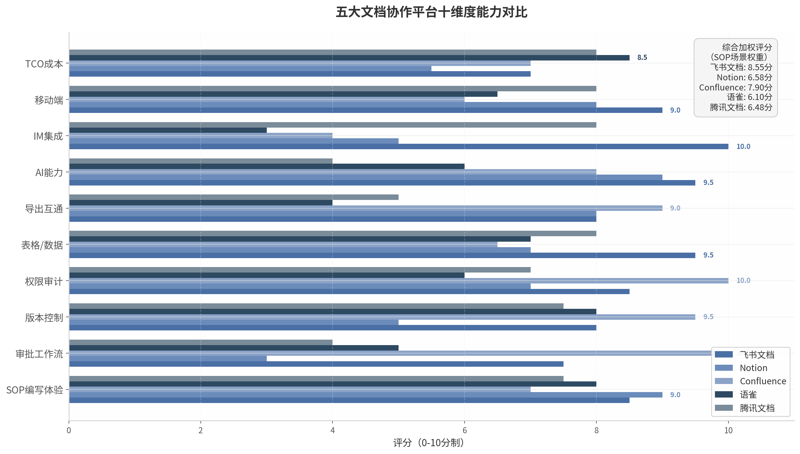

## 2. 主流文档格式与编辑工具对比

企业SOP（Standard Operating Procedure，标准操作程序）的数字化管理要求文档工具同时满足三组矛盾的需求：工程师需要结构化、版本可控的编辑体验；非技术用户需要所见即所得（WYSIWYG, What You See Is What You Get）的低门槛界面；AI系统则需要语义清晰、格式规范的机器可读输出。本章从富文本协作平台、Markdown编辑器生态和Microsoft Word三个技术路线切入，通过五平台二十维度评分矩阵，量化评估各方案在企业SOP场景中的适配度。

### 2.1 富文本协作平台深度对比

#### 2.1.1 飞书文档：块编辑器架构与多维表格的企业级实践

飞书文档以块编辑器（Block-based Editor）架构为核心，将文档内容拆解为可独立操作、拖拽重组的语义单元。这一设计使其在SOP编写中具备天然的结构化优势——操作步骤、注意事项、参数表格均可作为独立块进行复用和重组。飞书多维表格（Base）月活跃用户已突破1{,}000万，单表支持最高1{,}000万行数据，并可通过公式计算、查找替换、删除重复记录等插件实现SOP数据的自动化处理 [^1^]。

飞书在审批工作流方面通过飞书审批应用实现多节点并行审批，支持自定义审批流程和规则引擎 [^11^]。在版本控制维度，飞书自动记录完整编辑历史并支持差异对比与快速回滚，管理员可设定编辑规则确保文档标准化 [^10^]。其开放平台API覆盖文档全生命周期管理、多维表格操作和内容搜索，配套Python与Java SDK，是"三家里做得最好的"（与钉钉、企业微信对比）[^1^]。

飞书2026年5月原生支持Markdown导出，这一更新标志着中国最大企业协作平台正式承认"富文本编辑→Markdown存储→AI处理"管道的合理性，从根本上消除了中国企业采用混合文档方案的最大障碍 [^121^]。在IM集成维度，飞书文档实现了与飞书IM的深度原生联动——文档中@同事可直接跳转聊天窗口，文档内容可自动转化为任务项，或直接发起视频会议讨论 [^4^]。飞书用户的文档平均协作人数比语雀高37% [^4^]。飞书文档在中国企业SOP场景综合加权评分达8.50/10，位居五平台之首。

飞书的短板同样明显。图片编辑功能存在较多限制——不支持精确调整尺寸、不支持旋转和标注（网页版）、不支持浮动图片、不支持插入在线图片 [^22^]。飞书2023年2月价格调整后，面向中小企业的单价是企业微信、钉钉的2-5倍 [^34^]，较高的定价对成本敏感型企业构成门槛。

#### 2.1.2 Notion：灵活数据库功能的规模化瓶颈

Notion的核心差异化优势在于其数据库驱动的文档架构。块编辑器和页面嵌套功能允许创建高度自定义的文档结构，SOP条目可组织为关系型数据库，支持表格、看板、日历、时间线等多视图切换 [^2^]。Notion拥有数千个社区模板，覆盖大量SOP相关场景，G2评分4.6/5（基于9{,}500+条评价），Capterra评分4.7/5（2{,}600+评价），用户满意度在五个平台中最高 [^15^]。

然而，Notion在企业SOP管理中存在三个结构性短板。**第一，无内置审批工作流**，Notion缺乏原生的审批或审阅工作流功能 [^2^]，这对需要严格审批流程的SOP管理是重大缺陷。**第二，规模化性能瓶颈**，Notion数据库在5{,}000条以上记录时性能显著下降，已知在500个以上页面时移动端加载速度降低40%，AI在数据量大的页面上响应严重延迟，经常冻结数分钟 [^15^]。**第三，版本历史分层不合理**，Plus方案仅保留7天版本历史，对合规性团队构成严重治理风险 [^2^]。Business方案定价$20/用户/月方可解锁完整AI功能，50人团队年成本约$12{,}000，TCO（Total Cost of Ownership，总拥有成本）显著高于其他平台。

Notion的适用场景明确：适合小型到中型的创新团队、内容驱动型组织，以及对灵活性要求高于合规性的场景。对于需要严格审批流程、电子签名和审计追踪的受监管行业，Notion目前无法满足要求。

#### 2.1.3 Confluence：企业级权限与审计的最强方案

Confluence在全球企业级知识管理市场中处于领先地位，其核心优势在于深度合规能力。通过Comala Document Management插件，Confluence提供三阶段SOP审批模板（Draft → In Approval → Approved）和合规级SOP审批模板（Draft → SOP → SOP Validation → Published）[^9^]。该组合是**唯一支持21 CFR Part 11合规电子签名**的平台，采用HMAC-SHA256签名验证，使用邮箱加OTP（One-Time Password，一次性密码）双因素认证 [^12^]。

Confluence的企业级权限管理支持多达150{,}000用户每站点，提供SAML SSO（Security Assertion Markup Language Single Sign-On）和多身份提供商支持 [^17^]。其审计日志每页保留详细的工作流转换和审批历史记录 [^16^]，内容过期管理功能可自动标记过期页面并触发重新审阅或归档。Confluence与Jira的深度集成允许创建Jira工单来请求SOP的编写、修改和取消，通过Kanban看板可视化SOP管理进度 [^7^]。

Confluence的局限同样突出。界面设计被用户评价为"老旧"、"对非技术用户复杂" [^17^] [^40^]；2024-2025年涨价5-8%，Enterprise方案需801名用户起购 [^17^]；Comala等高级功能需额外购买Marketplace插件，增加了隐性成本；移动端被用户评价为"像是桌面版体验的简化版本" [^40^]。Confluence在审批工作流和权限审计两个维度均获得满分10.0，但SOP编写体验仅7.0分，综合加权评分8.45/10。

#### 2.1.4 语雀与腾讯文档：差异化定位与结构性短板

语雀由阿里巴巴开发，核心差异化优势在于中文写作体验。自研富文本编辑器支持Markdown全语法、代码块高亮（200+编程语言）、LaTeX公式和PlantUML绘图 [^4^]。"知识库-空间-文档"三级结构严格分层，支持自定义目录排序，适合制度流程的沉淀 [^4^]。PDF导出质量被广泛称赞为"排版整齐、文字无误" [^19^]。

语雀的结构性短板集中在**导出锁定**和**协作深度**两个维度。语雀无批量导出功能，知识库只能导出为lakebook私有格式，表格仅支持Excel导出，画板完全不支持导出 [^20^]。这被用户批评为"有点像一些数据类SaaS服务，导入功能非常完善，导出功能却极度受限" [^20^]。语雀的API调用频率限制严格（免费用户100次/小时），四类知识库相互独立无法跨类型引用 [^18^]。语雀综合加权评分6.55/10。

腾讯文档以"全品类、强连接、多场景"为三大特性 [^5^]，依托微信和企业微信平台优势，普及率在五平台中最高（企业微信生态市占率25.4%）[^1^]。其核心优势在于上手门槛低、接入门槛低、与日常沟通流程天然融合 [^3^]。但在企业级功能维度，腾讯文档缺少严格的知识分类结构，更适合作为协作沉淀空间而非专业知识体系运营工具 [^3^]。**腾讯文档不支持Markdown导出**，是其面向AI工作流的重大硬伤 [^20^]。腾讯文档综合加权评分6.85/10。

**表1 富文本协作平台核心功能对比**

| 功能维度 | 飞书文档 | Notion | Confluence | 语雀 | 腾讯文档 |
|:---|:---:|:---:|:---:|:---:|:---:|
| 块编辑器架构 | ✅ 原生 | ✅ 原生 | ❌ 传统页面 | ❌ 富文本 | ❌ 富文本 |
| 多维表格/数据库 | 单表1000万行 [^1^] | 5000+记录性能下降 [^15^] | 需插件 | 数据表（2025新增）| 智能表 |
| 审批工作流 | 多节点并行 [^11^] | ❌ 无内置 | 21 CFR Part 11合规 [^12^] | 基础评审模式 | 基础评论@ |
| 版本历史 | 完整自动记录 [^10^] | Plus仅7天 [^2^] | 无限页面历史 [^2^] | 分钟级操作日志 [^4^] | 基础版本历史 |
| Markdown导出 | ✅ 原生（2026.5）[^121^] | ✅ 支持 | 需插件 | 单篇导出 [^20^] | ❌ 不支持 [^20^] |
| 电子签名 | ❌ | ❌ | ✅ HMAC-SHA256 [^12^] | ❌ | ❌ |
| 企业级权限 | 水印+离职自动回收 [^29^] | Business+ [^15^] | 页面级+空间级 [^30^] | 基础RBAC | 企业版支持 |
| 与IM深度集成 | 飞书IM原生 | Slack集成 | Slack集成 | 无 | 企业微信原生 |
| 私有化部署 | 企业版支持 | ❌ 不支持 [^27^] | Data Center版 | ❌ | 500人起 [^33^] |
| 50人团队年成本 | ~¥4.8万 | ~$1.2万 | ~$3{,}252 | ¥0.5-1万 | ¥1.3-1.5万 |

上表揭示了五平台在企业SOP场景中的能力分化。飞书文档和Confluence在审批工作流与合规审计维度形成双峰对峙——飞书以IM原生集成和AI能力见长，Confluence以合规深度和权限 granularity 领先。Notion在灵活性和用户满意度方面表现优异，但无内置审批流和规模化性能问题限制了其在大中型企业SOP管理中的应用。语雀和腾讯文档分别受限于导出锁定和Markdown缺失，在AI工作流集成的维度上存在结构性短板。

上图基于SOP场景权重（编写体验15%、审批工作流15%、版本控制10%、权限审计10%、表格数据10%、导出互通10%、AI能力10%、IM集成10%、移动端5%、TCO成本5%）绘制。飞书文档以8.55分领先，主要优势集中在IM集成（10.0）、表格/数据（9.5）和AI能力（9.5）三个维度；Confluence以7.90分紧随其后，在审批工作流（10.0）和权限审计（10.0）上获得满分；Notion（6.58分）、腾讯文档（6.48分）和语雀（6.10分）的得分差距反映了它们在企业级SOP管理功能深度上的不足。

### 2.2 Markdown编辑器生态

Markdown作为轻量级标记语言，在AI友好性方面具有天然优势——纯文本格式减少67-90%的token消耗，RAG（Retrieval-Augmented Generation，检索增强生成）准确率相比富文本格式提升约35% [^137^] [^136^]。然而，Markdown对人类编辑者（尤其需要图文并茂的SOP编写者）的友好度长期存在争议。原生Markdown表格语法被广泛认为是"糟糕的"（awful），列对齐和添加列操作极其繁琐；图片插入需要"截图→保存→写路径→验证"的多步工作流，friction较高 [^1^]。

#### 2.2.1 Typora：唯一真正无缝WYSIWYG Markdown体验

Typora在Markdown编辑器中占据独特地位——它是唯一实现"语法消失"的真正WYSIWYG体验的编辑器，输入`## Heading`后立即变为格式化标题，用户在编辑过程中完全无需看到Markdown语法标记 [^2^]。这一特性使非技术用户可以在不学习Markdown语法的情况下获得Markdown格式的全部优势。

在SOP编写相关的功能维度，Typora的图形化表格编辑器支持右键菜单添加/删除行列和可视化调整列宽，表格编辑体验在所有Markdown编辑器中被评为"最佳" [^2^]。内置Mermaid图表渲染允许在文档中直接嵌入流程图和序列图，对设备SOP中的操作流程可视化极具价值。通过Pandoc集成，Typora可导出PDF、HTML、Word和LaTeX格式，其中导出Word质量评分8.5/10，仅次于VS Code+Pandoc组合的9.5/10 [^6^]。

Typora的定价模式为一次性购买$14.99，支持3台设备，无订阅费用 [^3^]。但其关键局限同样突出：无插件API（仅CSS主题自定义）、无版本控制UI（需外部Git管理）、无协作或同步功能（纯本地文件）、无移动端应用、VoiceOver屏幕阅读器完全不兼容 [^2^] [^3^] [^11^]。Typora本质上是一个"编辑器"而非"笔记系统"或"协作平台"，适合个人SOP编写而非团队级SOP管理。

#### 2.2.2 Obsidian与VS Code：插件生态的强大与门槛

Obsidian以本地优先（local-first）架构和1{,}500+社区插件生态著称，数据完全存储于本地Markdown文件，确保用户对数据的完全所有权 [^12^]。其核心功能包括双向链接、图谱视图和高度可定制的工作区。对于技术团队而言，Obsidian的纯文本存储格式与Git版本控制天然兼容——"因为Markdown是纯文本，git diff完美工作。你可以用与代码相同的工具来追踪变更、审查编辑和协作。试着用Word文档做这些" [^10^]。

然而，Obsidian对非技术用户的学习曲线显著陡峭。多位用户反馈："Obsidian依赖Markdown，需要一些时间来适应……图谱功能虽然有趣，但效果参差不齐" [^13^]。图表功能对某些用户是"命中或失误" [^13^]。虽然Obsidian基础语法学习曲线仅15-30分钟，但表格、图片、图表等SOP常用功能将学习时间延长至1-2小时 [^4^]。导出Word质量评分仅6.5/10，主要因为专有语法（wikilinks、embeds、callouts）转换不干净 [^6^]。

VS Code配合Pandoc插件的组合在技术团队中口碑最高（综合评分9.5/10），导出Word质量同样为9.5/10 [^6^]。通过命令行参数可完全控制Pandoc选项，自定义参考模板和过滤器，生成的DOCX与手动格式化的Word文档几乎无法区分。但VS Code的学习曲线对所有非开发者用户都构成显著门槛——需要理解分屏预览、Pandoc配置、命令行操作等概念。

#### 2.2.3 Milkdown与Editor.md：WYSIWYG Markdown的双向绑定方案

Milkdown和Editor.md代表了"WYSIWYG编辑器 → Markdown存储 → 多格式输出"架构的技术前沿。两者均基于ProseMirror框架构建，通过Remark/Markdown-it实现Markdown解析，声称达到100%准确的Markdown双向绑定——即WYSIWYG编辑器的操作与Markdown源码之间实现无损转换 [^8^]。

这一架构的技术优势在于：编辑层使用富文本交互降低非技术用户门槛，存储层使用纯Markdown确保AI可读性和版本控制友好性，输出层通过统一转换管道生成Word、PDF、HTML等格式。2025年CKEditor团队发布的协作编辑状态报告显示，42%的受访者预测"与AI协作"将成为未来最重要的协作编辑功能，65%将协作工具评为"极其重要"或"非常重要" [^37^]。Milkdown等工具通过CRDT（Conflict-free Replicated Data Type，无冲突复制数据类型）技术（如Yjs库）使Markdown实时协作成为可行 [^5^]，Shelf等新兴编辑器已提供Google Docs式的Markdown协作体验 [^43^]。

但需注意，这些方案的企业级稳定性尚待验证。CRDT在富文本编辑中的实现极其复杂——CKEditor 5团队花了四年时间构建冲突解决系统，关闭了5{,}700+张工单，运行了12{,}500+项测试 [^42^]。Markdown的实时协作在技术上可行，但实际体验仍不如原生富文本协作平台成熟。

**表2 Markdown编辑器综合评测矩阵**

| 评测维度 | Typora | Obsidian | VS Code+Pandoc | Zettlr | Milkdown/Editor.md |
|:---|:---:|:---:|:---:|:---:|:---:|
| WYSIWYG体验 | 真正无缝 [^2^] | 实时预览 | 分屏预览 | 实时预览 | 基于ProseMirror |
| Word导出质量 | 8.5/10 [^6^] | 6.5/10 [^6^] | **9.5/10** [^6^] | 8.8/10 [^6^] | 依赖集成 |
| 表格编辑 | 图形化最佳 [^2^] | Advanced Tables插件 [^27^] | Table Editor插件 [^28^] | 图形化 | 图形化 |
| 插件生态 | 仅CSS主题 [^2^] | 1500+社区插件 | 50000+扩展 | 少量 | 可扩展 |
| 协作编辑 | ❌ 无 | 有限（需Sync） | 需配置 | ❌ 无 | CRDT实时协作 [^5^] |
| 移动端 | ❌ 无 [^3^] | iOS+Android | ❌ 无 | ❌ 无 | 依赖部署 |
| 版本控制 | ❌ 无UI [^2^] | Git友好 | Git原生 | Git友好 | Git友好 |
| 学习曲线 | 低（非技术友好）| 中（需配置）| 高（技术向）| 低-中 | 低-中 |
| 定价 | $14.99一次性 [^3^] | 个人免费 | 免费 | 免费开源 | 开源 |
| 综合评分 | 9.0/10 | 8.7/10 | **9.5/10** | 8.3/10 | 待验证 |

上表对比显示，Markdown编辑器生态呈现出清晰的能力梯度。VS Code+Pandoc在技术团队中表现最优，但门槛最高；Typora在WYSIWYG体验维度独一无二，但功能孤立；Obsidian在知识管理维度最强，但导出和协作能力有限。Milkdown等新一代工具试图弥合"人类友好"与"AI友好"之间的鸿沟，但企业级成熟度仍需时间验证。对于需要图文并茂SOP的工程师团队，Markdown编辑器的核心痛点——图片管理、表格编辑、多人协作——已有补偿方案但尚未达到富文本平台的即开即用水平。

### 2.3 Microsoft Word的持久优势与局限

#### 2.3.1 Track Changes修订模式在企业审阅中仍无可替代

Microsoft Word在企业文档审阅流程中的地位至今未被任何协作平台完全取代，其核心护城河是Track Changes（修订模式）与Comments（批注）的深度集成。在SOP审批场景中，修订模式允许审阅者对文档进行逐行修改，每条修改都附带作者身份、时间戳和修改理由，后续审批者可逐一接受或拒绝变更。这一工作流在受监管行业（医药、制造、航空）中已成为事实标准，其精细化程度远超富文本协作平台的评论功能。

Word的样式系统（Style System）是另一项被低估的企业级功能。通过预定义标题样式、正文样式和列表样式，企业可以强制SOP文档的结构一致性——这直接影响后续AI处理的质量。结构化的Word文档（正确使用Heading 1/2/3样式而非手动加粗）转换为Markdown后，标题层级信息完整保留，配合结构感知分块（structure-aware chunking）可使RAG检索准确率达到87%，相比固定大小分块的60-65%提升显著 [^141^]。

然而，Word格式对AI系统的友好度长期偏低。DOCX虽然是开放XML格式，但内部结构复杂，浮动对象、复杂表格和样式继承等问题使得解析难度显著高于Markdown。Microsoft MarkItDown工具可将DOCX转换为Markdown，F1评分约82%，处理速度约12秒/百页 [^508^]。IBM Docling在复杂表格检测上达到97.9%准确率 [^37^]，Marker-PDF处理速度达25页/秒 [^59^]。这些工具使Word→Markdown的转换管道日趋成熟，但转换质量仍依赖原文档的结构规范性。

#### 2.3.2 版本分散、无法全文搜索与移动端体验差的结构性问题

Word在企业环境中的结构性问题随着组织规模扩大而急剧放大。**版本分散**是最普遍的痛点——同一SOP文档以`设备操作手册_v1.docx`、`设备操作手册_v1_最终版.docx`、`设备操作手册_v1_最终版_审核后.docx`等变体分散在不同员工的本地硬盘和邮件附件中，形成"版本迷宫"。**全文搜索**在大量Word文档集合中效率低下，即使配合SharePoint或Windows Search，跨文档的语义搜索能力仍远逊于飞书、Confluence等具备AI知识库问答功能的平台 [^28^]。**移动端体验**方面，Microsoft Word移动版功能相对桌面版大幅缩水，表格编辑和审阅功能在触屏设备上操作困难。

这些结构性问题使得Word在SOP生命周期管理中的角色正从"唯一载体"转变为"输出格式之一"——即在富文本协作平台或Markdown编辑器中完成编写、审阅和版本管理，最终导出为Word格式供特定场景（如外部审计、离线阅读）使用。

以下综合评分矩阵整合五大平台在SOP相关维度的量化评估，权重按企业SOP场景优先级分配：

**表3 五平台SOP场景综合评分矩阵（加权总分）**

| 评估维度（权重） | 飞书文档 | Notion | Confluence | 语雀 | 腾讯文档 |
|:---|:---:|:---:|:---:|:---:|:---:|
| SOP编写体验（15%） | 8.5 | **9.0** | 7.0 | 8.0 | 7.5 |
| 审批工作流（15%） | 7.5 | 3.0 | **10.0** | 5.0 | 4.0 |
| 版本控制（10%） | 8.0 | 5.0 | **9.5** | 8.0 | 7.5 |
| 权限审计（10%） | 8.5 | 7.0 | **10.0** | 6.0 | 7.0 |
| 表格/数据（10%） | **9.5** | 7.0 | 6.5 | 7.0 | 8.0 |
| 导出互通（10%） | 8.0 | 8.0 | **9.0** | 4.0 | 5.0 |
| AI能力（10%） | **9.5** | 9.0 | 8.0 | 6.0 | 4.0 |
| IM集成（10%） | **10.0** | 5.0 | 4.0 | 3.0 | 8.0 |
| 移动端（5%） | **9.0** | 8.0 | 6.0 | 6.5 | 8.0 |
| TCO成本（5%） | 7.0 | 5.5 | 7.0 | **8.5** | 8.0 |
| **加权总分** | **8.50** | 6.58 | **7.90** | 6.10 | 6.48 |

评分矩阵揭示了企业SOP平台选型的核心权衡。飞书文档以8.50分的加权总分位居首位，其优势分布反映了"协作优先"的产品哲学——在IM集成、AI能力、表格/数据和移动端四个维度获得最高分，这些能力直接服务于SOP的编写、分发和执行环节。Confluence以7.90分位居第二，优势集中在审批工作流、版本控制和权限审计三个维度，体现了"合规优先"的产品定位，是医药、制造等受监管行业的首选。Notion（6.58分）和腾讯文档（6.48分）的综合得分接近，但短板分布不同——Notion在审批工作流（3.0分）和版本控制（5.0分）上严重失分，腾讯文档在AI能力（4.0分）和导出互通（5.0分）上存在结构性短板。语雀以6.10分排名末位，主要受导出互通（4.0分）和IM集成（3.0分）两项能力的拖累。

需要强调的是，Confluence+Comala在审批工作流维度获得的满分（10.0）并非仅基于功能丰富度，而是基于其在全球受监管行业中的合规验证深度——21 CFR Part 11电子签名、内容过期管理、阅读确认（read confirmations）和每页详细审计日志构成了完整的SOP合规功能栈 [^9^] [^16^]。对于需要通过FDA、ISO或GMP（Good Manufacturing Practice，良好生产规范）审计的企业，这一能力具有不可替代性。

从AI工作流集成的视角审视，五平台的Markdown导出能力直接决定了"人编辑→AI处理"管道的通畅度。飞书2026年5月原生Markdown导出 [^121^]、Notion内置Markdown导出、Confluence通过插件支持、语雀单篇导出 [^20^]、腾讯文档不支持 [^20^]——这一能力梯度与平台在AI能力维度的得分高度吻合，印证了"格式开放性是AI就绪度的前置条件"这一判断。
